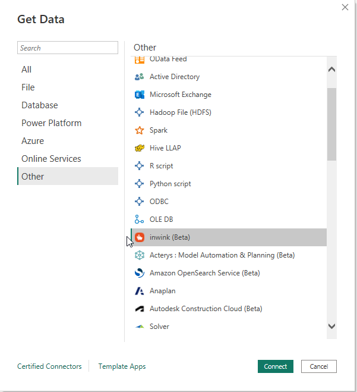
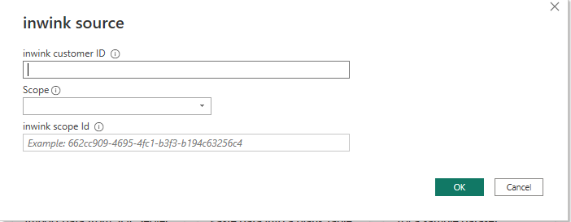

# inwink Connector (Beta)
 
## Summary

| Item | Description |
| ---- | ----------- |
| Release State | General Availability |
| Products | Power BI (datasets) Power BI (Dataflows) |
| Authentication Types Supported | Organizational account |

## Prerequisites
Before you can sign in to inwink Connector, you must have an inwink account (username/password).

 
## Connect to inwink data

To connect to inwink data:

1. Select **Get Data** from the **Home** ribbon in Power BI Desktop. Select **Online Services** from the categories on the left, select **inwink**, and then select **Connect**.

2. Provide your inwink customer ID, the scope you want to retrieve data from (Event, Community or Audience) and the scope ID

3. Sign in to your inwink account, select **Sign in**.

4. Connect using your user email and password

5. Once the connection is established, you can preview and select Tables within the **Navigator**. 

You can **Load** the selected tables, which brings the entire tables into Power BI Desktop, or you can select **Transform Data** to edit the query, which opens Power Query Editor. You can then filter and refine the set of data you want to use, and then load that refined set of data into Power BI Desktop.

## Limitations and issues

Table relationships may be automatically set by Power BI Desktop when loading the tables and induce errors. Delete all relationships on column 'Status'