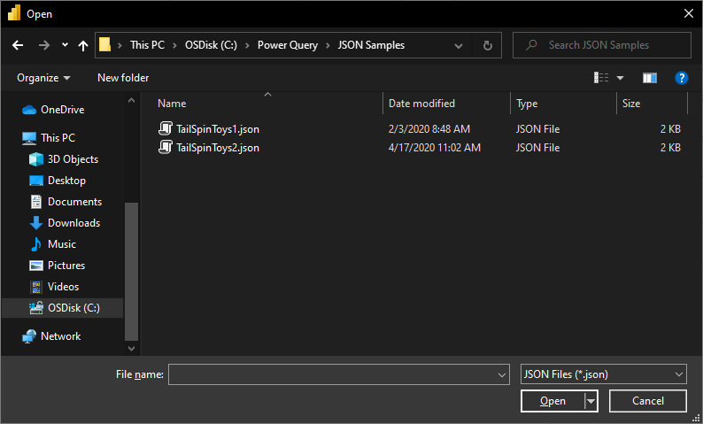
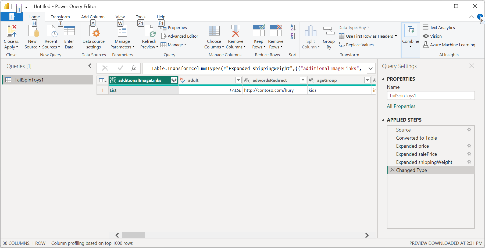
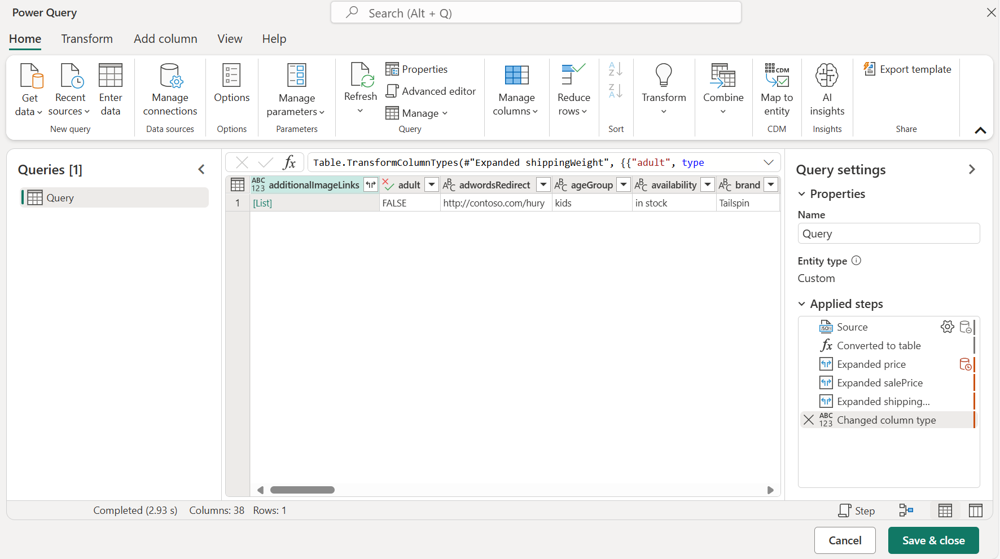
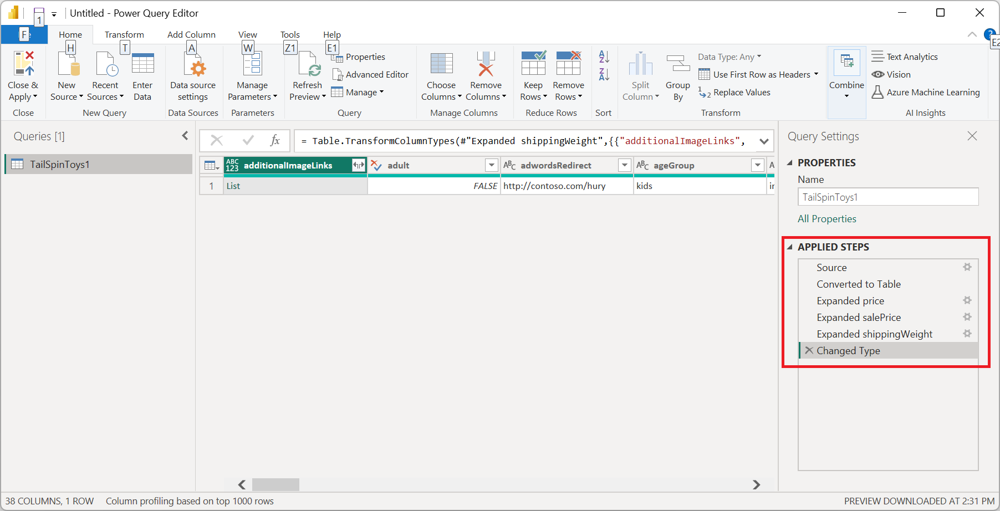

# JSON

## Summary

| Item | Description |
| ---- | ----------- |
| Release State | General Availability |
| Products | Excel<br/>Power BI (Semantic models)<br/>Power BI (Dataflows)<br/>Fabric (Dataflow Gen2)<br/>Power Apps (Dataflows)<br/>Dynamics 365 Customer Insights<br/>Analysis Services |
| Authentication Types Supported | Anonymous<br/>Basic (Web only)<br/>Organizational Account<br/>Web API (Web only)<br/>Windows |
| Function Reference Documentation | [Json.Document](/powerquery-m/json-document) |

> [!NOTE]
> Some capabilities may be present in one product but not others due to deployment schedules and host-specific capabilities.

## Capabilities supported

* Import

## Load a local JSON file from Power Query Desktop

To load a local JSON file:

1. Select the **JSON** option in the **Get Data** selection. This selection launches a local file browser where you can select your JSON file.

   

2. Select **Open** to open the file.

Loading the JSON file will automatically launch the Power Query Editor. Power Query uses automatic table detection to seamlessly flatten the JSON data into a table. From the editor, you can then continue to transform the data if you want, or you can just close and apply. More information: [Automatic table detection from JSON files](#automatic-table-detection-from-json-files)



## Load a local JSON file from Power Query Online

To load a local JSON file:

1. From the **Data sources** page, select **JSON**.

2. Enter the path to the local JSON file.

   

3. Select an on-premises data gateway from **Data gateway**.

4. If authentication is required, enter your credentials.

5. Select **Next**.

Loading the JSON file will automatically launch the Power Query Editor. Power Query uses automatic table detection to seamlessly flatten the JSON data into a table. From the editor, you can then continue to transform the data if you want, or you can just save and close to load the data. More information: [Automatic table detection from JSON files](#automatic-table-detection-from-json-files)



## Load from the web

To load a JSON file from the web, select the [Web connector](./web/web.md), enter the web address of the file, and follow any credential prompts.

## Automatic table detection from JSON files

Importing data from JSON files (or Web APIs) can be challenging for end users. Here is an example of JSON file with multiple levels of nested data.


With the addition of automatic table detection capabilities, using the JSON connector in Power Query will automatically apply transformation steps to flatten the JSON data into a table. Previously, users had to flatten records and lists manually.



## Troubleshooting

If you see the following message, it might be because the file is invalid, for example, it's not really a JSON file, or is malformed. Or you might be trying to load a JSON Lines file.


If you're trying to load a JSON Lines file, the following sample M code converts all JSON Lines input to a single flattened table automatically:

```powerquery-m
let
    // Read the file into a list of lines
    Source = Table.FromColumns({Lines.FromBinary(File.Contents("C:\json-lines-example.json"), null, null)}),
    // Transform each line using Json.Document
    #"Transformed Column" = Table.TransformColumns(Source, {"Column1", Json.Document})
in
    #"Transformed Column"
```

You'll then need to use an *Expand* operation to combine the lines together.
