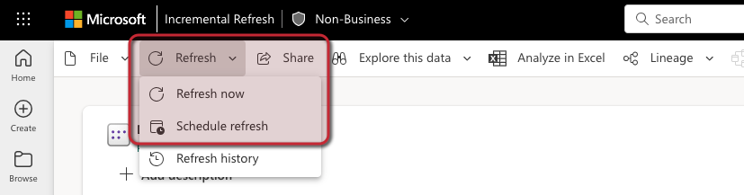
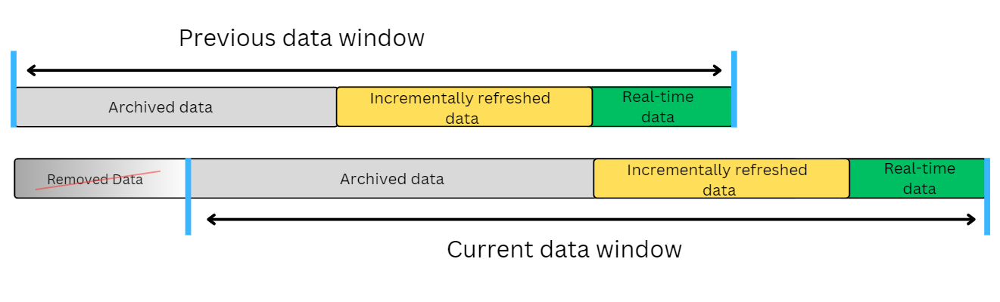
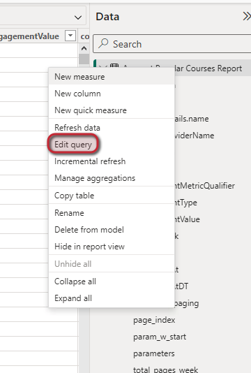
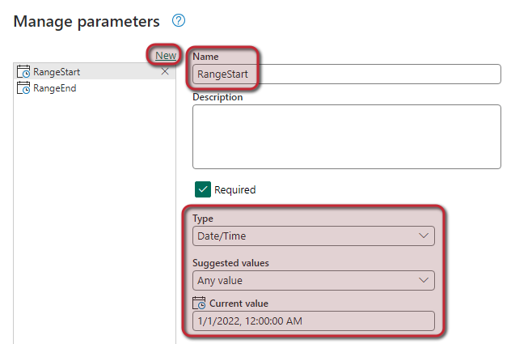
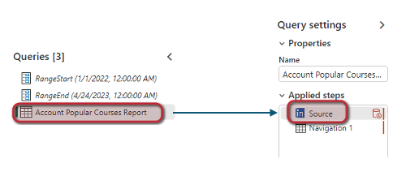
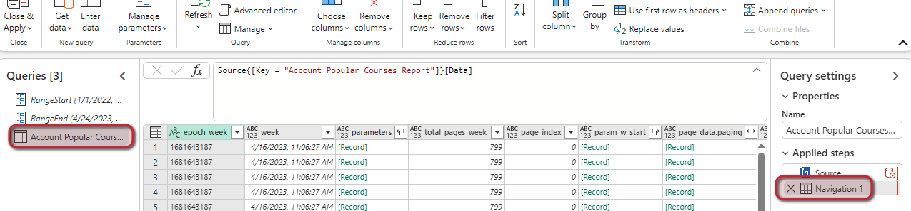
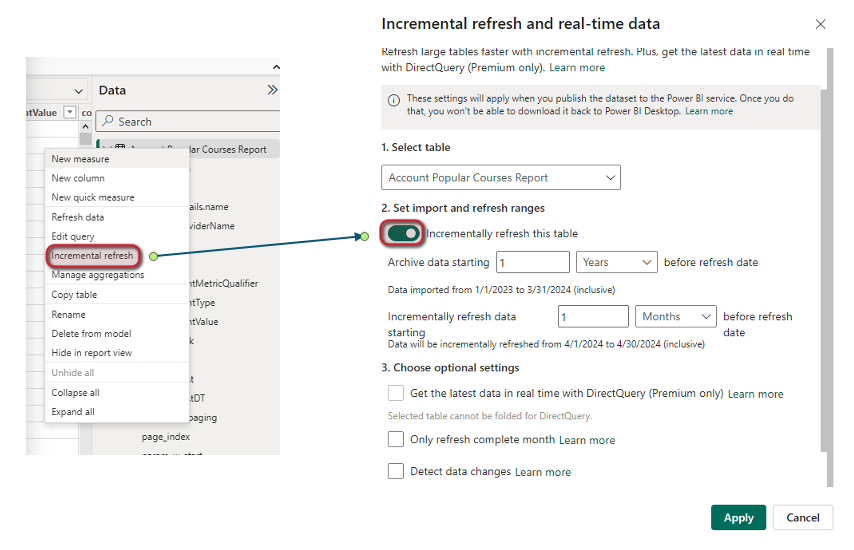
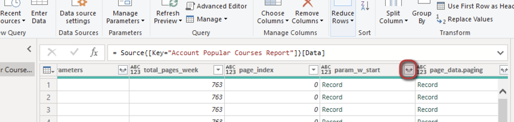
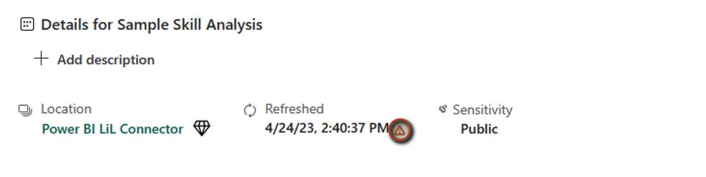

# LinkedIn Learning - Power BI Connector

> [!NOTE]
> The following connector article is provided by LinkedIn Learning, the owner of this connector and a member of the Microsoft Power Query Connector Certification Program. If you have questions regarding the content of this article or have changes you would like to see made to this article, visit the LinkedIn Learning website and use the support channels there.

## Summary

| Item | Description |
| ---- | ----------- |
| Release State | General Availability |
| Products | Power BI Desktop   Power Apps |
| Authentication Types Supported | Oauth 2-Step |

## Overview

The Power BI Connector is a specialized data connector designed and developed to establish a direct connection between Power BI and the LinkedIn Learning APIs. Through this integration, users can access essential insights and engagement metrics, including course completions, hours of content viewed, and active learning days.

These insights can be aggregated based on various entities, such as individuals, groups, accounts, or content objects like courses and videos. By analyzing these metrics, organizations can effectively measure the impact and success of their learning and development initiatives.

## Capabilities Supported

* The Power BI Connector facilitates the extraction of learner engagement data and course information in a straightforward and practical manner.

> [!NOTE]
> Some capabilities shown may not be present by default and may require additional support from LinkedIn to enable. Please reach out to your LinkedIn Learning account team.

### Advantages

* No need to download or receive CSV files.​
* Ability to query data periods greater than 1 year.
* No requirement for coding solutions to connect to the LinkedIn Learning API for learner and asset data.

### Limitations

* Learner activation and license data are not accessible in our reporting API. Consequently, this data will not be available in the Power BI Connector.

## Prerequisites

The scenario outlined in this tutorial assumes that you already have the following prerequisites:

* A Microsoft Windows PC ​
* Microsoft Power BI Desktop: [Click Here](https://powerbi.microsoft.com/en-us/downloads/)
* LinkedIn Learning admin access

## Steps to Configure LinkedIn Learning Power BI Connector

The following steps outline the process for configuring the LinkedIn Learning Power BI Connector:

> [!NOTE]
> Before starting this configuration, ensure that you have already generated the API Keys to obtain the **Client ID and Client Secret** required for the Power BI Connector.
>
>
> [**Click Here: For steps on how to provision API Keys**](https://learn.microsoft.com/en-us/linkedin/learning/reporting/reporting-docs/reporting-api#provision-api-keys)
>
> Please ensure when generating the API keys you have selected the **"content & report"** checkboxes.

### Authentication

To obtain your Client ID & Client Secret from LinkedIn Learning, follow these steps:

1. Login to LinkedIn Learning, if you are not already in the **Admin** screen, select **Go to Admin**, then click **Me > Integrate**.

    

2. In the **Access content and reports via API** you will be able to locate the client ID and Secret you have generated for the Power BI Connector.

3. Next, open Power BI, select **File**, then click **Get Data**

4. In the search box look for **"LinkedIn Learning"**

      

5. Once you have selected the **LinkedIn Learning Connector**; You'll be prompted to input the **Client ID & Client Secret** that was generated within LinkedIn Learning.

> [!NOTE]
> The **Client ID and Client Secret** are stored within Power BI and only need to be entered once. However, you can update them under Transform Data and then Data Source Settings.

Once you have successfully connected, you'll' see the data tables available to load into Power BI.

### Overview of Data Tables

To load data into tables, follow these steps;

1. Click on **Get Data**
2. Select the **LinkedIn Learning data connector**
3. Then select the tables you would like to load or create

> [!NOTE]
> By default 1 year’s worth of data will load for each data table. Please be aware that this may take some time to load.
> **Additionally the data tables used in the LinkedIn Learning Power BI connector match our documented API end points.**

**API endpoint documentation;**

* LinkedIn Learning API documentation [Click Here](https://learn.microsoft.com/en-us/linkedin/learning/overview/)
* Account Popular Courses [Click Here](https://learn.microsoft.com/en-us/linkedin/learning/integrations/learning-activity-reports#account-popular-courses-report)
* Account Popular Custom Content [Click Here](https://learn.microsoft.com/en-us/linkedin/learning/integrations/learning-activity-reports#learner-custom-content-activity-detail-report)
* Account Total Activity Summary [Click Here](https://learn.microsoft.com/en-us/linkedin/learning/integrations/learning-activity-reports#account-total-activity-summary-report)
* Content Summary [Click Here](https://learn.microsoft.com/en-us/linkedin/learning/integrations/learning-activity-reports#content-summary-report)
* Learner Activity Summary [Click Here](https://learn.microsoft.com/en-us/linkedin/learning/integrations/learning-activity-reports#learner-activity-summary-report)
* Learner Course Activity Detail [Click Here](https://learn.microsoft.com/en-us/linkedin/learning/integrations/learning-activity-reports#learner-course-activity-detail-report)
* Learner Custom Content Activity Detail [Click Here](https://learn.microsoft.com/en-us/linkedin/learning/integrations/learning-activity-reports#account-popular-custom-content-report)
* Learner Detail [Click Here](https://learn.microsoft.com/en-us/linkedin/learning/integrations/learning-activity-reports#learner-detail-report)
* Learner Summary [Click Here](https://learn.microsoft.com/en-us/linkedin/learning/integrations/learning-activity-reports#learner-summary-report)
* Organization Summary [Click Here](https://learn.microsoft.com/en-us/linkedin/learning/integrations/learning-activity-reports#organization-summary-report)

All data tables, except for Learning Assets, represent learner activity reports. The Learning Assets table provides our full catalog of courses, including all languages.

Despite the multiple possible queries available in the learning assets API endpoint, **all assets are loaded with complete information.** Additional details on the endpoint can be found in our API documentation. [Click Here](https://learn.microsoft.com/en-us/linkedin/learning/integrations/locale-and-type-api)

### Data Refresh options

In Power BI, there are two main options to refresh data to ensure that the latest up-to-date information is available:

* **On-Demand Refresh:** This allows users to manually trigger a refresh of the dataset whenever they need to update the data. This can be done directly from the Power BI Service interface or through the Power BI Desktop application. On-demand refresh is useful when immediate access to the latest data is required, or when the data source does not support scheduled refreshes.

* **Scheduled Refresh:** This option allows you to set up a refresh schedule for your dataset in Power BI Service. You can define how often you want the data to be refreshed, such as daily, weekly, or even multiple times per day.

 Scheduled refreshes can be configured to run at specific times or intervals to ensure that the data is always current.

This option is suitable for regularly updated datasets where the data source supports scheduled refresh.

#### Data refresh feature in the published dataset

To update the data tables, you can either schedule a refresh or perform an on-demand refresh.

1. Click on the dataset name you wish to refresh.

    

2. Select refresh option:
    1. Refresh now
    1. Schedule refresh

### Incremental Refresh (Optional)

> [!NOTE]
> Before beginning, ensure you have a plan that supports incremental refreshes **Incremental refresh is supported for Power BI Premium, Premium per user, Power BI Pro, and Power BI Embedded models.** [Click Here](https://learn.microsoft.com/en-us/power-bi/connect-data/incremental-refresh-overview#supported-plans)

Incremental refresh improves update performance and offers several benefits. This refresh method works by defining a data window for data archival, incremental refresh, and real-time data (when supported).

Additional information on incremental refresh can be found [Here](https://learn.microsoft.com/en-us/power-bi/connect-data/incremental-refresh-overview)

* Incremental updates are configured table by table and **require editing the query of each table in Power BI Desktop**.

> [!NOTE]
> This process is optional and not required for successful integration with LinkedIn Learning using the Power BI connector.

#### Setting Up Incremental Refresh

To setup the incremental refresh, follow these steps:

1. Right-click on the **"Specific table name"**
2. Click **"Edit Query"**

> [!NOTE]
> Two parameters of type datetime are needed: **RangeStart**  and **RangeEnd.** > **The names of parameters cannot be changed.**
>
> * **RangeStart**: Set this parameter to the date from which the data needs to be queried from the API.
> * **RangeEnd**: Set this parameter to today's date.

3. Select "Manage Parameters"

4. Set up the parameters for **RangeStart** and **RangeEnd**.

    1. Select **"New"**
    2. In the **Name** section, enter datetime parameter name e.g **RangeEnd**.
    3. Ensure the **"Required"** checkbox is ticked.
    4. Enter values as follows:
        1. Type: **Date/Time**
        2. Suggested Values: **Any value**
        3. Current Value: **Todays date**
        4. Repeat the same to create the **RangeStart** parameter but ensure that **Current Value** is set to the date from which the data needs to be queried.

5. After creating the parameters, move them to the top of the query section.

6. Then, click on the table name and then within applied steps, select **"Source"**.

7. In the source function, set the parameters as shown: **"= LinkedInLearning.Contents(RangeStart, RangeEnd)"**

8. Repeat the process for all data tables, ensuring that the same parameters (**RangeStart** and **RangeEnd**) are set for all sources within the applied steps section for each table.

9. Next, configure the **date range filtering.**

10. In each table or query select **Navigation** within the Applied Steps section.

11. Create a **datetime filter**.
    1. Select the dropdown arrow of the "Week column".
    2. Select "Date/Time Filters".
    3. Select "Custom Filter".
    4. Enter values as follows:
        1. Select **Basic**.
        2. Choose **"is after or equal to"**.
        3. Ensure parameter is set, then select **"RangeStart"**.
        4. Select **And**.
        5. Choose **"is before"**.
        6. Ensure parameter is set, then select **"RangeEnd"**.

12. Save and close the Power Query Editor. Please note that this process may take time depending on the number of tables and the date range.

13. The next step is to enable the incremental refresh for each table.

    1. Right-click on the **"Specific table name"**.
    2. Select **"Incremental Refresh"**.
    3. Click **"Incrementally refresh this table"**.
    4. Configure based on preferece.
    5. Click **"Apply"**.

> [!TIP]
> **Archive Data:** Defines the range when you no longer want to see data.
> **Incremental Refresh data:** Defines when data is no longer queried from the API. Ensure incremental refresh is set to no less than 1 month and a maximum of 6 months.

#### Data Columns / JSON

The following columns are used by the data connector and should not be deleted, as doing so may cause errors during data refresh:

* epoch week
* week
* parameters
* total_pages_week
* page_index
* param_w_start
* page_data.paging

Additionally, the column page_data.paging contains the paging information returned by the API.

If you encounter the **"expand"** symbol while editing a query, it indicates that the column can be expanded to show more rows.

Expanding the column **adds a step in the query settings.**

* You can expand as many columns as needed, which will duplicate rows.
* Expanding columns is particularly important for displaying skills in learning assets and custom properties in learner detail reports.

**Congratulations!** Your learning admins can now gain key insights and engagement metrics through their Microsoft Power BI application.

[Back-to-Top](#overview)

## Common Issues & Troubleshooting Tips

If the data update fails when attempting to refresh data:

1. Click on the warning sign to see the details of the error message to diagnose issue.

    

2. Review the details of the error message. This will help you identify and address any issues preventing the data refresh.

## Frequently Asked Questions

Please review our [LinkedIn Learning Reporting API FAQ](reporting-api-faq.md)

## Additional resources

* LinkedIn Learning API documentation [Click Here](https://learn.microsoft.com/en-us/linkedin/learning/overview/)
* Microsoft Power BI: [Click Here](https://www.microsoft.com/en-us/power-platform/products/power-bi/)

## Disclaimer

LinkedIn Learning is constantly investing in our reporting infrastructure. In the future, there may be changes to the Reporting API that may require
adjustments to how data is queried. These updates may require you to make some updates on your platform. We intend to provide detailed guidance in advance of any potential changes to ensure that you have enough time to make necessary changes in your application.

[Back-to-Top](#overview)
****