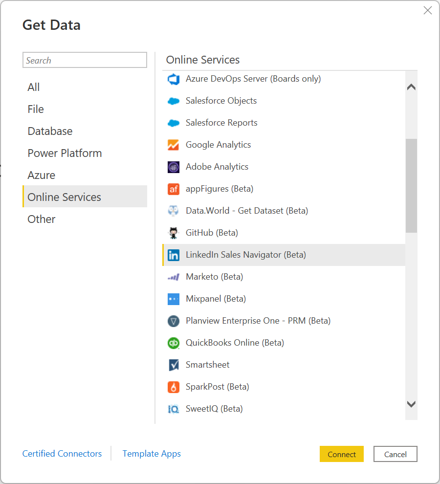
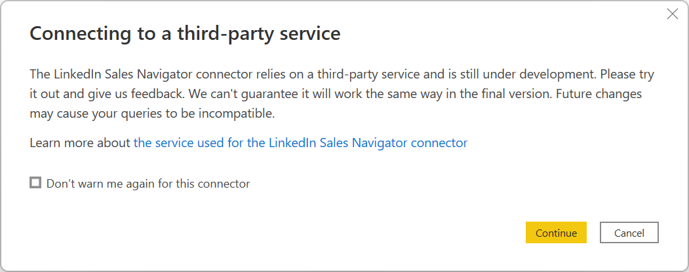

# LinkedIn Sales Navigator (Beta)

## Summary

| Item | Description |
| ---- | ----------- |
| Release State | Beta |
| Products | Power BI (Semantic models) |
| Authentication Types Supported | Organizational Account |
| Function Reference Documentation | &mdash; |

## Prerequisites

A LinkedIn Sales Navigator account. If you don't already have an account, sign up for [a free trial](https://business.linkedin.com/sales-solutions/cx/18/08/linkedin-sales-navigator).

## Capabilities supported

* Import

## Connect to LinkedIn Sales Navigator

To connect to LinkedIn Sales Navigator data:

1. Select **Get Data** from the **Home** ribbon in Power BI Desktop. Select **Online Services** from the categories on the left, then scroll until you see **LinkedIn Sales Navigator (Beta)**.

   

   Select **Connect** to continue.

2. You'll be advised that you're connecting to a third-party connecter that's still under development.

   

3. When you select **Continue**, you're prompted to specify which data you want.

   

4. In the **LinkedIn Sales Navigator** window that appears, select which data you want to return, either **All contacts** or **Selected contacts** from the first drop-down selector. You can then specify the start and end dates to constrain the data it receives to a particular time window.

5. Once you've provided the information, Power BI Desktop connects to the data associated with your LinkedIn Sales Navigator contract. Use the same email address you use to sign in to LinkedIn Sales Navigator through the website.

   

6. When you connect successfully, you're prompted to select the required data from your LinkedIn Sales Navigator contract from the **Navigator**.

   :::image type="content" source="media/linkedin-sales-navigator/navigator.png" lightbox="media/linkedin-sales-navigator/navigator.png" alt-text="Select data with Navigator":::
   
   Once you've selected the data you require, either select **Transform Data** to continue tranforming the data in the Power Query editor, or select **Load** to load the data into Power BI Desktop. Once in Power BI Desktop, you can create whatever reports you like with your LinkedIn Sales Navigator data.

## Getting help

If you run into problems when connecting to your data, contact [LinkedIn Sales Navigator support](https://www.linkedin.com/help/sales-navigator).
