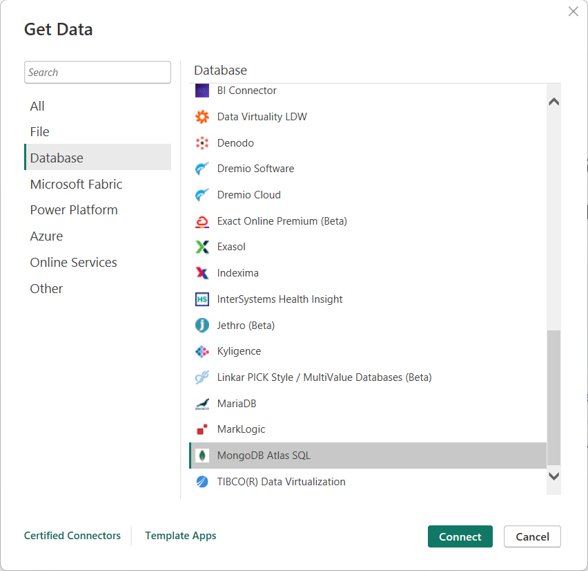
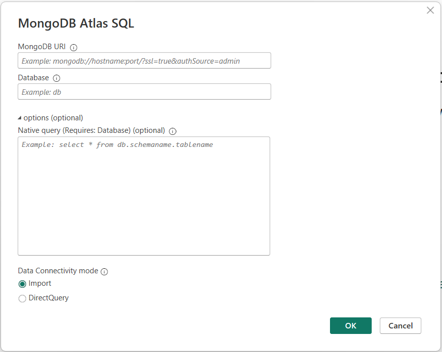
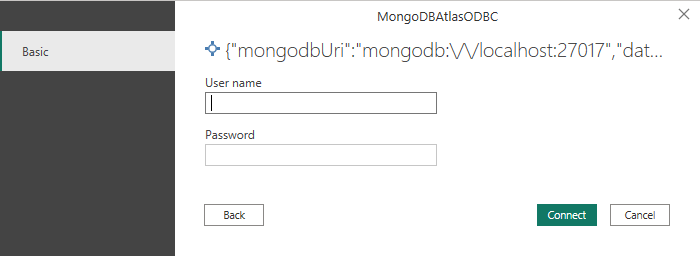
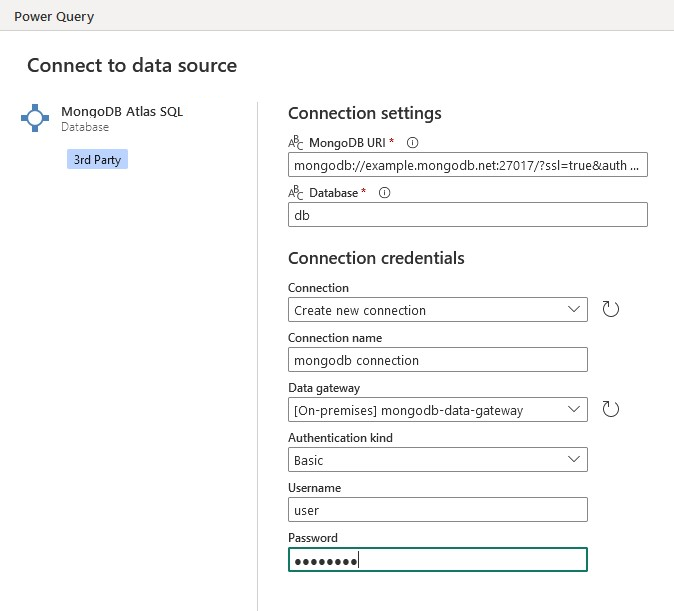
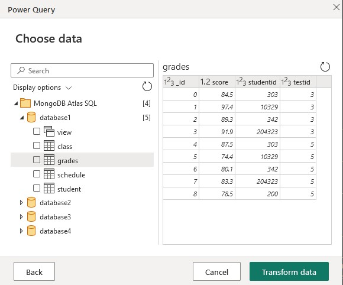

# MongoDB Atlas SQL interface

> [!NOTE]
> The following connector article is provided by MongoDB, the owner of this connector and a member of the Microsoft Power Query Connector Certification Program. If you have questions regarding the content of this article or have changes you would like to see made to this article, visit the MongoDB website and use the support channels there.

## Summary

| Item                           | Description                                                                                                 |
|--------------------------------|-------------------------------------------------------------------------------------------------------------|
| Release State                  | General Availability                                                                                        |
| Products                       | Power BI (Semantic models)<br/>Power BI (Dataflows)<br/>Fabric (Dataflow Gen2)                              |
| Authentication Types Supported | Database (Username/Password)<br/>X.509 Certificates<br/>OAuth (OIDC)<br/>AWS Identity and Access Management |

> [!NOTE]
> When using authentication mechanisms other than Username/Password (such as X.509 Certificates, OAuth (OIDC), or AWS IAM), you can leave the username and password fields blank in the connection dialogue. The appropriate credentials will be handled through the chosen authentication method.

## Prerequisites

To use the MongoDB Atlas SQL connector, you must have an [Atlas federated database](https://www.mongodb.com/docs/atlas/data-federation/) setup.

### Obtaining connection information for your federated database instance

1. Navigate to your federated database instance. In Atlas, select **Data Federation** from the left navigation panel.
2. Select **Connect** to open the federated database instance connection modal.
3. Select **Connect using the Atlas SQL Interface**.
4. Select **Power BI Connector**.
5. Copy your federated database name and MongoDB URI. You'll need them in a later step.

> [!NOTE]
> If some or all of your data comes from an Atlas cluster, you must use MongoDB version 5.0 or greater for that cluster to take advantage of Atlas SQL.

The [MongoDB Atlas SQL ODBC Driver](https://www.mongodb.com/try/download/odbc-driver) is required to use the MongoDB Atlas SQL Connector.

## Capabilities Supported

- Import
- DirectQuery (Power BI semantic models)

## Connect to MongoDB Atlas federated database using Atlas SQL interface from Power Query Desktop

To connect using the Atlas SQL interface:

1. Select **Get Data** from the **Home** ribbon in Power BI Desktop.

2. Select **Database** from the categories on the left, select **MongoDB Atlas SQL**, and then select **Connect**.  

   

3. If you're connecting to the MongoDB Atlas SQL connector for the first time, a third-party notice is displayed. 
   Select **"Don't warn me again with this connector"** if you don't want this message to be displayed again.

   Select **Continue**.

4. In the MongoDB Atlas SQL window that appears, fill in the following values:

   - The **MongoDB URI**. _Required_.
     Use the MongoDB URI obtained [in the prerequisites](#obtaining-connection-information-for-your-federated-database-instance).  Make sure that it doesn't contain your username and password. URIs containing username and/or passwords are rejected.
   - Your federated **Database** name. _Required_  
     Use the name of the federated database obtained [in the prerequisites](#obtaining-connection-information-for-your-federated-database-instance).
   - A SQL query. _Optional_ \
     Enter a native Atlas SQL query to execute immediately. If the **Database** is the same as above, you may omit it from the query.
     ```
     SELECT * FROM orders
     ```
   - Select either Import or DirectQuery for your desired Data Connectivity mode

   Select **OK**.  

   

5. Enter your Atlas MongoDB Database access username and password and select **Connect**.  

     

   > [!NOTE]
   > Once you enter your username and password for a particular Atlas federated database, Power BI Desktop uses those same credentials in subsequent connection attempts. You can modify those credentials by going to **File** > **Options and settings** > **Data source settings**.  

6. In **Navigator**, select one or multiple elements to import and use in Power BI Desktop. 
   Then select either **Load** to load the table in Power BI Desktop, or **Transform Data** to open the Power Query 
   editor where you can filter and refine the set of data you want to use, and then load that refined set of data into 
   Power BI Desktop.

## Connect to MongoDB Atlas federated database using Atlas SQL interface from Power Query Online

To connect using the Atlas SQL interface:

1. Select **MongoDB Atlas SQL** from the **Power Query - Choose data source** page.
2. On the **Connection settings** page, fill in the following values:
    - The **MongoDB URI**. _Required_.
      Use the MongoDB URI obtained [in the prerequisites](#obtaining-connection-information-for-your-federated-database-instance).  Make sure that it doesn't contain your username and password. URIs containing username and/or passwords are rejected.
    - Your federated **Database** name. _Required_  
      Use the name of the federated database obtained [in the prerequisites](#obtaining-connection-information-for-your-federated-database-instance).
    - Enter a **Connection name**.
    - Choose a **Data gateway**.
    - Enter your Atlas MongoDB Database access username and password and select **Next**.

   

3. In the **Navigator** screen, select the data you require, and then select **Transform data**. This selection opens the Power Query editor so that you can filter and refine the set of data you want to use.  

   

## Troubleshooting

When the connection can't be established successfully, the generic error message `The driver returned invalid (or failed to return) SQL_DRIVER_ODBC_VER: 03.80` is displayed. Start by checking your credentials and that you have no network issues accessing your federated database.

## Next steps

You might also find the following information useful:

- [Query with Atlas SQL](https://www.mongodb.com/docs/atlas/data-federation/query/query-with-sql/)
- [Set Up and Query Data Federation](https://www.mongodb.com/docs/atlas/data-federation/)
- [Schema Management](https://www.mongodb.com/docs/atlas/data-federation/query/sql/schema-management/)
- [SQL Reference](https://www.mongodb.com/docs/atlas/data-federation/query/sql/powerbi/connect/)
