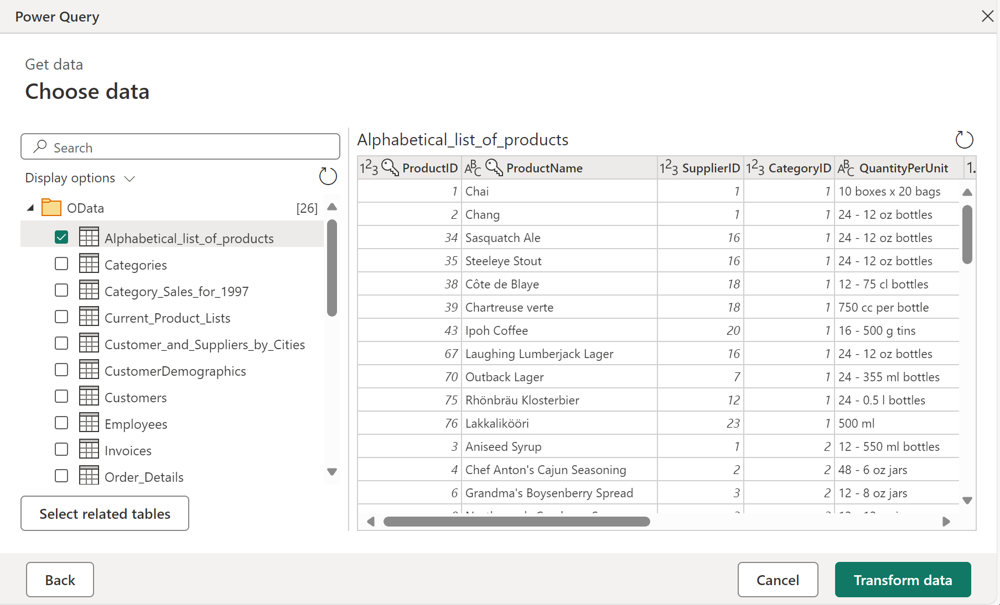
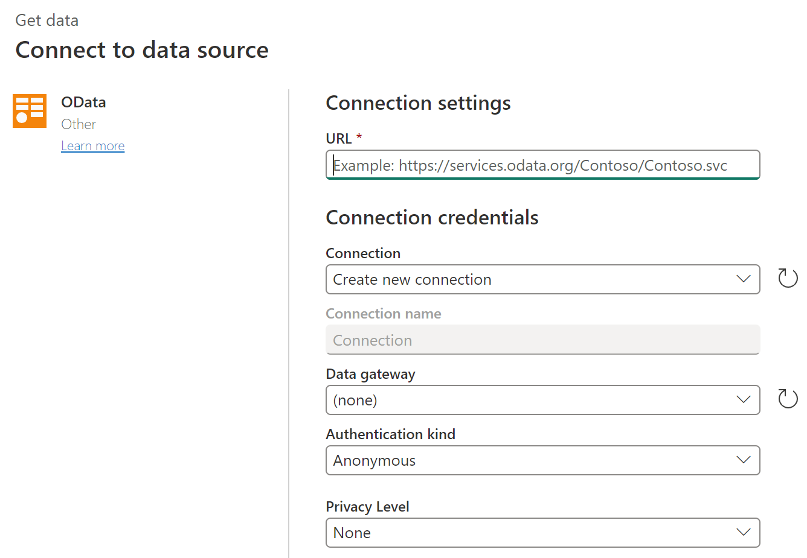
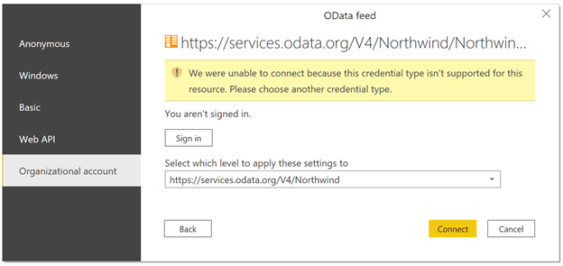

# OData Feed

## Summary

| Item | Description |
| ---- | ----------- |
| Release State | General Availability |
| Products | Excel Power BI (Datasets) Power BI (Dataflows) Fabric (Dataflow Gen2) Power Apps (Dataflows) Dynamics 365 Customer Insights Analysis Services |
| Authentication Types Supported | Anonymous Windows Basic (requires Gateway) Web API Organizational Account |
| Function Reference Documentation | [OData.Feed](/powerquery-m/odata-feed), [ODataOmitValues.Nulls](/powerquery-m/odataomitvalues-type) |

> [!NOTE]
>Some capabilities may be present in one product but not others due to deployment schedules and host-specific capabilities.

## Capabilities supported

* Basic
* Advanced
  * URL parts
  * Open type columns
* Select related tables

> [!NOTE]
> Microsoft Graph is not supported. More information: [Lack of Support for Microsoft Graph in Power Query](../connecting-to-graph.md)

## Load data from an OData Feed in Power Query Desktop

To load data from an OData Feed in Power Query Desktop:

1. Select the **OData** or **OData Feed** option in the connector selection.

2. Choose the **Basic** button and enter a URL address in the text box. This URL should be the root of the OData service you want to connect to. For example, enter `http://services.odata.org/V4/northwind/northwind.svc/`. Then select **OK**.

   

   If the URL address you enter is invalid, a  warning icon will appear next to the **URL** textbox.

3. If this is the first time you're connecting using the OData Feed, select the authentication type, input your credentials (if necessary), and select the level to apply the authentication settings to. Then select **Connect**.

   

4. From the **Navigator** dialog, you can select a table, then either transform the data in the Power Query Editor by selecting **Transform Data**, or load the data by selecting **Load**.

   

   If you have multiple tables that have a direct relationship to one or more of the already selected tables, you can select the **Select Related Tables** button. When you do, all tables that have a direct relationship to one or more of the already selected tables will be imported as well.

## Load data from an OData Feed in Power Query Online

To load data from an OData Feed in Power Query Online:

1. Select the **OData** or **OData Feed** option in the connector selection.

2. In the OData dialog that appears, enter a URL in the text box.

   

3. If this is the first time you're connecting using the OData Feed, select the authentication kind and enter your credentials (if necessary). Then select **Next**.

4. From the **Navigator** dialog, you can select a table, then transform the data in the Power Query Editor by selecting **Transform Data**.

   

   If you have multiple tables that have a direct relationship to one or more of the already selected tables, you can select the **Select Related Tables** button. When you do, all tables that have a direct relationship to one or more of the already selected tables will be imported as well.

## Connecting to Microsoft Graph

Connecting to [Microsoft Graph](/graph/overview) REST [APIs](https://graph.microsoft.com) from Power Query isn't recommended or supported. More information: [Lack of support for Microsoft Graph in Power Query](../connecting-to-graph.md)

## Known Issues and Limitations

### Joins

Due to the architecture of OData and other web connectors, joins can be non-performant. While you have the option to use navigation columns when merging between tables from an OData source, you don't have this option when merging with non-Odata sources.

If you're seeing performance issues when merging an OData source, you should apply [Table.Buffer](/powerquery-m/table-buffer) to your OData query in the advanced editor, before you merge the data.

### Test Connection issues

In cases where you're passing in a URL to the OData connector that's not just the service root (for example, if you have a filter on the URL), when you set up refresh in the service you should select **Skip Test Connection**.

When you enter credentials for an OData service into Power BI service (for example, after publishing a PBIX that uses `OData.Feed`), Power BI service will test the credentials but will ignore any query options that were specified in the M query. These query options might have been specified directly in the formula (for example, using the formula bar or advanced editor), or might have been added by the Power Query editor by default. You can find the full list of these query options in [OData.Feed](/powerquery-m/odata-feed).

### Authenticating to arbitrary services

Some services support the ability for the OData connector to authenticate with OAuth/AAD authentication out of the box. However, this won't work in most cases.

When attempting to authenticate, if the following error occurs:

`We were unable to connect because this credential type isn’t supported for this resource. Please choose another credential type.`

   

Contact the service owner. They'll either need to change the authentication configuration or build a custom connector.

### Maximum URL length

If you're using the OData feed connector to connect to a SharePoint list, SharePoint online list, or Project Online, the maximum URL length for these connections is approximately 2100 characters. Exceeding the character limit results in a 401 error. This maximum URL length is built in the SharePoint front end and can't be changed.

To get around this limitation, start with the root OData endpoint and then navigate and filter inside Power Query. Power Query filters this URL locally when the URL is too long for SharePoint to handle. For example, start with:

`OData.Feed("https://contoso.sharepoint.com/teams/sales/_api/ProjectData")`

instead of

`OData.Feed("https://contoso.sharepoint.com/teams/sales/_api/ProjectData/Projects?select=_x0031_MetricName...etc...")`
