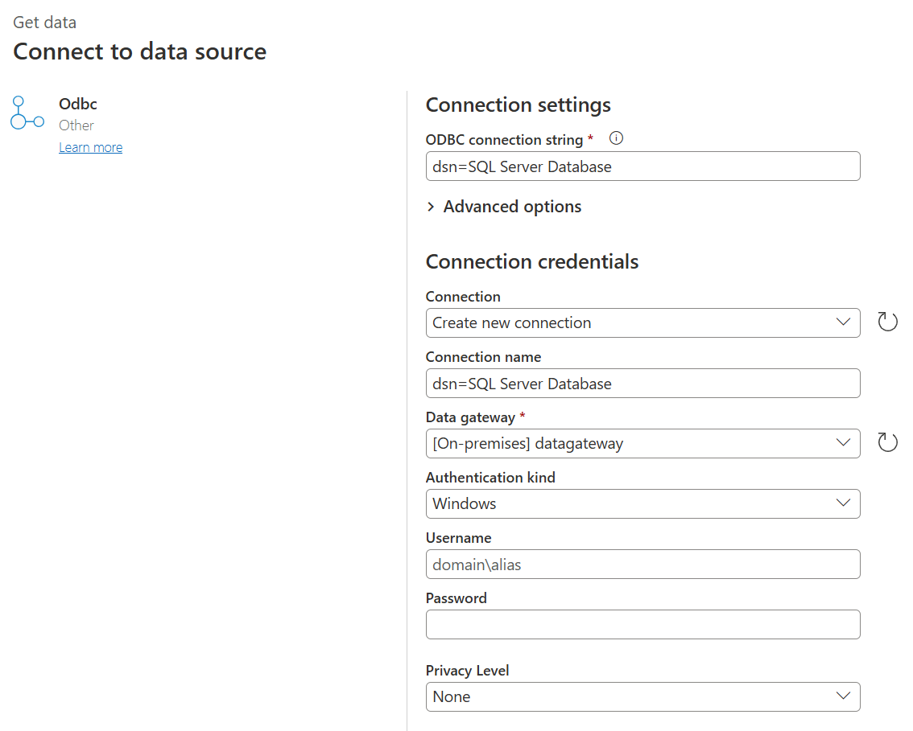

# ODBC

## Summary

| Item | Description |
| ---- | ----------- |
| Release State | General Availability |
| Products |  Excel Power BI (Semantic models) Power BI (Dataflows) Fabric (Dataflow Gen2) Power Apps (Dataflows) Dynamics 365 Customer Insights Analysis Services |
| Authentication Types Supported | Database (Username/Password) Windows Default or Custom |
| Function Reference Documentation | [Odbc.DataSource](/powerquery-m/odbc-datasource) [Odbc.Query](/powerquery-m/odbc-query) |

> [!NOTE]
> Some capabilities may be present in one product but not others due to deployment schedules and host-specific capabilities.

## Prerequisites

Before you get started, make sure you've properly configured the connection in the [Windows ODBC Data Source Administrator](/sql/odbc/admin/odbc-data-source-administrator). The exact process here depends on the driver.

## Capabilities Supported

* Import
* Advanced options
  * Connection string (non-credential properties)
  * SQL statement
  * Supported row reduction clauses

## Connect to an ODBC data source from Power Query Desktop

To make the connection, take the following steps:

1. Select the **ODBC** option in the **Get Data** selection.

2. In **From ODBC**, select the data source name (DSN) from the **Data source name (DSN)** drop-down box. In this example, a DSN name of **SQL Server Database** is used.

   :::image type="content" source="./media/odbc/odbc-builder.png" alt-text="ODBC connection builder in Power Query Desktop.":::

   You can also choose **Advanced options** to enter more optional connection information. More information: [Connect using advanced options](#connect-using-advanced-options)

3. Once you're done, select **OK**.

4. If this is the first time you're connecting to this database, select the authentication type and input your credentials when prompted.

   :::image type="content" source="./media/odbc/odbc-authentication.png" alt-text="ODBC authentication in Power Query Desktop.":::

   The authentication types available are:
   * **Default or Custom**: Select this authentication type when you don't specify any credentials if you're using DSN configured with a username and password. Or, if you need to include credentials as connection string properties.
   * **Windows**: Select this authentication type if you want to connect using Windows authentication. Optionally, include any connection string properties you need.
   * **Database**: Select this authentication type to use a username and password to access a data source with an ODBC driver. Optionally, include any connection string properties you need. This is the default selection.

   More information: [Authentication with a data source](../connectorauthentication.md)

5. Once you're done, select **Connect**.

6. In the **Navigator**, select the database information you want, then either select **Load** to load the data or **Transform Data** to continue transforming the data in Power Query Editor.

   :::image type="content" source="./media/odbc/odbc-desktop-navigator.png" alt-text="navigator.":::

## Connect to an ODBC data source from Power Query Online

To make the connection, take the following steps:

1. From the **Data sources** page, select **ODBC**.

2. In the ODBC page, enter your ODBC connection string. In the following example, the connection string is `dsn=SQL Server Database`.

   

3. If needed, select an on-premises data gateway in **Data gateway**.

4. Choose the authentication kind to sign in, and then enter your credentials.

5. Select **Next**.

6. In the **Navigator**, select the database information you want, and then select **Transform data** to continue transforming the data in Power Query Editor.

## Connect using advanced options

Power Query provides a set of advanced options that you can add to your query if needed.

:::image type="content" source="./media/odbc/odbc-advanced-options.png" alt-text="ODBC advanced options.":::

| Advanced option | Description |
| --------------- | ----------- |
| Connection string (non-credential properties) | Provides an optional connection string that can be used instead of the **Data source name (DSN)** selection in Power BI Desktop. If **Data source name (DSN)** is set to **(None)**, you can enter a connection string here instead. For example, the following connection strings are valid: **dsn=_\<myDSN>_** or **driver=_\<myDriver>_;port=_\<myPortNumber>_;server=_\<myServer>_;database=_\<myDatabase>_;**. To escape special characters, use `{ }` characters. Keys for connection strings vary between different ODBC drivers. Consult your ODBC driver provider for more information about valid connection strings. |
| SQL statement | Provides a SQL statement, depending on the capabilities of the driver. Ask your vendor for more information, or go to [Import data from a database using native database query](../native-database-query.md). |
| Supported row reduction clauses | Enables folding support for [Table.FirstN](/powerquery-m/table-firstn). Select **Detect** to find supported row reduction clauses, or select from one of the drop-down options (TOP, LIMIT and OFFSET, LIMIT, or ANSI SQL-compatible). This option isn't applicable when using a native SQL statement. Only available in Power Query Desktop. |

## Known issues and limitations

### Connection string attributes

If a DSN is specified in the ODBC connection string, the attributes after the DSN specification aren't included. If you want to use additional attributes, update them in the DSN itself, as opposed to in the connection string.
