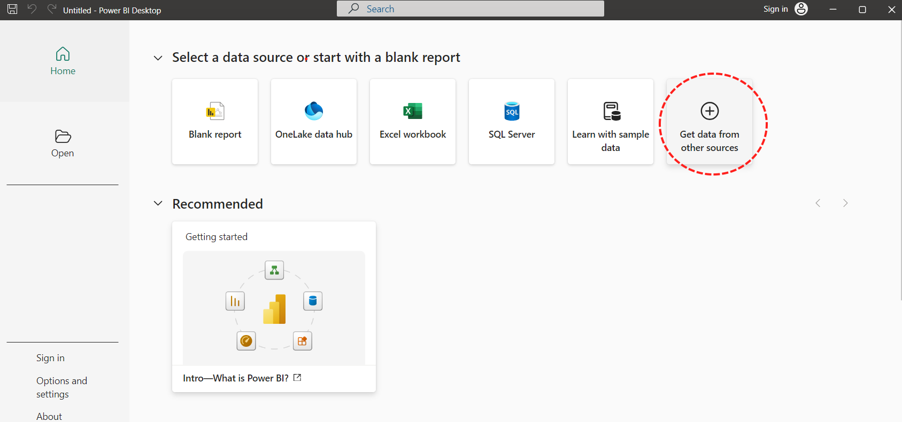
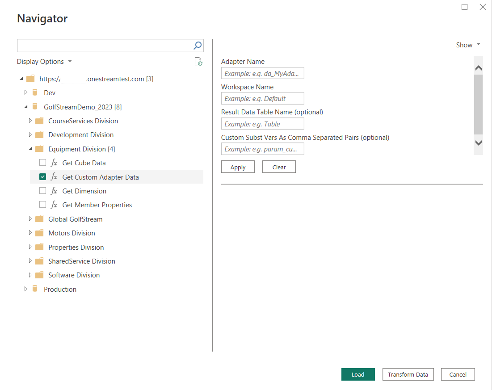

# OneStream

> [!NOTE]
> The following connector article is provided by OneStream Software, the owner of this connector and a member of the Microsoft Power Query Connector Certification Program. If you have questions regarding the content of this article or have changes you would like to see made to this article, visit the OneStream Software website and use the support channels there.

## Summary

| Item | Description |
| ---- | ----------- |
| Release State | General Availability (Beta) |
| Products | Power BI (Datasets) Power BI (Dataflows)|
| Authentication Types Supported | Organizational Account |

## Prerequisites

OneStream platform version 8.2 or higher is required.
There are [system requirements](https://www.microsoft.com/download/details.aspx?id=58494) to verify before you install Microsoft Power BI Desktop.

## Capabilities Supported

The OneStream Connector enables secure access to your OneStream applications. With the connector you can:

* Access cube and relational data from OneStream applications, directly into Power BI.
* Access metadata members and all their OneStream properties.
* Easily recreate your full hierarchy structures in Power BI
* Automate data loads to Power BI service.

## Connect to OneStream from Power BI Desktop

### Get Data

1. Open Power BI Desktop and select "Get Data"

2. Type "OneStream" in the search box to find the custom OneStream connector.

3. Select **OneStream**

4. Select **Connect**

### Configure the Connector

1. Enter your OneStream environment URL. Ensure that the Environment URL is entered with a leading **https://** (as shown in the screenshot below), otherwise, connection attempts will not work properly.

2. Click OK.

### Authenticate

1. Click OK and subsequently, **"Sign In"** to start the authentication process.

2. It will redirect and open OneStream Identity Server on your default browser for login.

3. Log in to your OneStream Account.

4. After successful login click on "Connect"

### OneStream Navigator

After successful login, OneStream Connector will show the navigator with 4 types of calls available:

* [Get Cube](#get-cube)
* [Get Custom Adapter](#get-custom-adapter)
* [Get Dimension](#get-dimension-and-get-member-properties)
* [Get Member Properties](#get-dimension-and-get-member-properties)

Refer to the [best practices](#best-practices-and-functions-help) links above if you need help configuring the functions. After selecting the function you want to use, follow through to [load the data](#load-data)

### Load Data

* Based on the requirement provide the values for the given function.
You can toggle the parameters to just the required ones or use all of them if necessary, Power BI will display a preview of data for the table that would be returned.

* After providing the parameters, click on Load or Transform the data.
  * Select **Load** to load the table into the internal Power BI Desktop data model.
  * Select **Transform data** to make changes in the table before loading it into the internal Power BI Desktop data model. **Transform data** will launch Power Query Editor in a new window with a representative view of the table.

* If you need to load additional tables, repeat the steps above of picking the function and providing the values and loading/transforming the table

* After data load to Power BI Desktop data model, you will be able to create relationships between tables as well as create reports.

### Details on OneStream Custom Connector

OneStream Connector fetches data from OneStream instance using REST (Representational State Transfer) APIs.

OneStream Connector performs all APIs calls under the permission boundary of current logged-in user, therefore applying the security defined for the user in OneStream.

> [!NOTE]
> Connector only uses READ scopes on behalf of Power BI report user to perform all operations. OneStream connector cannot perform any update operation.

OneStream Connector has a limitation of 2 million rows per call. Executing a query over this limit will trigger an error.

### Publish Power BI Reports to Power BI Service

* Click on the "Publish" button from Power BI Desktop to publish data, reports, and data model to the cloud-based Power BI Service.

* Choose the appropriate Power BI workspace and click "Select"

* After a successful publication, we will see a "Success" message with a link to navigate to the Power BI Service.

* Click on the link to view all reports from the Power BI Desktop in the Power BI Service as well as create dashboards in the Power BI Service.

## Best Practices and Functions Help

### General Best Practices

* Load only the necessary grain of data. Meaning, if you only need aggregated data at the month level, don't load data at the daily level. The smaller the model, the more performant it will always be.

* Limit the number of transformations you make. The more you complicate the query, the more chance there is for the query to fail.

* Leverage OneStream's financial logic and Cube Views/Data Adapters to create the tables that will then be loaded into Power BI. 
Example: Consolidations involve the parent entity only taking 40% of one of the child entities' values. Ensure that this logic is done in OneStream, and you load the data adapter in Power BI which already has the values populated. 
Attempting to replicate the logic in Power BI would be extremely inefficient and is better performed in the source system.

### Get Cube

This function retrieves data from a OneStream Cube.

* All the parameters can be specified via OneStream Member Script (e.g. 2023.Base for time), except View and Currency which require a single member.
* Currency refers to the Consolidation dimension in OneStream, so you can use Local or Aggregate for example.

### Get Custom Adapter

* Specify the Workspace and Adapter Name (mandatory parameters)
* Table Name and Parameters are optional
* Refer to a configured dashboard adapter inside OneStreame to make sure you are inserting the right values.

### Get Dimension and Get Member Properties

* Specify the OneStream Dimension Type you want to retrieve.
* Specify the Scenario Type. Use Default or All to use the selected cube default dimensions and retrieve the default properties.
* Include Descriptions can be set to True or False.

