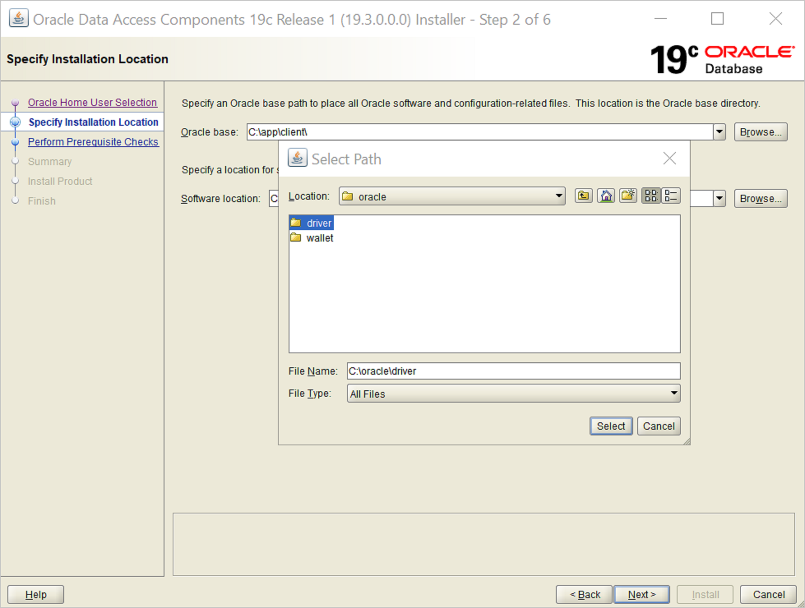
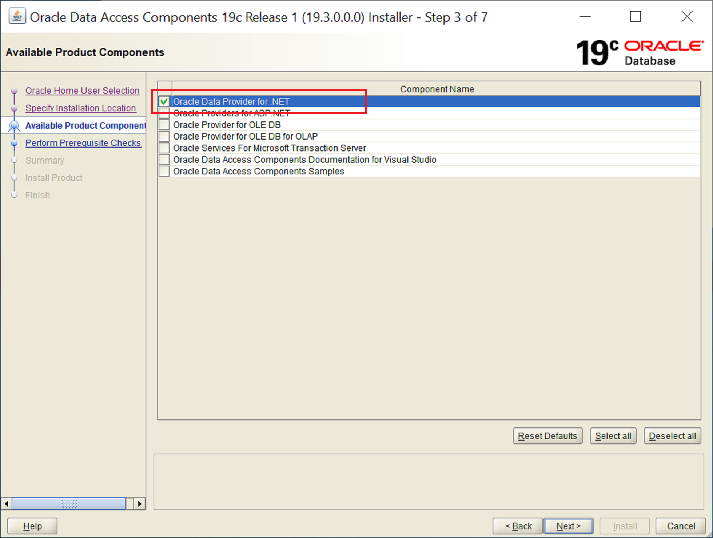
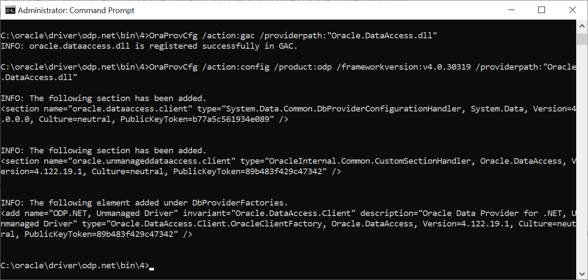

# Oracle database
 
## Summary

| Item | Description |
| ---- | ----------- |
| Release State | General Availability |
| Products | Power BI (Datasets) Power BI (Dataflows) Power Apps (Dataflows) Excel Dynamics 365 Customer Insights Analysis Services |
| Authentication Types Supported | Windows (desktop/online) Database (desktop) Basic (online) |
| Function Reference Documentation | [Oracle.Database](/powerquery-m/oracle-database) |
| | |

>[!Note]
> Some capabilities may be present in one product but not others due to deployment schedules and host-specific capabilities.

## Prerequisites

Supported Oracle versions:

* Oracle Server 9 and later
* Oracle Data Access Client (ODAC) software 11.2 and later

Before you can connect to an Oracle database using Power Query, you need to install the Oracle client software v8.1.7 or greater on your computer. To install the 32-bit Oracle client software, go to [32-bit Oracle Data Access Components (ODAC) with Oracle Developer Tools for Visual Studio (12.1.0.2.4)](https://www.oracle.com/technetwork/topics/dotnet/utilsoft-086879.html). To install the 64-bit Oracle client, go to [64-bit ODAC 12c Release 4 (12.1.0.2.4) Xcopy for Windows x64](https://www.oracle.com/technetwork/database/windows/downloads/index-090165.html).

>[!Note]
>Choose a version of Oracle Data Access Client (ODAC) that's compatible with your Oracle Server. For instance, ODAC 12.x doesn't always support Oracle Server version 9. Choose the Windows installer of the Oracle Client. During the setup of the Oracle client, make sure you enable *Configure ODP.NET and/or Oracle Providers for ASP.NET* at machine-wide level by selecting the corresponding checkbox during the setup wizard. Some versions of the Oracle client wizard selects the checkbox by default, others do'nt. Make sure that checkbox is selected so that Power Query can connect to your Oracle database.

To connect to an Oracle database with the [on-premises data gateway](/data-integration/gateway/), the correct Oracle client software must be installed on the computer running the gateway. The Oracle client software you use depends on the Oracle server version, but always matches the 64-bit gateway. For more information, go to [Manage your data source - Oracle](/power-bi/connect-data/service-gateway-onprem-manage-oracle).

## Capabilities Supported

* Import
* DirectQuery
* Advanced options
  * Command timeout in minutes
  * SQL statement
  * Include relationship columns
  * Navigate using full hierarchy

## Connect to an Oracle database from Power Query Desktop

To make the connection, take the following steps:

1. Select the **Oracle database** option in the connector selection.

2. Specify the Oracle Server to connect to in **Server**. If a SID is required, specify it by using the format *ServerName/SID*, where *SID* is the unique name of the database. If the *ServerName/SID* format doesn't work, use *ServerName/ServiceName*, where *ServiceName* is the alias you use to connect.

   

   >[!Note]
   > If you are using a local database, or autonomous database connections, you may need to place the server name in quotation marks to avoid connection errors.

3. If you're connecting from Power BI Desktop, select either the **Import** or **DirectQuery** data connectivity mode. The rest of these example steps use the Import data connectivity mode. To learn more about DirectQuery, go to [Use DirectQuery in Power BI Desktop](/power-bi/connect-data/desktop-use-directquery).

4. If you're connecting to this Oracle database for the first time, select the authentication type you want to use, and then enter your credentials. For more information about authentication, go to [Authentication with a data source](../connectorauthentication.md).

   

5. In **Navigator**, select the data you require, then either select **Load** to load the data or **Transform Data** to transform the data.

## Connect to an Oracle database from Power Query Online

To make the connection, take the following steps:

1. Select the **Oracle database** option in the data sources selection.

2. In the **Oracle database** dialog that appears, specify the Oracle Server to connect to in **Server**. If a SID is required, specify it by using the format *ServerName/SID*, where *SID* is the unique name of the database. If the *ServerName/SID* format doesn't work, use *ServerName/ServiceName*, where *ServiceName* is the alias you use to connect.

   

3. Select the name of your on-premises data gateway.

   > [!Note]
   > You must select an on-premises data gateway for this connector, whether the Oracle database is on your local network or on a web site.

4. If you're connecting to this Oracle database for the first time, select the type of credentials for the connection in **Authentication kind**. Choose **Basic** if you plan to use an account that's created within Oracle instead of Windows authentication.

5. Enter your credentials.

6. Select **Next** to continue.

7. In **Navigator**, select the data you require, then select **Transform data** to transform the data in Power Query Editor.

## Connect to an Oracle Autonomous Database

>[!Note]
>Currently, you can connect to an Oracle Autonomous Database from Excel, Power BI Desktop, Power BI service, and Power Apps using the procedures in this section.

To connect to an Oracle Autonomous Database, you need the following accounts and apps:

* An Oracle.com account ([Get an Oracle.com Account](https://docs.oracle.com/en/cloud/get-started/subscriptions-cloud/csgsg/get-oracle-com-account.html))
* An Oracle Cloud account ([About Oracle Cloud Accounts](https://docs.oracle.com/en/cloud/get-started/subscriptions-cloud/csgsg/oracle-cloud-accounts.html))
* An Oracle Autonomous Database ([Oracle Autonomous Database](https://www.oracle.com/ie/autonomous-database/))
* Power BI Desktop ([Get Power BI Desktop](/power-bi/fundamentals/desktop-get-the-desktop))
* Power BI service account ([Licensing the Power BI service for users in your organization](/power-bi/admin/service-admin-licensing-organization))
* On-premises data gateway ([Download and install a standard gateway](/data-integration/gateway/service-gateway-install#download-and-install-a-standard-gateway))

### Download your client credentials

The first step in setting up a connection to the Oracle Autonomous database is to download your client credentials.

To download your client credentials:

1. In your Oracle Autonomous database details page, select **DB Connection**.

   

2. From the **Database Connection** page, select **Download Wallet**.

   

3. Enter a password you would like to use with this wallet, confirm the password, then select **Download**.

   

### Download and install the Oracle Data Access Components runtime

1. Go to the [Oracle Data Access Components Runtime Downloads](https://www.oracle.com/database/technologies/dotnet-odacdeploy-downloads.html) page.

2. If you're using a 64-bit version of Power BI Desktop, under **64-bit ODAC OUI**, select the latest version of the ODAC installer, which is currently **64-bit ODAC 19.3.1**. If you're using a 32-bit version of Power BI Desktop, go to the download page for the 32-bit version from the link on the Oracle page. We recommend that you use the 64-bit version of Power BI Desktop. The examples in this article use the 64-bit version.

3. Review and accept the Oracle license agreement, then select **Download ODAC1931_x64.zip**.

4. You're asked to sign in to your Oracle account. This account might be different from your Oracle Cloud account, so be sure to enter the correct user name and password.

   The Oracle ODAC OUI zip file is then downloaded to your Windows default download location.

5. From the default download location, extract the files from the zip file and place them in a convenient folder of your choice.

6. Open a Windows command prompt (cmd.exe) in administrator mode.

7. In the command prompt, navigate to the folder where you extracted the ODAC OUI files.

8. Run setup.exe.

9. In **Specify Oracle Home User**, select **Use Windows Built-in Account**. Then select **Next**.

   

10. In **Specify Installation Location**, select the location for the Oracle base folder. Select **Browse** to browse to the folder you want to use, then select **Select**. Then select **Next**.

    

11. In **Available Product Components**, only select **Oracle Data Provider for .NET**. Then select **Next**.

    

12. The installer then performs some prerequisite checks to ensure your system meets the minimum installation and configuration requirements. Once this check is finished, select **Next**.

13. The installer then presents a summary of the actions it's going to take. To continue, select **Install**.

14. Once the installer has finished installing all of your driver components, select **Close**.

### Configure the unmanaged ODP.NET

1. In the command prompt, go to \<_install-folder_\>\odp.net\bin\4. In this example, the location is `c:\oracle\driver\odp.net\bin\4`.

2. Enter the following commands:

   `OraProvCfg /action:gac /providerpath:"Oracle.DataAccess.dll"`

   `OraProvCfg /action:config /product:odp /frameworkversion:v4.0.30319 /providerpath:"Oracle.DataAccess.dll"`

   

### Set the environment variables

1. Search for **Environment Variables** in the Windows Start menu **Search** option, and select **Edit the system environment variables**.

2. From **System Properties**, select **Environment Variables**.

3. In **Environment Variables**, under **System variables**, select **New**.

4. In **New System Variable**, enter `TNS_ADMIN` in **Variable name**, and the location where you'll unzip your ADB wallet in **Variable value**. Then select **OK**.

5. Select **OK**.

6. In **Environment Variables**, select **OK**.

7. In **System Properties**, select **OK**.

### Configure Oracle ADB credentials

1. On your Windows machine, go to the folder where you downloaded your Oracle ADB credentials from [Download your client credentials](#download-your-client-credentials).

2. Unzip the credentials into a folder. In this example, the credentials are extracted to c:\data\wallet\wallet_contosomart.

   

   >[!Note]
   >The tnsnames.ora file is used to connect to Oracle autonomous databases.

3. Open sqlnet.ora in an editor, such as Notepad.

4. Under **WALLET_LOCATION**, change the path to your wallet folder under the Directory option. In this example:

   `WALLET_LOCATION = (SOURCE = (METHOD = file) (METHOD_DATA = (DIRECTORY="c:\data\wallet\Wallet_ContosoMart")))`

5. Save and close the sqlnet.ora file.

Open the tnsnames.ora file in the wallets folder. The file contains a list of ADB net service names that you can connect to. In this example, the names are contosomart_high, contosomart_low, and contosomart_medium. Your ADB net service names will be different.

   

### Initial test of the connection

1. Open Power BI Desktop.

2. Select **Get Data**.

3. From **Get Data**, select **Database** > **Oracle database**.

4. Enter the name of the Oracle Autonomous Database server you want to connect to. In this example, the server is contosomart_high. Then select **OK**.

   

5. If you're signing in to this server from Power BI Desktop for the first time, you're asked to enter your credentials. Select **Database**, then enter the user name and password for the Oracle database. The credentials you enter here are the user name and password for the specific Oracle Autonomous Database you want to connect to. In this example, the database's initial administrator user name and password are used. Then select **Connect**.

   

At this point, the **Navigator** appears and displays the connection data.

You might also come across one of several errors because the configuration hasn't been properly set up. These errors are discussed in [Troubleshooting](#troubleshooting).

One error that might occur in this initial test takes place in **Navigator**, where the database appears to be connected, but contains no data. Instead, an Oracle: ORA-28759: failure to open file error appears in place of the data.

If this error occurs, be sure that the wallet folder path you supplied in sqlnet.ora is the full and correct path to the wallet folder.

### Configure the gateway

1. In Power BI service, select the gear icon in the upper right-hand side, then select **Manage gateways**.

   

2. In **Add Data Source**, select **Add data sources to use the gateway**.

   

3. In **Data Source Name**, enter the name you want to use as the data source setting.

4. In **Data Source Type**, select **Oracle**.

5. In **Server**, enter the name of the Oracle Autonomous Database server.

6. In **Authentication Method**, select **Basic**.

7. Enter the user name and password for the Oracle Autonomous Database. In this example, the default database administrator user name and password are used.

8. Select **Add**.

   

If everything has been installed and configured correctly, a **Connection Successful** message appears. You can now connect to the Oracle Autonomous Database using the steps described in [Connect to an Oracle database from Power Query Online](#connect-to-an-oracle-database-from-power-query-online).

## Connect using advanced options

Power Query Desktop and Power Query Online provide a set of advanced options that you can add to your query if needed.

The following table lists all of the advanced options you can set in Power Query Desktop and Power Query Online.

| Advanced option | Description |
| --------------- | ----------- |
| Command timeout in minutes | If your connection lasts longer than 10 minutes (the default timeout), you can enter another value in minutes to keep the connection open longer. This option is only available in Power Query Desktop. |
| SQL statement | For information, go to [Import data from a database using native database query](../native-database-query.md). |
| Include relationship columns | If checked, includes columns that might have relationships to other tables. If this box is cleared, these columns don't appear. |
| Navigate using full hierarchy | If checked, the navigator displays the complete hierarchy of tables in the database you're connecting to. If cleared, the navigator displays only the tables whose columns and rows contain data. |
| | |

Once you've selected the advanced options you require, select **OK** in Power Query Desktop or **Next** in Power Query Online to connect to your Oracle database.

## Known issues and limitations

Power BI sessions might still active on your Oracle database for approximately 30 minutes after a dataset refresh to that Oracle database. Only after approximately 30 minutes do those sessions become inactive/removed on the Oracle database. This behavior is by design.

## Troubleshooting

You might come across any of several errors from Oracle when the naming syntax is either incorrect or not configured properly:

* ORA-12154: TNS: could not resolve the connect identifier specified.
* ORA-12514: TNS: listener does not currently know of service requested in connect descriptor.
* ORA-12541: TNS: no listener.
* ORA-12170: TNS: connect timeout occurred.
* ORA-12504: TNS: listener was not given the SERVICE_NAME in CONNECT_DATA.

These errors might occur if the Oracle client either isn't installed or isn't configured properly. If it's installed, verify the tnsnames.ora file is properly configured and you're using the proper net_service_name. You also need to make sure the net_service_name is the same between the machine that uses Power BI Desktop and the machine that runs the gateway. More information: [Prerequisites](#prerequisites)

You might also come across a compatibility issue between the Oracle server version and the Oracle Data Access Client version. Typically, you want these versions to match, as some combinations are incompatible. For instance, ODAC 12.x doesn't support Oracle Server version 9.

If you downloaded Power BI Desktop from the Microsoft Store, you might be unable to connect to Oracle databases because of an Oracle driver issue. If you come across this issue, the error message returned is: *Object reference not set.* To address the issue, do one of these steps:

* Download Power BI Desktop from the Download Center instead of Microsoft Store.

* If you want to use the version from Microsoft Store: on your local computer, copy oraons.dll from *12.X.X\client_X* to *12.X.X\client_X\bin*, where *X* represents version and directory numbers.

If the *Object reference not set* error message occurs in Power BI when you connect to an Oracle database using the on-premises data gateway, follow the instructions in [Manage your data source - Oracle](/power-bi/connect-data/service-gateway-onprem-manage-oracle).

If you're using Power BI Report Server, consult the guidance in the [Oracle Connection Type](/sql/reporting-services/report-data/oracle-connection-type-ssrs) article.

## Next steps

[Optimize Power Query when expanding table columns](../optimize-expanding-table-columns.md)