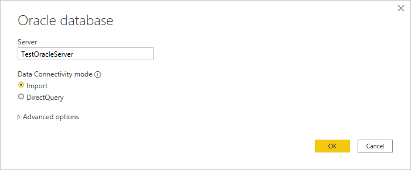
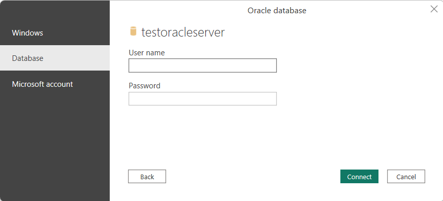
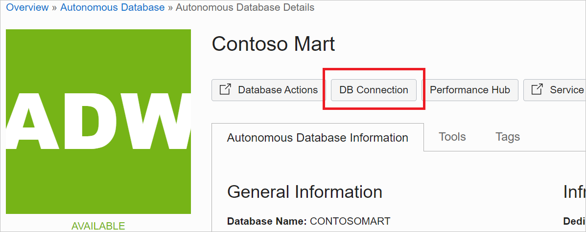
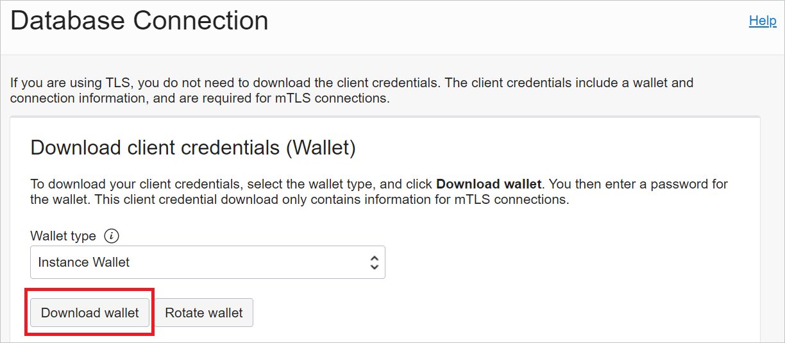
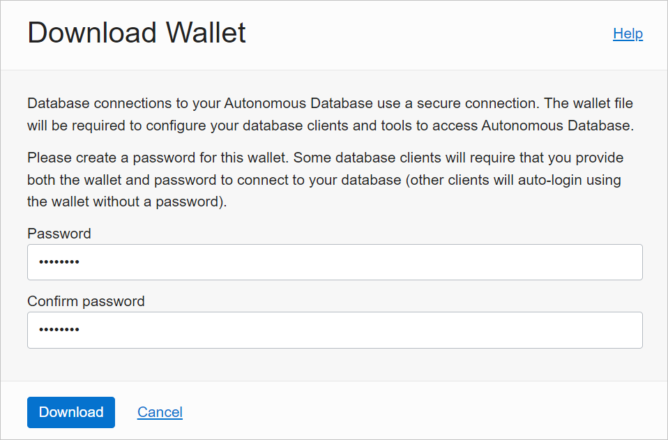
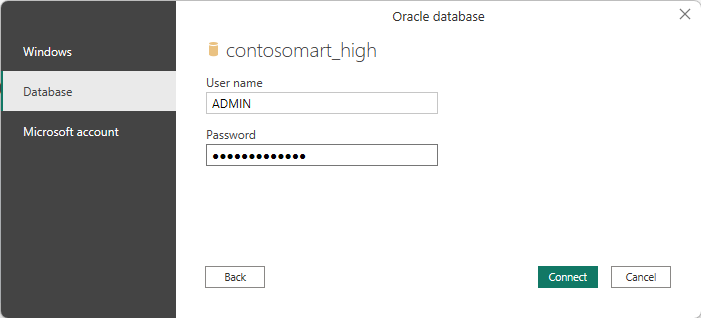
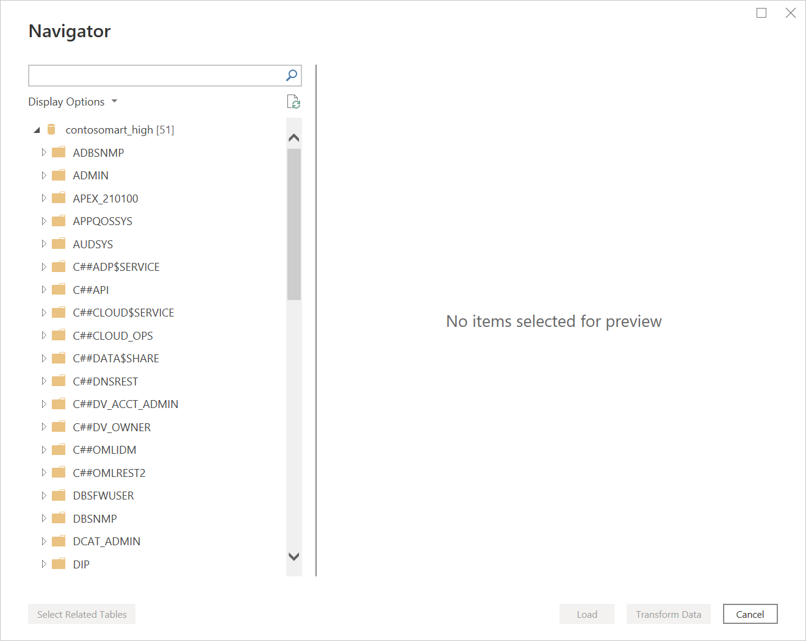
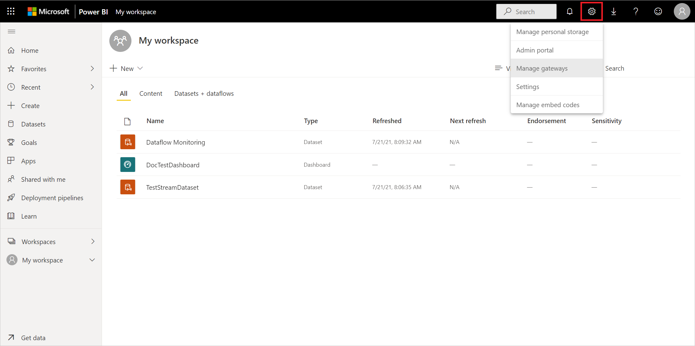
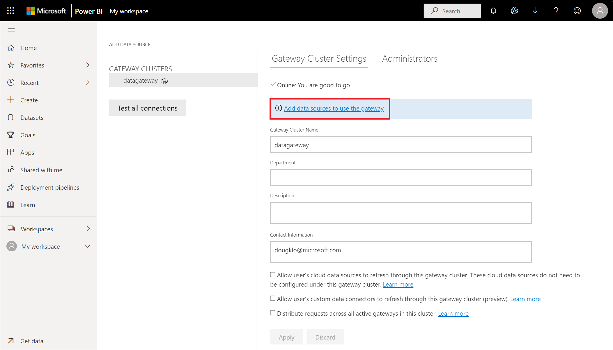
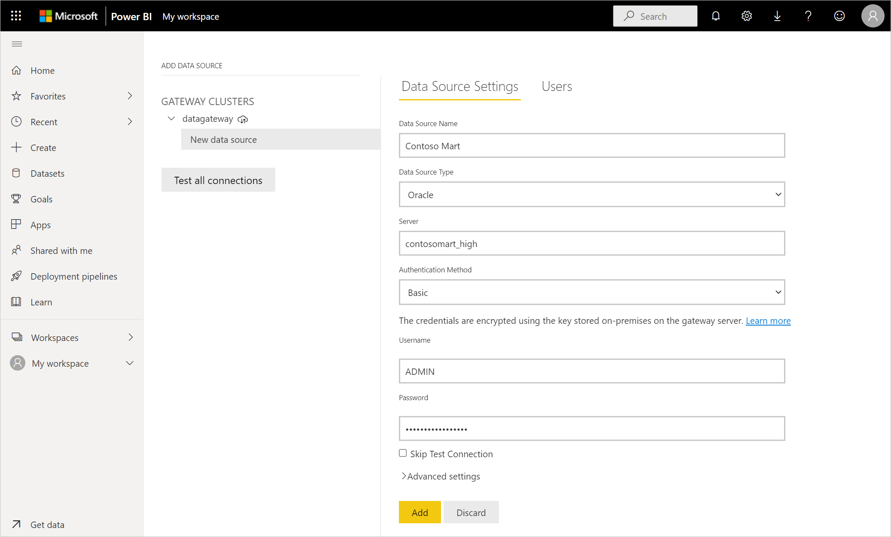

# Oracle database

## Summary

| Item | Description |
| ---- | ----------- |
| Release State | General Availability |
| Products | Excel Power BI (Datasets) Power BI (Dataflows) Fabric (Dataflow Gen2) Power Apps (Dataflows) Dynamics 365 Customer Insights Analysis Services |
| Authentication Types Supported | Windows (desktop/online) Database (desktop) Basic (online)  Azure Active Directory (desktop/online)|
| Function Reference Documentation | [Oracle.Database](/powerquery-m/oracle-database) |

>[!Note]
> Some capabilities may be present in one product but not others due to deployment schedules and host-specific capabilities.

## Prerequisites

Supported Oracle versions:

* Oracle Database Server 12c (12.1.0.2) and later
* Oracle Autonomous Database - all versions

Before you can connect to an Oracle database using Power Query, you need to install the Oracle Client for Microsoft Tools (OCMT). 

To connect to an Oracle database with the [on-premises data gateway](/data-integration/gateway/), 64-bit OCMT must be installed on the computer running the gateway. For more information, go to [Manage your data source - Oracle](/power-bi/connect-data/service-gateway-onprem-manage-oracle).

## Capabilities Supported

* Import
* DirectQuery (Power BI Datasets)
* Advanced options
  * Command timeout in minutes
  * SQL statement
  * Include relationship columns
  * Navigate using full hierarchy

## Download and install Oracle Client for Microsoft Tools
Oracle Client for Microsoft Tools installs and configures Oracle Data Provider for .NET (ODP.NET) to support 32-bit and 64-bit Microsoft tool connections with Oracle on-premises and cloud databases, including Oracle Autonomous Database (ADB). OCMT is a graphical installer that automates the Oracle Database Client setup process. It supports connecting with Power BI Desktop, Power BI service, Excel, SQL Server Analysis Services, SQL Server Data Tools, SQL Server Integration Services, SQL Server Reporting Services, and BizTalk Server.

OCMT is free software. It can be downloaded from the Oracle Client for Microsoft Tools page. For 64-bit Power BI Desktop and Power BI service, use 64-bit OCMT. For 32-bit Power BI Desktop, use 32-bit OCMT.

Even if you already have an Oracle Client or ODP.NET installed on your Power BI client, it is highly recommended you use the OCMT installer to properly complete all the configuration steps Power BI requires to work with Oracle database.
*	[OCMT 64-bit and 32-bit downloads](https://www.oracle.com/database/technologies/appdev/ocmt.html)
*	[OCMT installation and setup instructions](https://www.oracle.com/a/ocom/docs/database/oracle-client-for-microsoft-tools-install-instructions.pdf)

## Connect to an on-premises Oracle database from Power Query Desktop

To make the connection, take the following steps:

1. Select the **Oracle database** option in the connector selection.

2. Specify the Oracle net service name/TNS alias or Easy Connect (Plus) connection string to connect to in **Server**. Easy Connect is the simplest to use by setting the **Server** value to your Oracle Database server *Hostname/ServiceName*, where *ServiceName* is the global database name. The screen shot below uses a net service name.

   

3. If you're connecting from Power BI Desktop, select either the **Import** or **DirectQuery** data connectivity mode. The rest of these example steps use the Import data connectivity mode. To learn more about DirectQuery, go to [Use DirectQuery in Power BI Desktop](/power-bi/connect-data/desktop-use-directquery).

4. If you're connecting to this Oracle database for the first time, select the authentication type you want to use, and then enter your credentials. The authentication types available are:
* Windows authentication (Windows)
* Username and password (Database)
* Azure Active Directory (Microsoft account)

For more information about authentication, go to [Authentication with a data source](../connectorauthentication.md).

   

5. In **Navigator**, select the data you require, then either select **Load** to load the data or **Transform Data** to transform the data.

## Connect to an on-premises Oracle database from Power Query Online

To make the connection, take the following steps:

1.	[Install and setup an on-premises data gateway](/data-integration/gateway/service-gateway-install#download-and-install-a-standard-gateway).

2. From Power Query Online, select the **Oracle database** option in the data sources selection.

3. In the **Oracle database** dialog that appears, specify the Oracle net service name/TNS alias, Easy Connect Plus connection string, or connect descriptor to connect to in **Server**.

   

4. Provide a **Connection name**, such as "testoracleserver".

5. Select the name of your on-premises data gateway.

   > [!Note]
   > You must select an on-premises data gateway for this connector, whether the Oracle database is on your local network or on a web site.

6. If you're connecting to this Oracle database for the first time, select the type of credentials for the connection in **Authentication kind**. Choose **Basic** if you plan to login with an Oracle username and password. Choose **Windows** when using Windows operating system authentication and with both the Oracle client and server running on Windows.

6. Enter your credentials.

7. Select **Next** to continue.

8. In **Navigator**, select the data you require, then select **Transform data** to transform the data in Power Query Editor.

## Connect to an Oracle Autonomous Database

>[!Note]
>Currently, you can connect to an Oracle Autonomous Database from Excel, Power BI Desktop, Power BI service, Power Apps, SQL Server Analysis Services, and BizTalk Server using the procedures in this section. These tools use unmanaged ODP.NET to connect. Other Microsoft tools, including SQL Server Data Tools, SQL Server Integration Services, and SQL Server Reporting Services, use managed ODP.NET to connect to Oracle Autonomous Database using largely similar procedures.

To connect Power BI to an Oracle Autonomous Database, you need the following accounts and apps:

* An Oracle.com account ([Oracle.com Account Signup](https://profile.oracle.com/myprofile/account/create-account.jspx))
* An Oracle Cloud account ([Oracle Cloud Account Signup](http://signup.cloud.oracle.com/))
* An Oracle Autonomous Database ([Get an Always Free Autonomous Database](https://docs.oracle.com/en/cloud/paas/autonomous-database/adbsa/autonomous-always-free.html))
* Power BI Desktop ([Get Power BI Desktop](/power-bi/fundamentals/desktop-get-the-desktop)) or Power BI service account ([Licensing the Power BI service for users in your organization](/power-bi/admin/service-admin-licensing-organization))
* On-premises data gateway if using Power BI service ([Download and install a standard gateway](/data-integration/gateway/service-gateway-install#download-and-install-a-standard-gateway))

### Download your client credentials

The first step in setting up a connection to the Oracle Autonomous database is to download your client credentials.

To download your client credentials:

1. In your Oracle Autonomous database details page, select **DB Connection**.

   

2. From the **Database Connection** page, select **Download Wallet**.

   

3. Enter a password you would like to use with this wallet, confirm the password, then select **Download**.

   

### Configure Oracle ADB credentials

1. On your Windows machine, go to the folder where you downloaded your Oracle ADB credentials from [Download your client credentials](#download-your-client-credentials).

2. Unzip the credentials into the directory you specified in OCMT as the *Oracle Configuration File Directory*. In this example, the credentials are extracted to c:\data\wallet\wallet_contosomart.

   

   >[!Note]
   >The tnsnames.ora file defines your Oracle Autonomous Database address and connection information.

3. Open sqlnet.ora in an editor, such as Notepad.

4. Under **WALLET_LOCATION**, change the path to your wallet folder under the Directory option. In this example:

   `WALLET_LOCATION = (SOURCE = (METHOD = file) (METHOD_DATA = (DIRECTORY=c:\data\wallet\Wallet_ContosoMart)))`

5. Save and close the sqlnet.ora file.

Open the tnsnames.ora file in the wallets folder. The file contains a list of ADB net service names that you can connect to. In this example, the names are contosomart_high, contosomart_low, and contosomart_medium. Your ADB net service names will be different.

   

### Connect Power BI Desktop to Oracle ADB

1. Open Power BI Desktop.

2. Select **Get Data**.

3. From **Get Data**, select **Database** > **Oracle database**.

4. Enter the net service name of the Oracle Autonomous Database server you want to connect to. In this example, the **Server** is contosomart_high. Then select **OK**.

   

5. If you're signing in to this server from Power BI Desktop for the first time, you're asked to enter your credentials. Select **Database**, then enter the user name and password for the Oracle database. The credentials you enter here are the user name and password for the specific Oracle Autonomous Database you want to connect to. In this example, the database's initial administrator user name and password are used. Then select **Connect**.

   

   >[!Note]
   >You can use Azure Active Directory authentication to sign-on to Oracle Autonomous Database via the **Microsoft account** option.

At this point, the **Navigator** appears and displays the connection data.

You might also come across one of several errors because the configuration hasn't been properly set up. These errors are discussed in [Troubleshooting](#troubleshooting).

One error that might occur in this initial test takes place in **Navigator**, where the database appears to be connected, but contains no data. Instead, an Oracle: ORA-28759: failure to open file error appears in place of the data.

If this error occurs, be sure that the wallet folder path you supplied in sqlnet.ora is the full and correct path to the wallet folder.

### Configure the gateway

1. [Install and setup an on-premises data gateway](/data-integration/gateway/service-gateway-install#download-and-install-a-standard-gateway).
2. In Power BI service, select the gear icon in the upper right-hand side, then select **Manage gateways**.

   

3. In **Add Data Source**, select **Add data sources to use the gateway**.

   

4. In **Data Source Name**, enter the name you want to use as the data source setting.

5. In **Data Source Type**, select **Oracle**.

6. In **Server**, enter the net service name of the Oracle Autonomous Database server to connect to.

7. In **Authentication Method**, select **Basic**.

8. Enter the user name and password for the Oracle Autonomous Database. In this example, the default database administrator user name (ADMIN) and password are used.

9. Select **Add**.

   

If everything has been installed and configured correctly, a **Connection Successful** message appears. You can now connect to the Oracle Autonomous Database using the same steps described in [Connect to an on-premises Oracle database from Power Query Online](power-query/connectors/oracle-database#connect-to-an-oracle-database-from-power-query-online).

## Connect using advanced options

Power Query Desktop and Power Query Online provide a set of advanced options that you can add to your query if needed.

The following table lists all of the advanced options you can set in Power Query Desktop and Power Query Online.

| Advanced option | Description |
| --------------- | ----------- |
| Command timeout in minutes | If your connection lasts longer than 10 minutes (the default timeout), you can enter another value in minutes to keep the connection open longer. This option is only available in Power Query Desktop. |
| SQL statement | For information, go to [Import data from a database using native database query](../native-database-query.md). |
| Include relationship columns | If checked, includes columns that might have relationships to other tables. If this box is cleared, these columns don't appear. |
| Navigate using full hierarchy | If checked, the navigator displays the complete hierarchy of tables in the database you're connecting to. If cleared, the navigator displays only the tables whose columns and rows contain data. |

Once you've selected the advanced options you require, select **OK** in Power Query Desktop or **Next** in Power Query Online to connect to your Oracle database.

## Known issues and limitations

Power BI sessions can still be active on your Oracle database for approximately 30 minutes after a dataset refresh to that Oracle database. Only after approximately 30 minutes do those sessions become inactive/removed on the Oracle database. This behavior is by design.

## Troubleshooting

You might come across any of several errors from Oracle when the naming syntax is either incorrect or not configured properly:

* ORA-12154: TNS: could not resolve the connect identifier specified.
* ORA-12514: TNS: listener does not currently know of service requested in connect descriptor.
* ORA-12541: TNS: no listener.
* ORA-12170: TNS: connect timeout occurred.
* ORA-12504: TNS: listener was not given the SERVICE_NAME in CONNECT_DATA.

These errors might occur if the Oracle tnsnames.ora database connect descriptor is misconfigured, the net service name provided is misspelled, or the Oracle database listener is not running or not reachable, such as a firewall blocking the listener or database port. Be sure you are meeting the minimum installation prerequisites. More information: [Prerequisites](#prerequisites)

Visit the [Oracle Database Error Help Portal](https://docs.oracle.com/en/error-help/db/) to review common causes and resolutions for the specific Oracle error you encounter. Enter your Oracle error in the portal search bar.

If you downloaded Power BI Desktop from the Microsoft Store, you might be unable to connect to Oracle databases because of an Oracle driver issue. If you come across this issue, the error message returned is: *Object reference not set.* To address the issue, do the following:

* Download Power BI Desktop from the Download Center instead of Microsoft Store.

If the *Object reference not set* error message occurs in Power BI when you connect to an Oracle database using the on-premises data gateway, follow the instructions in [Manage your data source - Oracle](/power-bi/connect-data/service-gateway-onprem-manage-oracle).

If you're using Power BI Report Server, consult the guidance in the [Oracle Connection Type](/sql/reporting-services/report-data/oracle-connection-type-ssrs) article.

## Next steps

[Optimize Power Query when expanding table columns](../optimize-expanding-table-columns.md)
