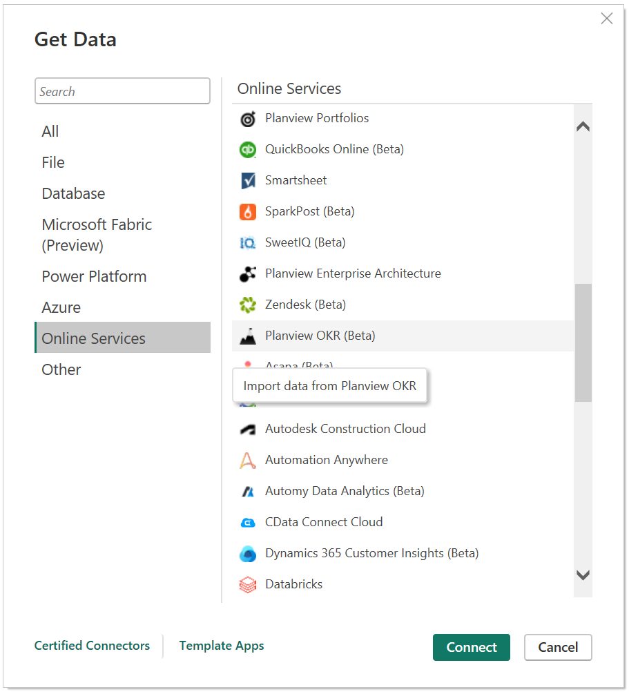
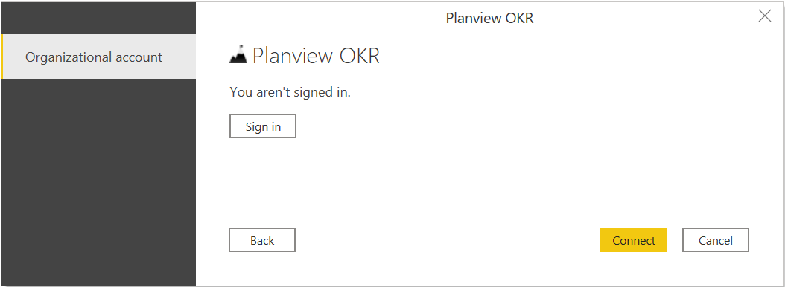
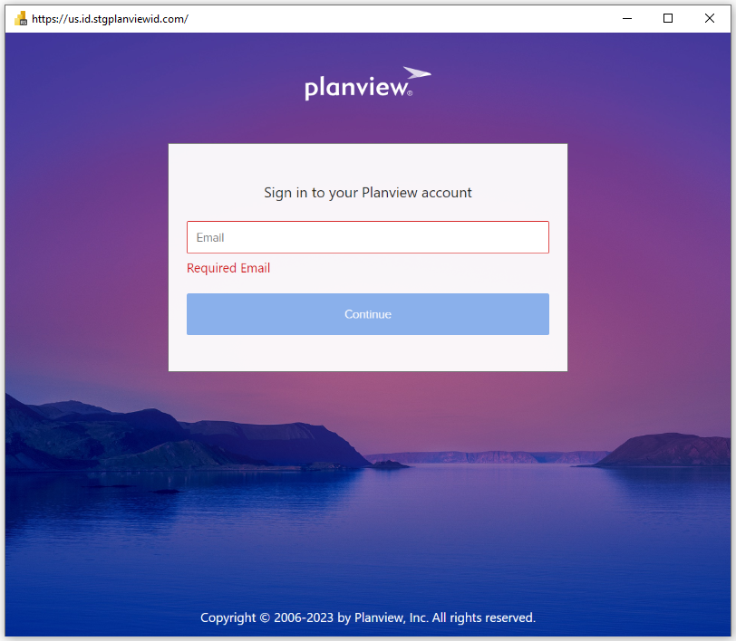
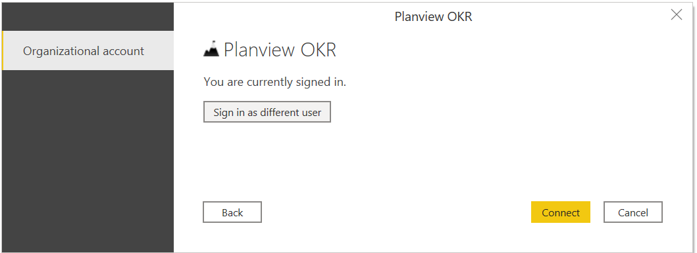

# Planview OKR (Beta)

## Summary

| Item | Description |
| ---- | ----------- |
| Release State | Preview |
| Products | Power BI (Datasets)   Power BI (Datasets)|
| Authentication Types Supported | Planview Admin account |
| | |

## Prerequisites

Before you can sign in to Planview OKR, you must have a Planview Admin account.

## Capabilities Supported

* Import

## Connect to Planview OKR data

To connect to Planview OKR data:

1. Select **Get Data** from the **Home** ribbon in Power BI Desktop. Select **Online Services** from the categories on the left, select **Planview OKR (Beta)**, and then select **Connect**.

   

2. If this is the first time you're getting data through the Planview OKR connector, a preview connector notice will be displayed. Select **Don't warn me again with this connector** if you don't want this message to be displayed again, and then select **Continue**.

3. Enter the Planview OKR OData URL location that you want to access, and the select **OK**.

   

4. To sign in to your Planview Admin account, select **Sign in**.

   

5. In the Planview OKR window that appears, provide your credentials to sign in to your Planview OKR account.

   

6. Select **Sign in**.

7. Once you've successfully signed in, select **Connect**.

   

8. In **Navigator**, select the information you want, then either select **Load** to load the data or **Transform Data** to continue transforming the data in Power Query Editor.

## Load data from Planview OKR in Power Query Online

To load data from Planview OKR in Power Query Online:

1. Select the **Planview OKR (Beta)** option in the connector selection.

2. In the dialog that appears, enter the Planview OKR URL location in the text box and the rest of details like below.

   

3. If this is the first time you're connecting using Planview OKR (Beta), you will need to sign in into your Planview Admin account.
4. 
    
5. After you sign in, click on the Next button.

6. In Navigator, select the data you require, then select Transform data to transform the data in Power Query Editor.
