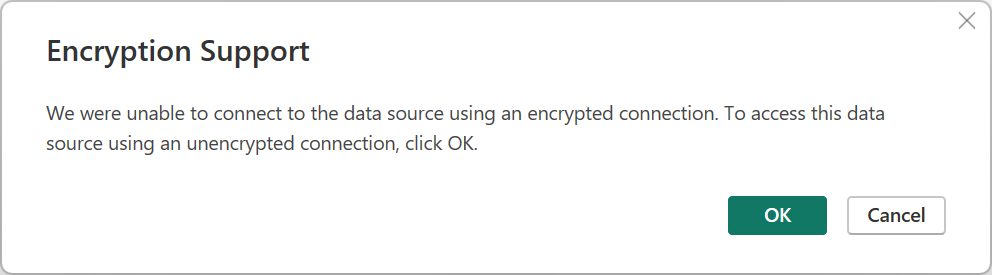
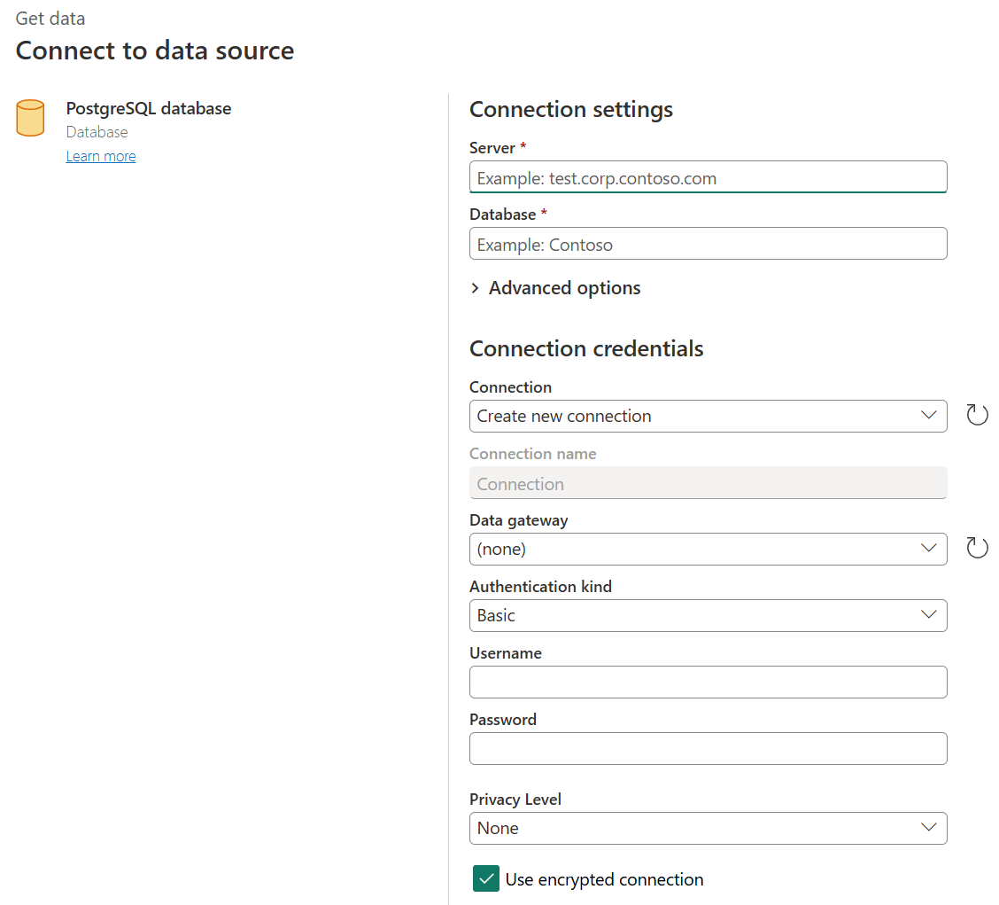

# PostgreSQL

## Summary

| Item | Description |
| ---- | ----------- |
| Release State | General Availability |
| Products | Excel Power BI (Datasets) Power BI (Dataflows) Fabric (Dataflow Gen2) Power Apps (Dataflows) Dynamics 365 Customer Insights Analysis Services |
| Authentication Types Supported | Database (Username/Password) |
| Function Reference Documentation | [PostgreSQL.Database](/powerquery-m/postgresql-database) |

> [!NOTE]
> Some capabilities may be present in one product but not others due to deployment schedules and host-specific capabilities.

## Prerequisites

As of the December 2019 release, NpgSQL 4.0.10 shipped with Power BI Desktop and no additional installation is required. GAC Installation overrides the version provided with Power BI Desktop, which will be the default. Refreshing is supported both through the cloud in the Power BI service and also on premise through the on-premise data gateway. To refresh data from the Power BI service without an on-premise data gateway, PostgreSQL must be hosted in a manner that allows direct connection from the Power BI services on Azure. This is natively supported for PostgreSQL hosted in Microsoft Azure. For other hosting environments, consult your hosting provider about configuring your PostgreSQL for direct access from the internet. If PostgreSQL is configured so that it can't be directly accessed from the internet (recommended for security), you'll need to use an on-premise data gateway for refreshes. In the Power BI service, NpgSQL 4.0.10 will be used, while on premise refresh will use the local installation of NpgSQL, if available, and otherwise use NpgSQL 4.0.10.

For Power BI Desktop versions released before December 2019, you must install the NpgSQL provider on your local machine. To install the NpgSQL provider, go to the [releases page](https://github.com/npgsql/Npgsql/releases), search for v4.0.10, and download and run the .msi file. The provider architecture (32-bit or 64-bit) needs to match the architecture of the product where you intend to use the connector. When installing, make sure that you select NpgSQL GAC Installation to ensure NpgSQL itself is added to your machine.

**We recommend NpgSQL 4.0.10. NpgSQL 4.1 and up won't work due to .NET version incompatibilities.**

For Power Apps, you must install the NpgSQL provider on your local machine. To install the NpgSQL provider, go to the [releases page](https://github.com/npgsql/Npgsql/releases) and download the relevant version. **Download and run the installer (the NpgSQL-[version number].msi) file**. Ensure you select the NpgSQL GAC Installation and on completion restart your machine for this installation to take effect.

## Capabilities Supported

- Import
- DirectQuery (Power BI Datasets)
- Advanced options
  - Command timeout in minutes
  - Native SQL statement
  - Relationship columns
  - Navigate using full hierarchy

## Connect to a PostgreSQL database from Power Query Desktop

Once the matching Npgsql provider is installed, you can connect to a PostgreSQL database. To make the connection, take the following steps:

1. Select the **PostgreSQL database** option in the connector selection.

2. In the **PostgreSQL database** dialog that appears, provide the name of the server and database.

   

3. Select either the **Import** or **DirectQuery** data connectivity mode.

4. If this is the first time you're connecting to this database, input your PostgreSQL credentials in the **User name** and **Password** boxes of the **Database** authentication type. Select the level to apply the authentication settings to. Then select **Connect**.

    

   For more information about using authentication methods, go to [Authentication with a data source](../connectorauthentication.md).

   >[!Note]
   > If the connection is not encrypted, you'll be prompted with the following message.

   

   Select **OK** to connect to the database by using an unencrypted connection, or follow the instructions in [Enable encrypted connections to the Database Engine](/sql/database-engine/configure-windows/enable-encrypted-connections-to-the-database-engine) to set up encrypted connections to PostgreSQL database.

5. In **Navigator**, select the database information you want, then either select **Load** to load the data or **Transform Data** to continue transforming the data in Power Query Editor.

   

## Connect to a PostgreSQL database from Power Query Online

To make the connection, take the following steps:

1. Select the **PostgreSQL database** option in the connector selection.

2. In the **PostgreSQL database** dialog that appears, provide the name of the server and database.

   

3. Select the name of the on-premises data gateway you want to use.

4. Select the **Basic** authentication kind and input your PostgreSQL credentials in the **Username** and **Password** boxes.

5. If your connection isn't encrypted, clear **Use Encrypted Connection**.

6. Select **Next** to connect to the database.

7. In **Navigator**, select the data you require, then select **Transform data** to transform the data in Power Query Editor.

## Connect using advanced options

Power Query Desktop provides a set of advanced options that you can add to your query if needed.

The following table lists all of the advanced options you can set in Power Query Desktop.

| Advanced option | Description |
| --------------- | ----------- |
| Command timeout in minutes | If your connection lasts longer than 10 minutes (the default timeout), you can enter another value in minutes to keep the connection open longer. This option is only available in Power Query Desktop. |
| SQL statement | For information, go to [Import data from a database using native database query](../native-database-query.md). |
| Include relationship columns | If checked, includes columns that might have relationships to other tables. If this box is cleared, you won’t see those columns. |
| Navigate using full hierarchy | If checked, the navigator displays the complete hierarchy of tables in the database you're connecting to. If cleared, the navigator displays only the tables whose columns and rows contain data. |

Once you've selected the advanced options you require, select **OK** in Power Query Desktop to connect to your PostgreSQL database.

## Native query folding

By default, native query folding is enabled. Operations that are capable of folding will be applied on top of your native query according to normal Import or Direct Query logic. Native Query folding isn't applicable with optional parameters present in [Value.NativeQuery()](/powerquery-m/value-nativequery).

In the rare case that folding doesn't work with native query folding enabled, you can disable it. To disable native query folding, set the `EnableFolding` flag to `false` for [Value.NativeQuery()](/powerquery-m/value-nativequery) in the advanced editor.

Sample:
`Value.NativeQuery(target as any, query, null, [EnableFolding=false])`

## Troubleshooting

Your native query may throw the following error:

`We cannot fold on top of this native query. Please modify the native query or remove the 'EnableFolding' option.`

A basic trouble shooting step is to check if the query in [Value.NativeQuery()](/powerquery-m/value-nativequery) throws the same error with a `limit 1` clause around it:

`select * from (query) _ limit 1`
