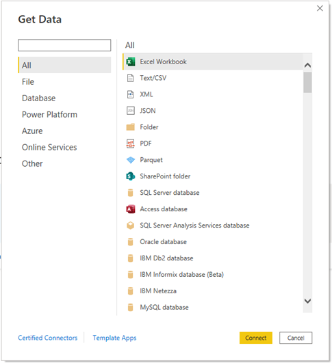
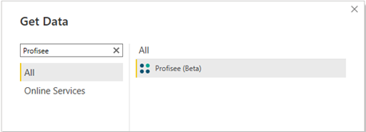
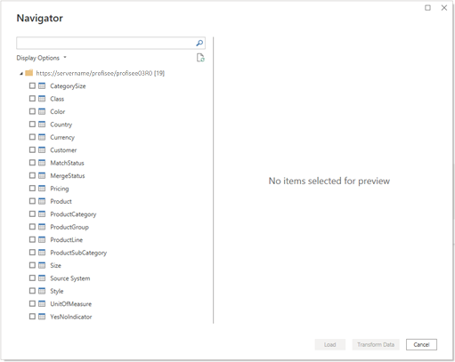

# Profisee (Beta)

>[!Note]
>The following connector article is provided by Profisee, the owner of this connector and a member of the Microsoft Power Query Connector Certification Program. If you have questions regarding the content of this article or have changes you would like to see made to this article, visit the [Profisee support site](https://support.profisee.com/aspx/ProfiseeCustomerHome) and use the support channels there.

| Item | Description |
| ---- | ----------- |
| Release State | Beta |
| Products | Power BI (datasets) Power BI (dataflows)
| Authentication Types Supported | Organizational account |

>[!Note]
>Some capabilities may be present in one product but not others due to deployment schedules and host-specific capabilities.

## Prerequisites

Before using the Profisee connector, you must have:

* A Profisee account (username and password)
* A running Profisee instance (version 2022.R1 or higher)

## Capabilities supported

* Import

## Connect to Profisee in Power BI Desktop

To use the Profisee connector:

1. Open Power BI Desktop.

2. Select the **Get Data** option in the **Home** ribbon to open the **Get Data** dialogue.

   

3. Enter **Profisee** into the search box or select **Online Services** and select **Profisee** from the list, then select **Connect.**

   

4. Enter the URL for your Profisee instance, then select **OK**.

   . 

5. If it's your first time connecting, you'll be prompted to sign in using an authentication service.

   

6. Select **Connect.**

   

7. Once connected, the **Navigator** is displayed. This display lists all entities in your Profisee instance. You can scroll through the navigator to locate specific entities, or search for entities by name using the search bar.

   

8. Select the entities that you want to import into Power BI. You can preview the data and choose to either first **Transform Data** if you want to edit the attribute columns, apply filters, and so on, or **Load** the data directly into Power BI Desktop.

   

9. Once loaded, the entities appear in the model view, and you can view the attributes ready for use in Power BI in the **Fields** dialog.

   

>[!NOTE]
 >Relationships in Profisee aren't created in the model in Power BI. After the entities are loaded, you can view the model and create or modify relationships as desired.
