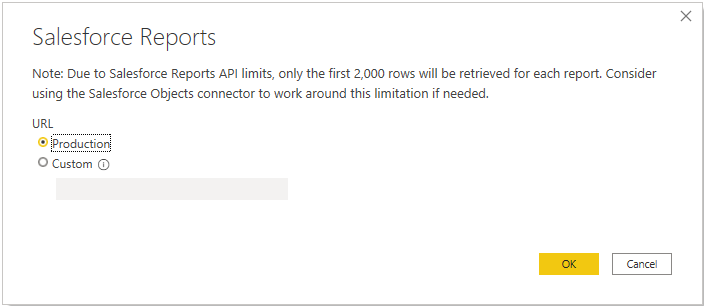
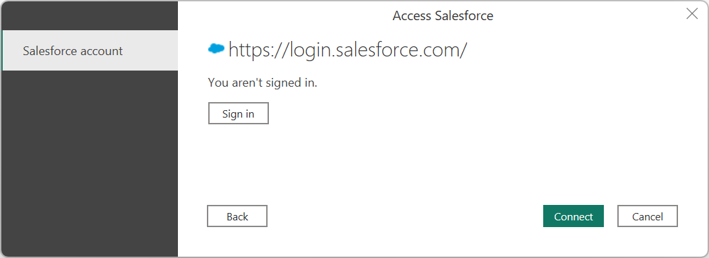
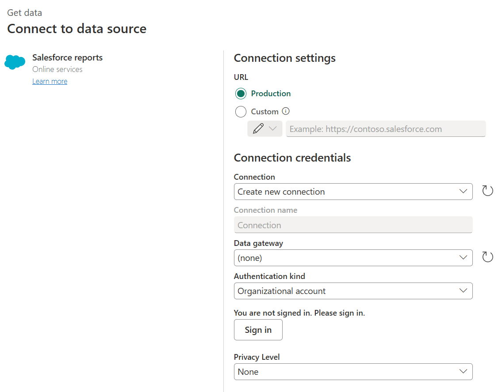

# Salesforce Reports

## Summary

| Item | Description |
| ---- | ----------- |
| Release State | General Availability |
| Products | Excel Power BI (Semantic models) Power BI (Dataflows) Fabric (Dataflow Gen2) Power Apps (Dataflows) Dynamics 365 Customer Insights Analysis Services |
| Authentication Types Supported | Salesforce account |

> [!NOTE]
> Some capabilities may be present in one product but not others due to deployment schedules and host-specific capabilities.

> [!WARNING]
> By default, Salesforce does not support Internet Explorer 11, which is used as part of the authentication experience to online services in Power Query Desktop. Please opt-in for [extended support for accessing Lightning Experience Using Microsoft Internet Explorer 11](https://help.salesforce.com/articleView?id=000333934&type=1&mode=1). You may also want to review Salesforce documentation on [configuring Internet Explorer](https://developer.salesforce.com/docs/atlas.en-us.salesforce_supported_browsers_cheatsheet.meta/salesforce_supported_browsers_cheatsheet/getstart_browser_ie.htm). At this time, users will be impaired from authenticating, but stored credentials should continue to work until their existing authentication tokens expire. To resolve this, go to [Enabling Microsoft Edge (Chromium) for OAuth Authentication in Power BI Desktop](../oauth-edge-chromium.md).

## Prerequisites

To use the Salesforce Reports connector, you must have a Salesforce account username and password.

Also, Salesforce API access should be enabled. To verify access settings, go to your personal Salesforce page, open your profile settings, and search for and make sure the **API Enabled** checkbox is selected. Note that Salesforce trial accounts don't have API access.

## Capabilities Supported

* Production
* Custom
  * Custom domains
  * CNAME record redirects

## Connect to Salesforce Reports from Power Query Desktop

To connect to Salesforce Reports data:

1. Select **Salesforce Reports** from the product-specific data connector list, and then select **Connect**.

2. In **Salesforce Reports**, choose the **Production** URL if you use the Salesforce production URL (`https://www.salesforce.com`) to sign in.

   

   You can also select **Custom** and enter a custom URL to sign in. This custom URL might be a custom domain you've created within Salesforce, such as `https://contoso.salesforce.com`. You can also use the custom URL selection if you're using your own CNAME record that redirects to Salesforce.

   Once you've selected the URL, select **OK** to continue.

3. Select **Sign in** to sign in to your Salesforce account.

   

   Once you've successfully signed in, select **Connect**.

4. If this is the first time you've signed in using a specific app, you'll be asked to verify your authenticity by entering a code sent to your email address. You'll then be asked whether you want the app you're using to access the data. For example, you'll be asked if you want to allow Power BI Desktop to access your Salesforce data. Select **Allow**.

5. In the **Navigator** dialog box, select the Salesforce Reports you want to load. You can then either select **Load** to load the data or select **Transform Data** to transform the data.

## Connect to Salesforce Reports from Power Query Online

To connect to Salesforce Reports data:

1. Select **Salesforce reports** from the product-specific data connector list, and then select **Connect**.

2. In **Salesforce reports**, choose the URL you want to use to connect. Select the **Production** URL if you use the Salesforce production URL (`https://www.salesforce.com`) to sign in.

   

   > [!NOTE]
   >Currently, you may need to select the **Custom** URL, enter **`https://www.salesforce.com`** in the text box, and then select **Production** to connect to your data.

   You can also select Custom and enter a custom URL to sign in. This custom URL might be a custom domain you've created within Salesforce, such as `https://contoso.salesforce.com`. You can also use the custom URL selection if you're using your own CNAME record that redirects to Salesforce.

   Also, you can select Include relationship columns. This selection alters the query by including columns that might have foreign-key relationships to other tables. If this box is unchecked, you won’t see those columns.

3. If this is the first time you've made this connection, select an on-premises data gateway, if needed.

4. Select **Sign in** to sign in to your Salesforce account. Once you've successfully signed in, select **Next**.

5. In the **Navigator** dialog box, select the Salesforce Reports you want to load. Then select **Transform Data** to transform the data.

## Specifying a Salesforce API version

We require you to specify a supported Salesforce API version to use the Salesforce connector. You can do so by modifying the query using the Power Query Advanced Editor. For example, `Salesforce.Data("https://login.salesforce.com/", [ApiVersion=48])`.

If you specify a version that isn't supported by Salesforce, you'll encounter an error message indicating that you have specified an unsupported ApiVersion.

For more information on Salesforce API versions and support, visit the [Salesforce website](https://help.salesforce.com/s/articleView?id=000381744&type=1).

## Known issues and limitations

* There's a limit on the number of fields a query to Salesforce can contain. The limit varies depending on the type of the columns, the number of computed columns, and so on. When you receive an `Query is either selecting too many fields or the filter conditions are too complicated` error, it means that your query exceeds the limit. To avoid this error, use the **Select Query** advanced option and specify fields that you really need.

* Salesforce session settings can block this integration. Ensure that the setting **Lock sessions to the IP address from which they originated** is disabled.

* The number of rows you can access in Salesforce Reports is limited by Salesforce to 2000 rows. As a workaround for this issue, you can use the [Salesforce Objects](salesforce-objects.md) connector in Power BI Desktop to retrieve all the rows from individual tables and recreate reports you’d like. The Object connector doesn’t have the 2000-row limit.

* Salesforce API access should be enabled. To verify access settings, go to profile settings for the current user and search for "API Enabled" checkbox.

* Salesforce trial accounts don't have API access.

* Lightning URLs aren't supported.

For more information about Salesforce internal API limits, go to [Salesforce Developer Limits and Allocations Quick Reference](https://developer.salesforce.com/docs/atlas.en-us.salesforce_app_limits_cheatsheet.meta/salesforce_app_limits_cheatsheet/salesforce_app_limits_platform_api.htm#!).
