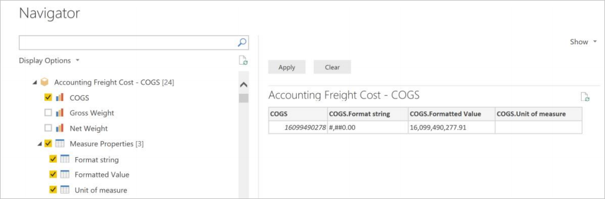

# Navigate the query objects

After you connect to your SAP BW instance, the **Navigator** dialog box will show a list of available catalogs in the selected server.

You'll see one catalog folder with the name $INFOCUBE. This folder contains all InfoProviders in the SAP BW system.

The other catalog folders represent InfoProviders in SAP BW for which at least one query exists.

:::image type="content" source="sap-bw-navigator.png" alt-text="Screenshot of navigator displaying the catalog folders.":::

The **Navigator** dialog box displays a hierarchical tree of data objects from the connected SAP BW system. The following table describes the types of objects.

| Symbol | Description                                              |
| ------ | ---------------------------------------------------------|
| :::image type="content" source="server.png" alt-text="Server symbol."::: | Your SAP BW server |
| :::image type="content" source="catalog.png" alt-text="Catalog symbol."::: | Catalog&mdash;either **$INFOCUBE** or an InfoProvider |
| :::image type="content" source="infocube.png" alt-text="Cube symbol."::: | InfoCube or a BEx Query |
| :::image type="content" source="key.png" alt-text="Key symbol."::: | Key figure |
| :::image type="content" source="characteristic.png" alt-text="Characteristic symbol."::: | Characteristic |
| :::image type="content" source="char-level.png" alt-text="Characteristic level symbol."::: | Characteristic level |
| :::image type="content" source="property.png" alt-text="Property symbol."::: | Property (Attribute) |
| :::image type="content" source="hierarchy.png" alt-text="Hierarchy symbol."::: | Hierarchy |

&nbsp;
:::image type="content" source="navigator-display-options.png" alt-text="Navigator with display options context menu open.":::

> [!NOTE]
>The navigator shows InfoCubes and BEx queries. For BEx queries, you may need to go into Business Explorer, open the desired query and check **Allow External Access to this Query: By OLE DB for OLAP** for the query to be available in the navigator.

> [!NOTE]
>In Power BI Desktop, objects below an InfoCube or BEx Query node, such as the key figures, characteristics, and properties are only shown in Import connectivity mode, not in DirectQuery mode. In DirectQuery mode, all the available objects are mapped to a Power BI model and are available for use in any visual.

In the navigator, you can select from different display options to view the available query objects in SAP BW:

* **Only selected items**: This option limits the objects shown in the list to just the selected items. By default, all query objects are displayed. This option is useful for a review of the objects that you included in your
query. Another approach to viewing selected items is to select the column names in the preview area.

* **Enable data previews**: This value is the default. This option allows you to control whether a preview of the data should be displayed on the right-hand side in the **Navigator** dialog box. Disabling data previews reduces the amount of server interaction and response time. In Power BI Desktop, data preview is only available in Import connectivity mode.

* **Technical names**: SAP BW supports the notion of *technical names* for query objects, as opposed to the descriptive names that are shown by default. Technical names uniquely identify an object within SAP BW. With the option selected, the technical names will appear next to the descriptive name of the object.

## Characteristic hierarchies

A characteristic will always have at least one characteristic level (Level 01), even when no hierarchy is defined on the characteristic. The **Characteristic Level 01** object contains all members for the characteristic as a flat list of values.

Characteristics in SAP BW can have more than one hierarchy defined. For those characteristics, you can only select one hierarchy or the **Level 01** object.

For characteristics with hierarchies, the properties selected for that characteristic will be included for each selected level of the hierarchy.

:::image type="content" source="characteristic-hierarchies.png" alt-text="Characteristic hierarchies with selected properties.":::

## Measure properties

When you pick a measure, you have an option to select the units/currency, formatted value, and format string. In the screenshot below, it's useful to get the formatted value for COGS. This helps us follow the same formatting standard across all the reports.

> [!NOTE]
> Measure properties are not available in Power BI Desktop in DirectQuery mode.

## Flattening of multi-dimensional data

Based on the selected objects and properties in the navigator, Power Query constructs an MDX statement that is sent for execution to SAP BW. The MDX statement returns a flattened data set that can be further manipulated using the Power Query Editor.

Power Query uses a newer interface that is available in SAP BW version 7.01 or higher. The interface reduces memory consumption and the result set is not restricted by the number of cells.

The flattened data set is aggregated in SAP BW at the level of the selected characteristics and properties.

Even with these improvements, the resulting data set can become very large and time-consuming to process.

**Performance recommendation**

Only include the characteristics and properties that you ultimately need. Aim for higher levels of aggregation. For example, do you need Material-level details in your report, or is MaterialGroup-level enough? What hierarchy levels are required in Power BI? Try to create smaller data sets, with higher levels of aggregation, or multiple smaller data sets, that can be joined together later.

## Query parameters

Queries in SAP BW can have dynamic filters defined that allow you to restrict the data set that's returned by the query. In the BEx Query Designer, this type of dynamic filter can be defined with what's called a *Characteristic Restriction* and assigning a *Variable* to that restriction. Variables on a query can be required or optional, and they're available to the user in the navigator.

When you select an SAP BW query with characteristic restrictions in the Power Query navigator, you'll see the variables displayed as parameters above the data preview area.

:::image type="content" source="variables-as-parameters.png" alt-text="Screenshot showing the variables displayed as parameters above the data preview area.":::

Using the **Show** selector, you can display all parameters that are defined on the query, or just the required ones.

The query shown in the previous image has several optional parameters, including one for **Material Group**. You can select one or more material groups to only return purchasing information for the selected values, that is, casings, motherboards, and processors. You can also type the values directly into the values field. For variables with multiple entries, comma-separated values are expected, in this example it would look like `[0D_MTLGROUP].[201], [0D_MTLGROUP].[202], [0D_MTLGROUP].[208]`.

The value **#** means unassigned; in the example any data record without an assigned material group value.

:::image type="content" source="select-material-group.png" alt-text="Select values menu showing material groups that can be selected.":::

**Performance recommendation**

Filters based on parameter values get processed in the SAP BW data source, not in Power BI. This type of processing can have performance advantages for larger data sets when loading or refreshing SAP BW data into Power BI. The time it takes to load data from SAP BW into Power BI increases with the size of the data set, for example, the number of columns and rows in the flattened result set. To reduce the number of columns, only select the key figures, characteristics, and properties in the navigator that you eventually want to see.

Similarly, to reduce the number of rows, use the available parameters on the query to narrow the data set, or to split up a larger data set into multiple, smaller data sets that can be joined together in the Power BI Desktop data model.

In many cases, it may also be possible to work with the author of the BEx Query in SAP BW to clone and modify an existing query and optimize it for performance by adding additional characteristic restrictions or removing unnecessary characteristics.

## Loading SAP data into Power Query

Once you've selected the SAP data set you want in the navigator, you can import the data into Power Query Editor. Select **Transform Data** to launch the Power Query Editor, where you can perform additional data transformation and filtering steps.

:::image type="content" source="launch-query-editor.png" alt-text="View of Power Query Editor after it is launched.":::

In the example above, a parameter was used to only bring back records with a **Material Group** of casings, motherboards, and processors.

In Power Query Desktop, you can also select **Load** to bring the entire data set from SAP BW into Power BI Desktop. Power BI Desktop will take you to the **Report** view where you can begin visualizing the data or make further modifications using the **Data** or **Relationships** views.

### See also

* [Transform and filter an SAP BW data set](transform-filter-sap-bw-data.md)
