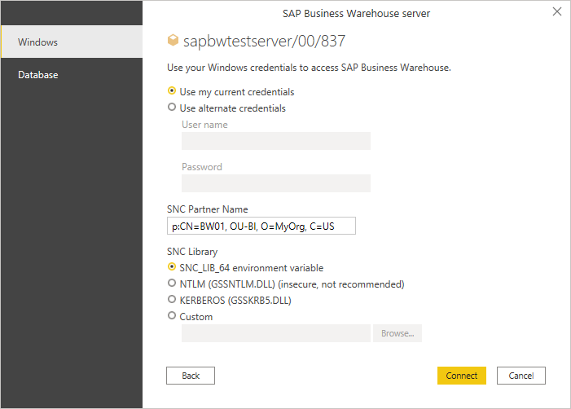

# Windows authentication and single sign-on

>[!NOTE]
> The following information about Windows authentication and single sign-on applies only to Power Query Desktop. For more information about using Windows authentication and single sign-on in Power Query Desktop, go to [Overview of single sign-on (SSO) for gateways in Power BI](/power-bi/connect-data/service-gateway-sso-overview).

For Windows-based authentication and single sign-on functionality, your SAP BW server must be configured for sign in using Secure Network Communications (SNC). SNC is a mechanism provided by the SAP system that enables application-level security on data exchanged between a client, such as Power BI Desktop, and the SAP BW server. SNC works with different external security products and offers features that the SAP system doesn't directly provide, including single sign-on.

In addition to your SAP BW server being configured for SNC sign in, your SAP user account needs to be configured with an SNC name (transaction SU01 in your SAP system).

For more detailed information, go to [Secure Network Communication](https://help.sap.com/viewer/f7dd32926c1c4fcf889a4303d833a22b/7.31.18/en-US/e656f466e99a11d1a5b00000e835363f.html), and the chapter *Single Sign-On Configuration* in this document.

Secure Login is a software solution by SAP that allows customers to benefit from the advantages of SNC without having to set up a public-key infrastructure (PKI). Secure Login allows users to authenticate with Windows Active Directory credentials.

Secure Login requires the installation of the Secure Login Client on your Power BI Desktop machine. The installation package is named SAPSetupSCL.EXE and can be obtained from the [SAP Service Marketplace](https://support.sap.com/swdc) (requires SAP customer credentials).

For further information, go to [Secure Login](https://help.sap.com/viewer/a017d0089ae44f879c89d67dbdafd121/2.0/en-US/631b1669678d41d79d94601c238e218b.html).

1. In the **SAP Business Warehouse server** dialog box, select the **Windows** tab.

2. Select to either use your current Windows credentials or specify alternate Windows credentials.

3. Enter the **SNC Partner Name**. This name is the configured SNC name in the SAP BW server’s security token. You can retrieve the SNC name with transaction **RZ11** (Profile Parameter Maintenance) in SAPGUI and parameter name **snc/identity/as**.

   For X.509 certificate security tokens, the format is:

   &nbsp;&nbsp;&nbsp;&nbsp;&nbsp;&nbsp;**p:_\<X.509 Distinguished Name\>_**

   &nbsp;&nbsp;&nbsp;&nbsp;&nbsp;Example (values are case-sensitive): **p:CN=BW0, OU=BI, O=MyOrg, C=US**

   For Kerberos security tokens, the format is:

   &nbsp;&nbsp;&nbsp;&nbsp;&nbsp;&nbsp;**p:CN=_\<service_User_Principal_Name\>_**

   &nbsp;&nbsp;&nbsp;&nbsp;&nbsp;&nbsp;Example (values are case-sensitive): **p:CN=SAPServiceBW0@BWSERVER.MYORG.COM**

4. Select the **SNC Library** that your SAP BW environment has been configured for.

   * The **SNC_LIB** or **SNC_LIB_64** option will check the corresponding environment variable on your machine and use the DLL that's specified there.

   * The **NTLM** and **KERBEROS** options will expect the corresponding DLL to be in a folder that's been specified in the **PATH** variable on your local machine. The libraries for 32-bit systems are GSSNTLM.DLL (for NTLM) and GSSKRB5.DLL (for Kerberos). The libraries for 64-bit systems are GX64NTLM.DLL (for NTLM) and GX64KRB5.DLL (for Kerberos).

   * The **Custom** option allows for the use of a custom developed library.

   Validate the settings with your SAP Administrator. 

   

5. Select **Connect**.

### See also

* [Use advanced options](use-advanced-options.md)