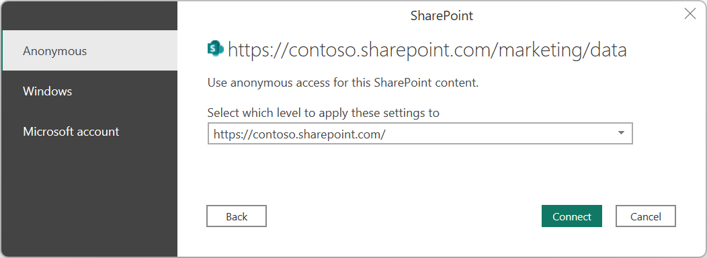
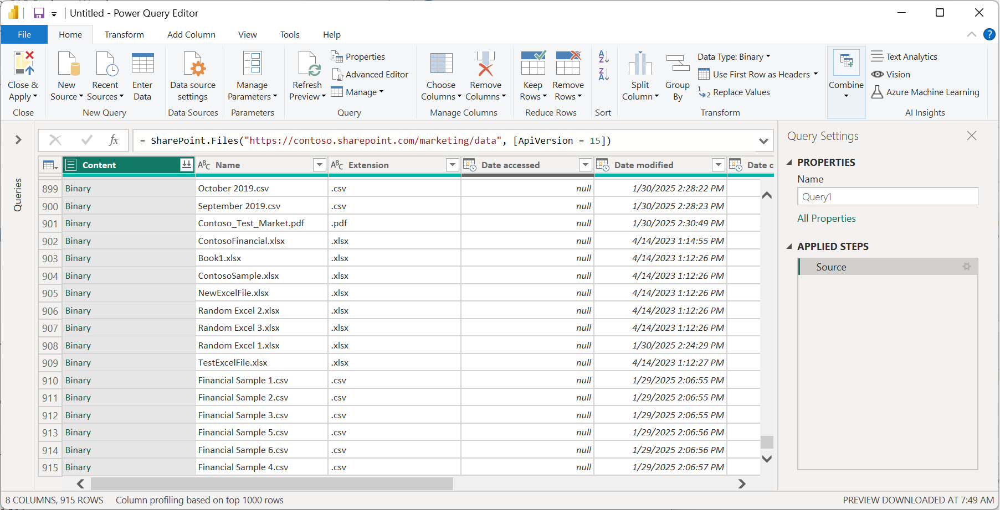
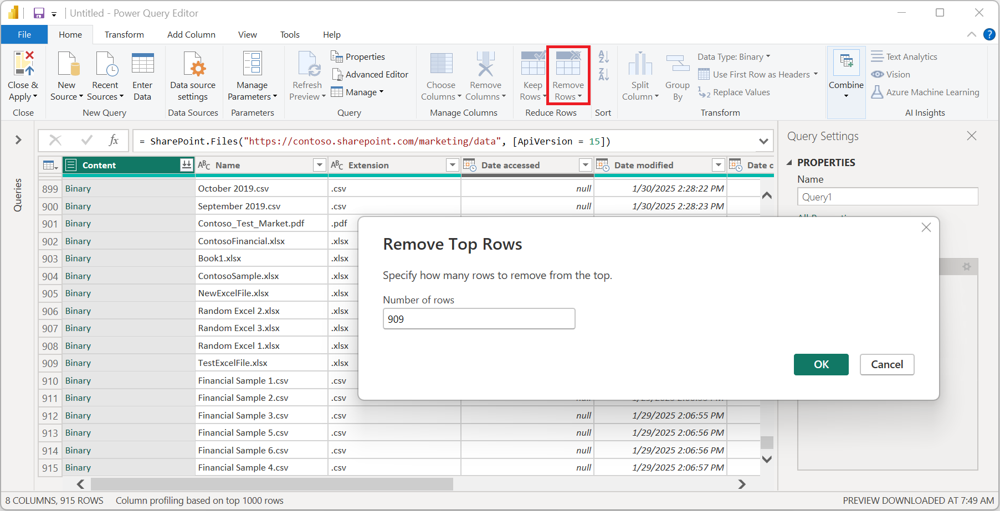

# SharePoint folder

## Summary

| Item | Description |
| ---- | ----------- |
| Release State | General Availability |
| Products | Excel Power BI (Datasets) Power BI (Dataflows) Fabric (Dataflow Gen2) Power Apps (Dataflows) Dynamics 365 Customer Insights |
| Authentication Types Supported | Anonymous Microsoft Account Windows |
| Function Reference Documentation | [SharePoint.Contents](/powerquery-m/sharepoint-contents) [SharePoint.Files](/powerquery-m/sharepoint-files) |

> [!NOTE]
>Some capabilities may be present in one product but not others due to deployment schedules and host-specific capabilities.

> [!NOTE]
>Microsoft Entra ID/OAuth for SharePoint on-premises isn’t supported using the on-premises data gateway.

## Capabilities supported

* Folder path
* Combine
  * Combine and load
  * Combine and transform

## Determine the site URL

When you're connecting to a SharePoint site, you'll be asked to enter the site URL. To find the site URL that contains your SharePoint folder, first open a page in SharePoint. From a page in SharePoint, you can usually get the site address by selecting **Home** in the navigation pane, or the icon for the site at the top. Copy the address from your web browser's address bar and save for later.

   

## Connect to a SharePoint folder from Power Query Desktop

To connect to a SharePoint folder:

1. From **Get Data**, select **SharePoint folder**.

2. Paste the SharePoint site URL you copied in [Determine the site URL](#determine-the-site-url) to the **Site URL** text box in the **SharePoint folder** dialog box. In this example, the site URL is `https://contoso.sharepoint.com/marketing/data`. If the site URL you enter is invalid, a  warning icon will appear next to the URL text box.

   

   Select **OK** to continue.

3. If this is the first time you've visited this site address, select the appropriate authentication method. Enter your credentials and choose which level to apply these settings to. Then select **Connect**.

   

   For more information about authentication methods and level settings, go to [Authentication with a data source](../connectorauthentication.md).

4. When you select the SharePoint folder you want to use, the file information about all of the files in that SharePoint folder are displayed. In addition, file information about any files in any subfolders is also displayed.

   

5. Select **Combine & Transform Data** to combine the data in the files of the selected SharePoint folder and load the data into the Power Query Editor for editing. Or select **Combine & Load** to load the data from all of the files in the SharePoint folder directly into your app.

   

> [!NOTE]
>The **Combine & Transform Data** and **Combine & Load** buttons are the easiest ways to combine data found in the files of the SharePoint folder you specify. You could also use the **Load** button or the **Transform Data** buttons to combine the files as well, but that requires more manual steps.

## Connect to a SharePoint folder from Power Query Online

To connect to a SharePoint folder:

1. From the **Data sources** page, select **SharePoint folder**.

2. Paste the SharePoint site URL you copied in [Determine the site URL](#determine-the-site-url) to the **Site URL** text box in the **SharePoint folder** dialog box. In this example, the site URL is `https://contoso.sharepoint.com/marketing/data`.

   

3. If the SharePoint folder is on-premises, enter the name of an on-premises data gateway.

4. Select the authentication kind, and enter any credentials that are required.

5. Select **Next**.

6. When you select the SharePoint folder you want to use, the file information about all of the files in that SharePoint folder are displayed. In addition, file information about any files in any subfolders is also displayed.

   

7. Select **Combine** to combine the data in the files of the selected SharePoint folder and load the data into the Power Query Editor for editing.

    > [!NOTE]
    >The **Combine** button is the easiest way to combine data found in the files of the SharePoint folder you specify. You could also use the **Transform Data** buttons to combine the files as well, but that requires more manual steps.

## Troubleshooting

### Combining files

All of the files in the SharePoint folder you select will be included in the data to be combined. If you have data files located in a subfolder of the SharePoint folder you select, all of these files will also be included. To ensure that combining the file data works properly, make sure that all of the files in the folder and the subfolders have the same schema.

In some cases, you might have multiple folders on your SharePoint site containing different types of data. In this case, you'll need to delete the unnecessary files. To delete these files:

1. In the list of files from the SharePoint folder you chose, select **Transform Data**.

   

2. In the Power Query editor, scroll down to find the files you want to keep.  

   

3. In the example shown in the screenshot above, the required files are the last rows in the table. Select **Remove Rows**, enter the value of the last row before the files to keep (in this case 903), and select **OK**.

   

4. Once you've removed all the unnecessary files, select **Combine Files** from the **Home** ribbon to combine the data from all of the remaining files.

For more information about combining files, go to [Combine files in Power Query](../combine-files-overview.md).

### Filename special characters

If a filename contains certain special characters, it may lead to authentication errors because of the filename being truncated in the URL. If you're getting unusual authentication errors, make sure all of the filenames you're using don't contain any of the following special characters.

`# % $`

If these characters are present in the filename, the file owner must rename the file so that it does NOT contain any of these characters.

### Permissions

When requesting document library contents, you should have Read access to the SharePoint site as well as the document library and any folders leading to the requested file.

### Microsoft Entra ID authentication

Microsoft Entra ID authentication isn't supported for on-premises SharePoint sources.
