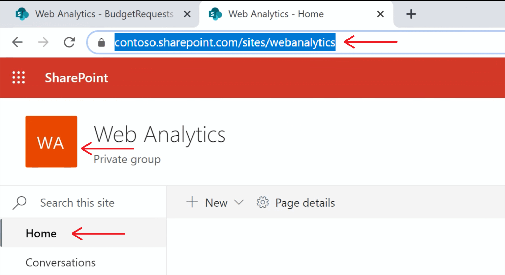
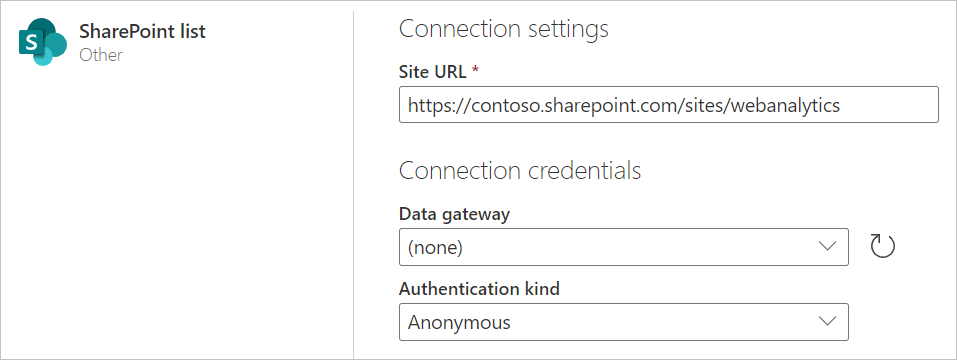
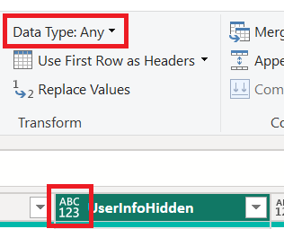
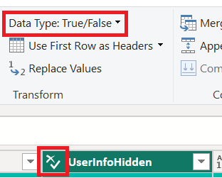

# SharePoint list

## Summary

| Item | Description |
| ---- | ----------- |
| Release State | General Availability |
| Products | Excel Power BI (Datasets) Power BI (Dataflows) Fabric (Dataflow Gen2) Power Apps (Dataflows) Dynamics 365 Customer Insights Analysis Services |
| Authentication Types Supported | Anonymous Windows Microsoft Account |
| Function Reference Documentation | [SharePoint.Contents](/powerquery-m/sharepoint-contents) [SharePoint.Files](/powerquery-m/sharepoint-files) [SharePoint.Tables](/powerquery-m/sharepoint-tables) |

>[!Note]
> Some capabilities may be present in one product but not others due to deployment schedules and host-specific capabilities.

>[!NOTE]
>AAD/OAuth for SharePoint on-premises isn’t supported using the on-premises data gateway.

## Capabilities supported

* Site URL

## Determine the site URL

When you're connecting to a SharePoint site, you'll be asked to enter the site URL. To find the site URL that contains your SharePoint list, first open a page in SharePoint. From a page in SharePoint, you can usually get the site address by selecting **Home** in the navigation pane, or the icon for the site at the top. Copy the address from your web browser's address bar and save for later.

   

## Connect to a SharePoint list from Power Query Desktop

To connect to a SharePoint list:

1. From **Get Data**, select **SharePoint List**.

2. Paste the SharePoint site URL you copied in [Determine the site URL](#determine-the-site-url) to the **Site URL** field in the open dialog box.

   

   If the URL address you enter is invalid, a  warning icon will appear next to the **Site URL** textbox.

   Select **OK** to continue.

3. If this is the first time you've visited this site address, select the appropriate authentication method. Enter your credentials and chose which level to apply these settings to. Then select **Connect**.

   

    For more information about authentication methods and level settings, go to [Authentication with a data source](../connectorauthentication.md).

4. From the **Navigator**, you can select a location, then either transform the data in the Power Query editor by selecting **Transform Data**, or load the data by selecting **Load**.

   

## Connect to a SharePoint list from Power Query Online

To connect to a SharePoint list:

1. From the **Data sources** page, select **SharePoint list**.

2. Paste the SharePoint site URL you copied in [Determine the site URL](#determine-the-site-url) to the **Site URL** field in the open dialog box.

   

3. Enter the name of an on-premises data gateway if needed.

4. Select the authentication kind, and enter any credentials that are required.

5. Select **Next**.

6. From the **Navigator**, you can select a location, then transform the data in the Power Query editor by selecting **Next**.

   

## Troubleshooting

### Use root SharePoint address

Make sure you supply the root address of the SharePoint site, without any subfolders or documents. For example, use link similar to the following: `https://contoso.sharepoint.com/teams/ObjectModel/`

### Inconsistent behavior around boolean data

When using the SharePoint list connector, Boolean values are represented inconsistently as TRUE/FALSE or 1/0 in Power BI Desktop and Power BI service environments. This may result in wrong data, incorrect filters, and empty visuals.

This issue only happens when the **Data Type** is not explicitly set for a column in the Query View of Power BI Desktop. You can tell that the data type isn't set by seeing the "ABC 123" image on the column and "Any" data type in the ribbon as shown below.

The user can force the interpretation to be consistent by explicitly setting the data type for the column through the Power Query Editor. For example, the following image shows the column with an explicit Boolean type.

### Using OData to access a SharePoint List

If you use an OData feed to access a SharePoint List, there's an approximately 2100 character limitation to the URL you use to connect. More information: [Maximum URL length](odata-feed.md#maximum-url-length)

### Azure Active Directory authentication

Azure Active Directory authentication (AAD) isn't supported for on-premises SharePoint sources.

## Next steps

[Optimize Power Query when expanding table columns](../optimize-expanding-table-columns.md)
