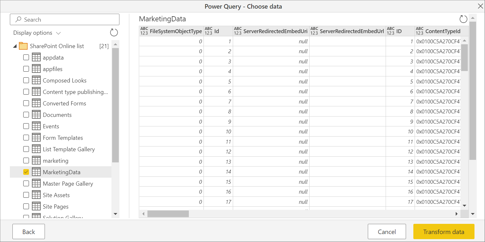

# SharePoint Online list

## Summary

| Item | Description |
| ---- | ----------- |
| Release State | General Availability |
| Products | Power BI (Datasets)<br/>Power BI (Dataflows)<br/>Power Apps (Dataflows)<br/>Excel<br/>Dynamics 365 Customer Insights |
| Authentication Types Supported | Anonymous<br/>Windows<br/>Microsoft Account |
| Function Reference Documentation | [SharePoint.Contents](/powerquery-m/sharepoint-contents)<br/>[SharePoint.Files](/powerquery-m/sharepoint-files)<br/>[SharePoint.Tables](/powerquery-m/sharepoint-tables) |

>[!Note]
> Some capabilities may be present in one product but not others due to deployment schedules and host-specific capabilities.

## Capabilities supported

* Site URL

## Determine the site URL

When you're connecting to a SharePoint site, you'll be asked to enter the site URL. To find the site URL that contains your SharePoint Online list, first open a page in SharePoint. From a page in SharePoint, you can usually get the site address by selecting **Home** in the navigation pane, or the icon for the site at the top. Copy the address from your web browser's address bar and save for later.

   

## Connect to a SharePoint Online list from Power Query Desktop

To connect to a SharePoint Online list:

1. From **Get Data**, select **SharePoint Online list**.

2. Paste the SharePoint site URL you copied in [Determine the site URL](#determine-the-site-url) to the **Site URL** field in the open dialog box.

   

   If the URL address you enter is invalid, a  warning icon will appear next to the **Site URL** textbox.

   You can also select either the 1.0 implementation of this connector or the 2.0 implementation. More information: [Connect to SharePoint Online list v2.0](#connect-to-sharepoint-online-list-v20)

   Select **OK** to continue.

3. If this is the first time you've visited this site address, select the appropriate authentication method. Enter your credentials and chose which level to apply these settings to. Then select **Connect**.

   

    For more information about authentication methods and level settings, go to [Authentication with a data source](../connectorauthentication.md).

4. From the **Navigator**, you can select a location, then either transform the data in the Power Query editor by selecting **Transform Data**, or load the data by selecting **Load**.

   

## Connect to a SharePoint Online list from Power Query Online

To connect to a SharePoint Online list:

1. From the **Data sources** page, select **SharePoint Online list**.

2. Paste the SharePoint site URL you copied in [Determine the site URL](#determine-the-site-url) to the **Site URL** field in the open dialog box.

   

3. Enter the name of an on-premises data gateway if needed.

4. Select the authentication kind, and enter any credentials that are required.

5. Select **Next**.

6. From the **Navigator**, you can select a location, then transform the data in the Power Query editor by selecting **Transform data**.

   

## Connect to SharePoint Online list v2.0

In the October 2020 release of Power BI Desktop, we introduced an updated version of the SharePoint Online list connector. This connector has improved APIs and greater usability, but isn't backwards compatible with usage of the 1.0 connector version. The 2.0 connector version is generally available as of September 2022.

To access it, you'll enter the same connector screen through step 2 in [Connect to a SharePoint Online list from Power Query Desktop](#connect-to-a-sharepoint-online-list-from-power-query-desktop). However, make sure you select **2.0** under **Implementation** if it isn't already selected.

   

With this update to the connector, we're making available two different views for the same data:

* **All**
* **Default**

The **All** view includes all user created and system defined columns. You can see what columns are included in the following screen.

   

The default view is what you'll see when looking at the list online in whichever view you've set as *Default* in your settings. If you edit this view to add or remove either user created or system defined columns, or by creating a new view and setting it as default, these changes will propagate through the connector.

   [](./media/sharepoint-online-list/sharepoint-online-list-settings.png#lightbox)
   
>[!Note]
> If you set the default view in your SharePoint site to **Calendar** view or **Board** view, SharePoint only returns the columns shown in the selected view. In this scenario, Power BI will not retrieve all the columns in the list, even though you choose **All** option. This is by design.

## Troubleshooting

### Use root SharePoint address

Make sure you supply the root address of the SharePoint site, without any subfolders or documents. For example, use a link similar to `https://contoso.sharepoint.com/teams/ObjectModel/`.

### Timezone issues

When using the SharePoint Online list (v1.0) connector, you may notice that timezone data doesn't match what you would expect from your browser. The SharePoint web-based client does a local timezone conversion based on the browser's knowledge of the user's timezone.

The backend API for SharePoint uses UTC time and sends this UTC time directly to Power BI. Power BI doesn't convert this UTC time, but reports it to the user.

To get time into local time, the user must do the same conversion the SharePoint client does. An example of the column operations that would do this are:

```
#"Changed Type" = Table.TransformColumnTypes(#"Renamed Columns",{{"Datewithtime", type datetimezone}}),
#"Timezone Shifted" = Table.TransformColumns(#"Changed Type", {"Datewithtime", DateTimeZone.ToLocal})
```

The first operation changes the type to `datetimezone`, and the second operation converts it to the computer's local time.

### SharePoint join limit

**This issue is limited to the SharePoint Online list v2.0 connector**

The SharePoint Online list v2.0 connector uses a different API than the v1.0 connector and, as such, is subject to a maximum of 12 join operations per query, as documented in the [SharePoint Online documentation](/sharepoint/install/software-boundaries-limits-2019#list-and-library-limits) under **List view lookup threshold**. This issue will manifest as SharePoint queries failing when more than 12 columns are accessed simultaneously from a SharePoint list. However, you can work around this situation by creating a default view with less than 12 lookup columns.

### Using OData to access a SharePoint Online list

If you use an OData feed to access a SharePoint Online list, there's an approximately 2100 character limitation to the URL you use to connect. More information: [Maximum URL length](odata-feed.md#maximum-url-length)
