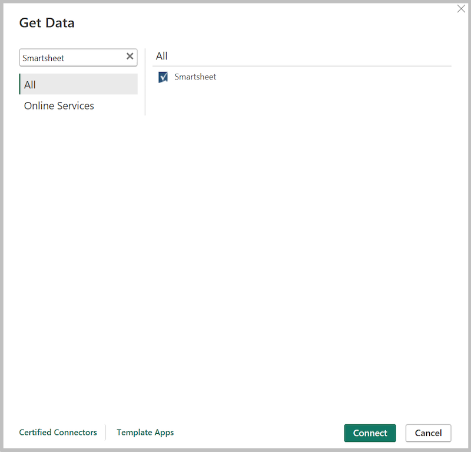
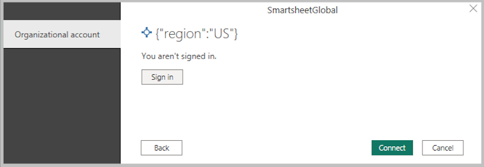
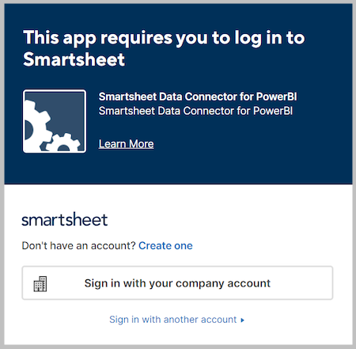
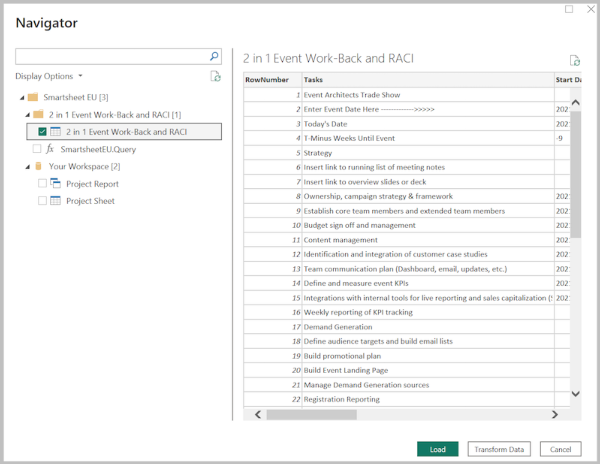

# Smartsheet

## Summary

| Item | Description |
| ---- | ----------- |
| Release State | Beta |
| Products | Power BI Dataflow Fabric Dataflow Gen2 |
| Authentication Types Supported | Smartsheet account |
| Function Reference Documentation | &mdash; |

> [!NOTE]
> Some capabilities may be present in one product but not others due to deployment schedules and host-specific capabilities.

## Prerequisites

Before you can sign in to Smartsheet, you must have a Smartsheet account.

## Capabilities Supported

* Import

### Supported Smartsheet Regions

The Smartsheet connector supports the Smartsheet US region (https://app.smartsheet.com) and Smartsheet EU region (https://app.smartsheet.eu).

## Connect to Smartsheet

1. Select **Get Data** from the **Home** ribbon in Power BI Desktop.

2. In the search box, enter **Smartsheet** and then select **Connect**.

   

3. Select the region to connect to.

   

4. If this is the first time you're getting data through the Smartsheet connector, a third-party notice will be displayed. Select **Don't warn me again with this connector** if you don't want this message to be displayed again, and then select **Continue**.

5. To sign in to your Smartsheet account, select **Sign in**.

   

6. In the Smartsheet window that appears, select your login method and provide your credentials to sign in to your Smartsheet account.

   

7. Upon first login, you'll be prompted to allow the connector access to Smartsheet, select **Allow**.

   

8. Once successfully logged in, select **Connect**.

   

Once the connection is established, you'll see the folders and workspaces you have access to within the **Navigator** dialog. Select the data you want to import and then select **Load**. 

   

## Getting Help

If you run into problems when connecting to your data, [Contact Support](https://help.smartsheet.com/contact).
