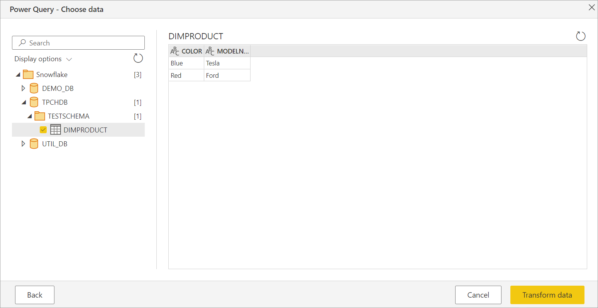

# Snowflake

## Summary

| Item | Description |
| ---- | ----------- |
| Release State | General Availability |
| Products | Power BI (Datasets)<br/>Power BI (Dataflows)<br/>Power Apps (Dataflows) |
| Authentication Types Supported | Database (Username/Password), Azure AD |
| Function Reference Documentation | - |

> [!NOTE]
> Some capabilities may be present in one product but not others due to deployment schedules and host-specific capabilities.

## Capabilities Supported

- Import
- DirectQuery (Power BI Desktop)
- Advanced options
  - Specify a text value to use as Role name
  - Relationship columns
  - Connection timeout in seconds
  - Command timeout in seconds
  - Database
  - Native SQL statement

## Connect to Snowflake data warehouse from Power Query Desktop

To make the connection to a **Snowflake** computing warehouse, take the following steps:

1. Select **Get Data** from the **Home** ribbon in Power BI Desktop, select **Database** from the categories on the left, select **Snowflake**, and then select **Connect**.

   

2. In the **Snowflake** window that appears, enter the name of your Snowflake server in **Server** and the name of your Snowflake computing warehouse in **Warehouse**.

   

3. Optionally, enter values in any advanced options that you want to use to modify the connection query, such as a text value to use as a Role name or a command timeout. More information: [Connect using advanced options](#connect-using-advanced-options)

4. Select **OK**.

5. To sign in to your Snowflake computing warehouse, enter your username and password, and then select **Connect**.

   

   > [!NOTE]
   > Once you enter your username and password for a particular **Snowflake** server, Power BI Desktop uses those same credentials in subsequent connection attempts. You can modify those credentials by going to **File > Options and settings > Data source settings**. More information: [Change the authentication method](../connector-authentication.md#change-the-authentication-method)

   If you want to use the Microsoft account option, the Snowflake Azure Active Directory (Azure AD) integration must be configured on the Snowflake side. More information: [Power BI SSO to Snowflake - Getting Started](https://docs.snowflake.com/en/user-guide/oauth-powerbi.html#getting-started)

6. In **Navigator**, select one or multiple elements to import and use in Power BI Desktop. Then select either **Load** to load the table in Power BI Desktop, or **Transform Data** to open the Power Query Editor where you can filter and refine the set of data you want to use, and then load that refined set of data into Power BI Desktop.

   

7. Select **Import** to import data directly into Power BI, or select **DirectQuery**, then select **OK**. More information: [Use DirectQuery in Power BI Desktop](/power-bi/connect-data/desktop-use-directquery)

   >[!Note]
   >Azure Active Directory (Azure AD) Single Sign-On (SSO) only supports DirectQuery.

   

## Connect to a Snowflake database from Power Query Online

To make the connection, take the following steps:

1. Select the **Snowflake** option in the connector selection.

2. In the **Snowflake** dialog that appears, enter the name of the server and warehouse.

   

3. Enter any values in the advanced options you want to use. If there are any advanced options not represented in the UI, you can edit them in the **Advanced Editor** in Power Query later.

4. Enter your connection credentials, including selecting or creating a new connection, which gateway you would like to use, and a username and password.

5. Select **Next** to connect to the database.

6. In **Navigator**, select the data you require, then select **Transform data** to transform the data in Power Query Editor.

   

## Connect using advanced options

Power Query provides a set of advanced options that you can add to your query if needed.

The following table lists all of the advanced options you can set in Power Query.

| Advanced option | Description |
| --------------- | ----------- |
| Role name | Specifies the role that the report uses via the driver. This role must be available to the user, otherwise no role will be set. |
| Include relationship columns | If checked, includes columns that might have relationships to other tables. If this box is cleared, you won’t see those columns. |
| Connection timeout in seconds | Specifies how long to wait for a response when interacting with the Snowflake service before returning an error. Default is 0 (no timeout).|
| Command timeout in seconds | Specifies how long to wait for a query to complete before returning an error. Default is 0 (no timeout). |
| Database | Specifies a specific database in the warehouse. This option is only available in Power Query Desktop. |
| SQL Statement | For information, go to [Import data from a database using native database query](../native-database-query.md). This option is only available in Power Query Desktop. |

Once you've selected the advanced options you require, select **OK** in Power Query Desktop or **Next** in Power Query Online to connect to your Snowflake database.

## Limitations and known issues

### Hyphens in database names

If a database name has a hyphen in it, you may encounter an ```ODBC: ERROR[42000] SQL compilation error```. This is a known issue and there is no known workaround available. A fix is being investigated and the documentation here will be updated when the fix is ready.

## Additional information

- [Connect to Snowflake in Power BI Service](/power-bi/connect-data/service-connect-snowflake)
