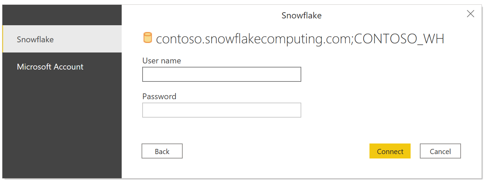
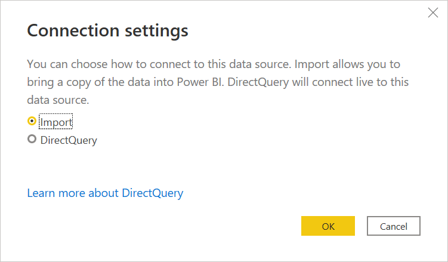

# Snowflake

## Summary

| Item | Description |
| ---- | ----------- |
| Release State | General Availability |
| Products | Power BI (Semantic models)<br/>Power BI (Dataflows)<br/>Fabric (Dataflow Gen2)<br/>Power Apps (Dataflows) |
| Authentication Types Supported | Snowflake (Username/Password), Microsoft account (Microsoft Entra ID) |
| Function Reference Documentation | &mdash; |

> [!NOTE]
> Some capabilities may be present in one product but not others due to deployment schedules and host-specific capabilities.

> [!NOTE]
> Since January 2025, we introduced a new implementation for the Snowflake connector, currently available in preview. Learn more about [this feature](#new-snowflake-connector-implementation-preview).

## Capabilities Supported

- Import
- DirectQuery (Power BI semantic models)
- Advanced options
  - Specify a text value to use as Role name
  - Relationship columns
  - Connection timeout in seconds
  - Command timeout in seconds
  - Database
  - Native SQL statement

## Connect to Snowflake data warehouse from Power Query Desktop

> [!NOTE]
>
> Since March 2025 version of Power BI Desktop, the [**New Snowflake connector implementation**](#new-snowflake-connector-implementation-preview) option is enabled by default. If you need to revert to the old connector behavior, you may deselect the option in "Options and settings" or remove the `Implementation="2.0"` flag from existing queries.

To make the connection to a **Snowflake** computing warehouse, take the following steps:

1. Select **Get Data** from the **Home** ribbon in Power BI Desktop, select **Database** from the categories on the left, select **Snowflake**, and then select **Connect**.

   

2. In the **Snowflake** window that appears, enter the name of your Snowflake server in **Server** and the name of your Snowflake computing warehouse in **Warehouse**.

   

3. Optionally, enter values in any advanced options that you want to use to modify the connection query, such as a text value to use as a Role name or a command timeout. More information: [Connect using advanced options](#connect-using-advanced-options)

4. Select **OK**.

5. To sign in to your Snowflake computing warehouse, enter your username and password, and then select **Connect**.

   

   > [!NOTE]
   > Once you enter your username and password for a particular **Snowflake** server, Power BI Desktop uses those same credentials in subsequent connection attempts. You can modify those credentials by going to **File > Options and settings > Data source settings**. More information: [Change the authentication method](../connector-authentication.md#change-the-authentication-method)

   If you want to use the Microsoft account option, the Snowflake Microsoft Entra ID integration must be configured on the Snowflake side. More information: [Power BI SSO to Snowflake - Getting Started](https://docs.snowflake.com/en/user-guide/oauth-powerbi#getting-started)

6. In **Navigator**, select one or multiple elements to import and use in Power BI Desktop. Then select either **Load** to load the table in Power BI Desktop, or **Transform Data** to open the Power Query Editor where you can filter and refine the set of data you want to use, and then load that refined set of data into Power BI Desktop.

   :::image type="content" source="./media/snowflake/navigator-desktop.png" alt-text="Screenshot of the Navigator with the test schema database open and the DimProduct table selected.":::

7. Select **Import** to import data directly into Power BI, or select **DirectQuery**, then select **OK**. More information: [Use DirectQuery in Power BI Desktop](/power-bi/connect-data/desktop-use-directquery)

   > [!NOTE]
   >Microsoft Entra ID single sign-on (SSO) only supports DirectQuery.

   

## Connect to a Snowflake database from Power Query Online

To make the connection, take the following steps:

1. Select the **Snowflake** option in the connector selection.

2. In the **Snowflake** dialog that appears, enter the name of the server and warehouse.

   :::image type="content" source="./media/snowflake/snowflake-pqo-advanced.png" alt-text="Snowflake connection builder in Power Query Online.":::

3. Enter any values in the advanced options you want to use. If there are any advanced options not represented in the UI, you can edit them in the **Advanced Editor** in Power Query later.

4. Enter your connection credentials, including selecting or creating a new connection, which gateway you would like to use, and a username and password.

5. Select **Next** to connect to the database.

6. In **Navigator**, select the data you require, then select **Transform data** to transform the data in Power Query Editor.

   :::image type="content" source="./media/snowflake/navigator-online.png" alt-text="Screenshot of the online Navigator with the test schema database open and the DimProduct table selected.":::

## Connect using advanced options

Power Query provides a set of advanced options that you can add to your query if needed.

The following table lists all of the advanced options you can set in Power Query.

| Advanced option | Description |
| --------------- | ----------- |
| Role name | Specifies the role that the report uses via the driver. This role must be available to the user, otherwise no role is set. |
| Include relationship columns | If checked, includes columns that might have relationships to other tables. If this box is cleared, you don’t see those columns. |
| Connection timeout in seconds | Specifies how long to wait for a response when interacting with the Snowflake service before returning an error. Default is 0 (no time-out).|
| Command timeout in seconds | Specifies how long to wait for a query to complete before returning an error. Default is 0 (no time-out). |
| Database | Specifies a specific database in the warehouse. This option is only available in Power Query Desktop. |
| SQL Statement | For information, go to [Import data from a database using native database query](../native-database-query.md). This option is only available in Power Query Desktop. |

Once you select the advanced options you require, select **OK** in Power Query Desktop or **Next** in Power Query Online to connect to your Snowflake database.

## New Snowflake connector implementation (Preview)

Since January 2025, we introduced a new implementation for the Snowflake connector to enhance the integration with Snowflake, currently available in preview. It uses Arrow Database Connectivity (ADBC) instead of ODBC to connect to and retrieve data from Snowflake which improves performance especially for large result sets. As we continue to enhance and add new capabilities to this connector, we encourage you to upgrade to the latest version to try it out and [provide us feedback](https://aka.ms/snowflake-connector-feedback).

- In February 2025 release, this connector is upgraded with the following improvement:
  - Enhanced performance by reducing the number of metadata calls.
  - Resolved duplicate values issue for large result sets.
- In March 2025 release, this connector is upgraded to further boost the performance. And it's enabled by default in Power BI Desktop so that the newly created connections automatically use the new connector implementation. The issue of [views not visible](#views-not-visible-with-implementation20) has been fixed in the most recent release.

> [!NOTE]
> This feature is supported in the 64-bit version of Power BI Desktop and doesn't work in the 32-bit version.

To access this feature in Power BI Desktop, navigate to **Options and settings** (under the **File** tab) > **Options** > **Preview features**, and then select the checkbox to enable the **Use new Snowflake connector implementation** option. Once the option is on, all the newly created connections automatically use the new connector implementation. Since March 2025 version of Power BI Desktop, this option is enabled by default. If you would like to revert to the old connector behavior, you may deselect the option in "Options and settings".

:::image type="content" source="./media/snowflake/new-implementation-option.png" alt-text="Screenshot of the new Snowflake implementation option in Power BI Desktop.":::

Your existing connections remain unchanged. You can try out the feature by adding the `Implementation="2.0"` flag in `Snowflake.Databases` in your queries as follows. This property differentiates the version of the connector you're using.

To access this feature in Dataflow Gen2, after you configure getting data from Snowflake, go to **Advanced editor** in the top ribbon, and add the `Implementation="2.0"` flag in `Snowflake.Databases` in your queries as follows to use this new connector.

```powerquery-m
Source = Snowflake.Databases("contoso.snowflakecomputing.com", "CONTOSO_WH", [Implementation="2.0"])
```

> [!NOTE]
> When you use the on-premises data gateway, note the minimal supported version is January 2025. You're recommended to use the latest version to evaluate this feature with the most current capabilities.

To aid with diagnosing any potential issue, you can find the `Implementation` and `DriverType` details in your Mashup logs. As an example:

```json
{"Start":"2024-11-02T00:14:02.7968686Z","Action":"Engine/Module/Snowflake/IO/Snowflake/Implementation","ResourceKind":"Snowflake","ResourcePath":"powerbi.snowflakecomputing.com ;DEMO_WH","HostProcessId":"29200","Implementation":"2.0","DriverType":"ADBC","ProductVersion":"2.139.0.0 (Main)+eda56ecd858054173a4d11db9c63a6da5cf92a99","ActivityId":"106f16b6-cfbb-4853-9f20-ed45486486d2","Process":"Microsoft.Mashup.Container.NetFX45","Pid":38560,"Tid":1,"Duration":"00:00:00.0000291"}
```

Currently, this connector has the following known limitations: 

- Multi-statement queries are not supported.
- Duration type is not supported.
- Relationships are not supported.

## Troubleshooting

### Error: SQL compilation error: Object does not exist, or operation cannot be performed

The error occurs when the system can't find the specified object. Often, this error is due to the user having an invalid database name set as their default database.

Ensure that a valid default database name is used for the property DEFAULT_NAMESPACE:
 `DESC USER`*`username`*

To update the default database name: `alter user`*`username`*` set DEFAULT_NAMESPACE=<database name>.<schema name>`. For more information, see the Snowflake documentation - https://docs.snowflake.com/en/sql-reference/sql/alter-user

## Limitations and known issues

### Hyphens in database names

If a database name has a hyphen in it, you can encounter an ```ODBC: ERROR[42000] SQL compilation error```. This issue is addressed in the September 2024 release.

### Slicer visual for Boolean datatype

The slicer visual for the Boolean data type isn't functioning as expected in the June 2024 release. This nonfunctionality is a known issue. As a temporary solution, users can convert the Boolean data type in their reports to text by navigating to: Transfer -> Data Type -> Text. A fix is provided in October 2024 release.

### Views not visible with Implementation="2.0"

In some version of March 2025 release of Power BI Desktop, you may encounter issue that views are not visible when using the [new Snowflake connector](#new-snowflake-connector-implementation-preview) (`Implementation="2.0"`). This issue has been fixed since the latest March 2025 release of Power BI Desktop. Upgrade your installation to try again.

### TIMESTAMP_NTZ values are UTC with Implementation="2.0"

TIMESTAMP_LTZ types are not being converted to the local time zone but are returning the UTC value when using the [new Snowflake connector](#new-snowflake-connector-implementation-preview) (`Implementation="2.0"`). For example, doing `SELECT CURRENT_TIMESTAMP` from Snowflake is returning the UTC time, not the user's local time zone. There's ongoing work towards a fix and the documentation will be updated when a fix is released.

## Additional information

- [Connect to Snowflake in Power BI Service](/power-bi/connect-data/service-connect-snowflake)
