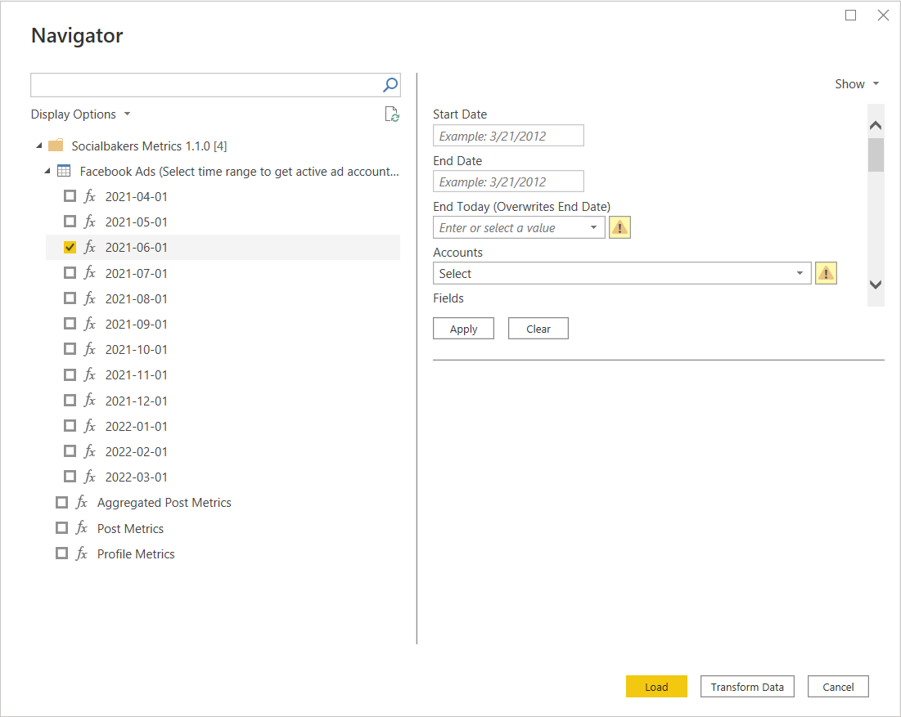

# Socialbakers (Beta)

> [!NOTE]
> The following connector article is provided by Socialbakers (now Emplifi), the owner of this connector and a member of the Microsoft Power Query Connector Certification Program. If you have questions regarding the content of this article or have changes you would like to see made to this article, visit the Emplifi website and use the support channels there.

## Summary

| Item | Description |
| --- | --- |
| Release state | Beta |
| Products | Power BI (Datasets) Power BI (Dataflows) Fabric (Dataflow Gen2) |
| Authentication Types Supported | Basic |
| Function Reference Documentation | &mdash; |

> [!NOTE]
> Some capabilities may be present in one product but not others due to deployment schedules and host-specific capabilities.

## **Prerequisites**

To use the Socialbakers (Emplifi) Connector, you must have Socialbakers (Emplifi) credentials (Token and Secret). Contact the Emplifi Support team to get yours, if you don't have them. The credentials allow the user to get the data and metrics from the profiles the user has added to the Emplifi platform.

## **Capabilities Supported**

- Import

## Connect to Socialbakers API from Power BI Desktop

### Authentication

When the connector is started for the first time, authentication is needed. Enter your **Token** and **Secret** to the new modal window. Credentials can be provided to you by the Emplifi Support team.

Once you sign in, the authentication information is automatically stored by Power BI for future use. It can be found under **File** > **Options and settings** > **Data source settings** > **Global permissions**.

At any time, the permissions can be cleared (or edited) and new credentials can be entered.

## Navigator

Once authenticated, a Navigator window pops up. All possible data sources can be selected here.

Not all data sources are the same. The differences are described [later](#facebook-ads-data-source).

### Example usage

1. Choose the Data Source you would like to work with by selecting the checkbox.
    - Parameters can be selected on the right section of the Navigator.

   

2. Enter the data and select the metrics in the Parameters section. For more details about the metrics, visit the [Socialbakers API documentation](https://api.socialbakers.com).
    - An example selection follows below:
        - **Start Date:** `07/01/2021`
        - **End Date:** `07/30/2021`
        - **End Today:** `No`
        - **Metrics:** `engagement_rate (FB, IG, TW, YT, VK), likes(FB, IG, TW, YT)`
        - **Time dimension:** `day`
        - **Dimensions:** `profile`
        - **Profiles Facebook:** `Emplifi (<profile_id>)`
        - **Profiles Instagram:** `Emplifi (<profile_id>)`
        - **Profiles YouTube:** `Emplifi (<profile_id>)`
3. Once all required parameters are selected, select **Apply**.

   > [!NOTE]
   > Not all parameters are explicitly mandatory, but they could be needed for specific selections. For example, the profile selection is optional, but you still need to select some profiles to get any data.

   

4. Once all data and metrics are selected, use the **Load** button to load the data to the report. It's also possible to **Transform Data** before loading it into the report.

   > [!NOTE]
   > It's possible to select more than one data source by checking more of the boxes, setting their parameters, and then selecting **Load**.

#### Facebook Ads Data Source

Facebook Ads is a little bit more specific data source that differs from the other sources. All other sources (for example, Aggregated Post Metrics, Post Metrics, Profile Metrics) follow the same process as described above. Facebook Ads has an extra step to perform before the Parameters are set.

When selected, Facebook Ads first display a list of the last 12 months.

By selecting the specific month(s), you're narrowing down all your Facebook Ad Accounts to the ones that were active in the selected time period.

You can select the specific Ad Accounts in the Parameters section under the **"Accounts"** parameter, along with the **Campaigns** selection.

## Troubleshooting

If any error occurs, check the [documentation](https://api.socialbakers.com/) and make sure you're following the guidelines of the API.

## Additional instructions

- It's possible to clear the parameter selection by choosing **Clear**.
- If **Transform Data** is chosen, you can see all of the function documentation from which it’s possible to gain more understanding of what is going on behind the screen.
