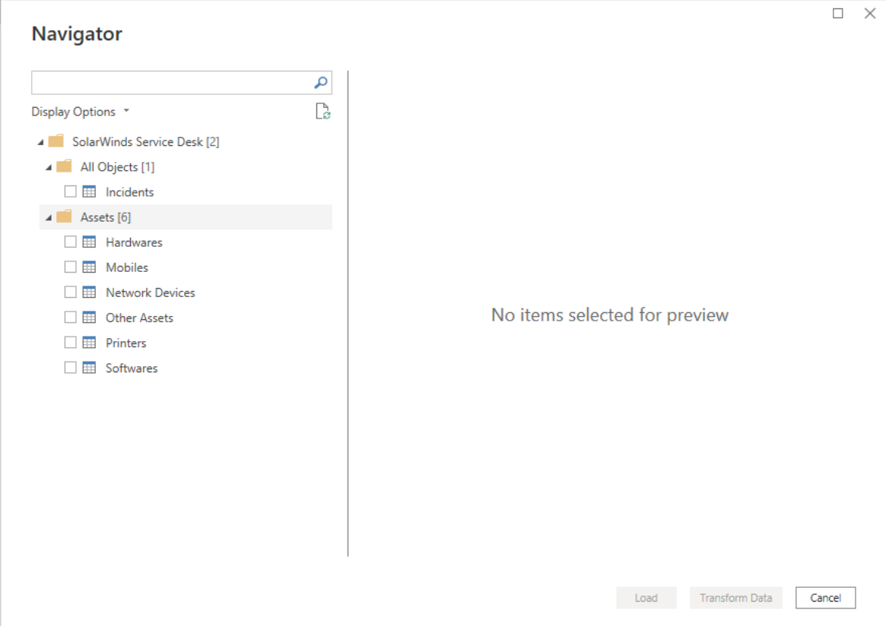
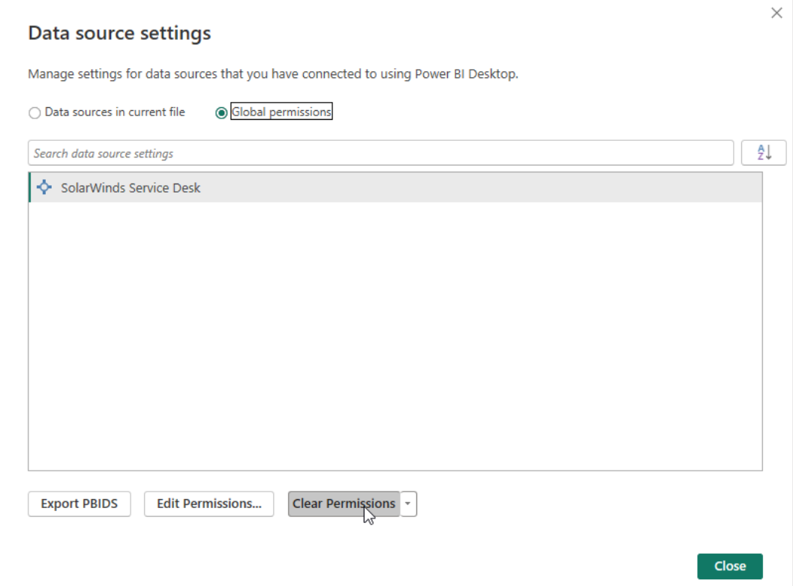

# SolarWinds Service Desk

This connector lets you incrementally import incidents and different asset records from SolarWinds Service Desk (SWSD) to Microsoft Power BI. The import provides raw data on the topics most relevant to your organization. You can then review and analyze the data by viewing it in a variety of formats, such as tables, graphs, and charts.

> [!NOTE]
> The following connector article is provided by SolarWinds, the owner of this connector and a member of the Microsoft Power Query Connector Certification Program. If you have questions regarding the content of this article or want to request change to it, visit the [SolarWinds Service Desk - Power BI Connector](https://documentation.solarwinds.com/en/success_center/swsd/default.htm#powerbi.htm?cshid=swsd_powerbi) documentation website.

## Summary

| Item                           | Description                                  |
|--------------------------------|----------------------------------------------|
| Release state                  | General Availability                                         |
| Products                       | Power BI (Semantic models)<br/>Power BI (Dataflows)<br/> Fabric (Dataflow Gen2) |
| Authentication Types Supported | SolarWinds Service Desk JSON Web Token (JWT) |

## Prerequisites

Before you can use this connector to get SolarWinds Service Desk data, you must have a SolarWinds Service Desk user who has set up [Token authentication for API integration](https://documentation.solarwinds.com/en/success_center/swsd/content/completeguidetoswsd/token-authentication-for-api-integration.htm).

## Capabilities Supported

* Import

## Connect to SolarWinds Service Desk

The instructions below contain special steps for customers who previously used the BETA SWSD Power BI Connector to create reports and wish to connect those reports with the new out-of-the-box version.

1. In Power BI Desktop, select **Get Data** from **Home**. Select **SolarWinds Service Desk**, and then select **Connect**.

   

2. Sign in with the JSON web token you generated as described in prerequisites, and then click **Connect** to verify your access to SWSD.

   

3. In the **Navigator** dialog box, select the tables you want to import. and then click **Load**.

   

4. After completion of the steps above, you should see your chosen models load under Data view. The records you have just imported were created in SWSD during last month.

### Additional steps for previous users of the BETA connector

If you previously used the BETA SWSD Power BI Connector to create reports, and you already have model name Incidents and reports based on it, and you wish to connect those reports with the new out-of-the-box version, follow these steps:

1. Go to the _Incidents_ model, and right-click Edit query. A Power Query Editor opens.

   

2. Select the _Incidents_ query and open Advanced Editor

   

You should see the following lines:
````
    Source = SolarWindsServiceDesk.Contents(),
    Incidents1 = Source{[Name="Incidents"]}[Data] 
````
3. Replace those lines with the following lines:
````
    Source = SolarWindsServiceDesk.ContentsV110(null, null),
    #"All Objects" = Source{[Name="All Objects"]}[Data], 
    Incidents1 = #"All Objects"{[Name="Incidents"]}[Data] `
````
4. Click Done
5. Click Close & Apply.

The reports will display data from the past month instead of the last two years. Going forward, those reports are connected to the new SWSD Power BI Connector.

## Incremental Refresh Setting

Incremental Refresh saves download time after your initial download is performed. To set up incremental refresh, follow these steps:

1. On the Home menu bar, click Transform Data. A Power Query Editor opens.
2. Open Manage Parameters > Create parameters. Create two new DateTime parameters named RangeEnd and RangeStart ,with one month set as the range between them. These new parameters reduce download time. See: [create-parameters](https://learn.microsoft.com/en-us/power-bi/connect-data/incremental-refresh-configure#create-parameters) for instructions.

   

3. For each query you wish to set with Incremental refresh, open Advanced Editor.

The following line displays:
````
    Source = SolarWindsServiceDesk.ContentsV110(null, null),
````
4. Replace the line with the following:
````
    Source = SolarWindsServiceDesk.ContentsV110(RangeStart, RangeEnd),
````
5. Click Done
6. Click Close & Apply.
7. Go to Data view.
8. For each model you’ve downloaded, define the policy for Incremental refresh and real-time data as shown below:

   

    a. Archive data starting 2 Years before refresh date. Note: Do not exceed 2 years.
    b. Incrementally refresh data starting 1 Days before the refresh date. See: [define-policy](https://learn.microsoft.com/en-us/power-bi/connect-data/incremental-refresh-configure#define-policy) for instructions.
   

## Publishing reports
All customers publishing to the Power BI Service (Cloud) need to perform the steps below. This applies to both first-time publishers and those who have published in the past.

1. Publish the report to Power BI Service Workspace, based on the out-of-the-box connector.
2. Establish settings for each published semantic model in the Power BI Service:
   
3. For each semantic model, open the **Data Source Credentials** section and edit the credentials with the key and token you used when you established the connection with the connector in desktop Power BI.
   

Your reports in Desktop and Cloud are now connected to and using the new version of SolarWinds Service Desk Connector.

You can refresh each semantic model for the first time. The refresh will download the archived data you defined in the incremental refresh policy (records from a maximum of 2 years ago). 

SolarWinds suggests setting the first large download with a scheduled refresh. Optionally, you can run it manually by clicking Refresh the semantic model.

For instructions on configuring a scheduled refresh see: [scheduled-refresh](https://learn.microsoft.com/en-us/power-bi/connect-data/refresh-scheduled-refresh).

After the first refresh, future refreshes will be much quicker and will download only the new records from SWSD.

## Limitations and issues

Users should be aware of the following limitations and issues associated with accessing SolarWinds Service Desk:

* There is no limit on the number of users who can pull data, but if they are not using Incremental Refresh and try to import data from a range larger than one year, each user can refresh only once every 24 hours.

* The fields that are imported are limited. For additional fields please submit a feature request in [THWACK](https://thwack.solarwinds.com/products/solarwinds-service-desk-swsd/i/feature-requests/create), for feedback or support please reach [SolarWinds support](https://www.solarwinds.com/company/contact-us).

### Credential error in the Navigator

If a credential error occurs in the Navigator, clear your recent data source settings.

1. In Power BI Desktop, select File > Data source settings.

   

2. Select the SWSD data source, and then select **Clear permissions**.
3. Establish the connection to the Navigator again.
