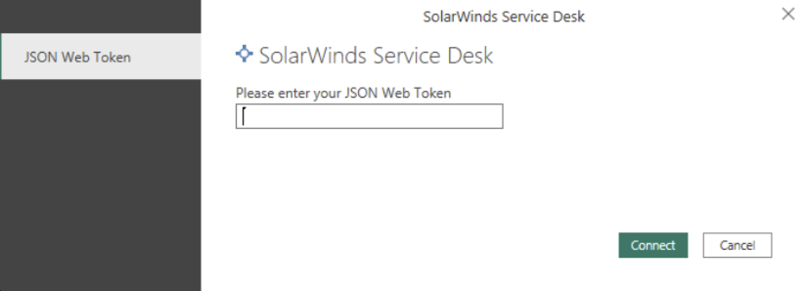

# SolarWinds Service Desk (Beta)

This connector lets you import incident records from SolarWinds Service Desk to Microsoft Power BI. You can import records from the past two years. You'll will have raw data on the topics
most relevant to your organization, which you can then analyze and review by viewing it in a
variety of formats, such as tables, graphs, and charts.

> [!NOTE]
> The following connector article is provided by SolarWinds, the owner of this connector and a member of the Microsoft Power Query Connector Certification Program. If you have questions regarding the content of this article or want to request change to it, visit the [SolarWinds Service Desk](https://documentation.solarwinds.com/en/success_center/swsd/default.htm#powerbi.htm?cshid=swsd_powerbi) documentation website and provide feedback at the bottom of the page.

## Summary

| Item                           | Description                                  |
|--------------------------------|----------------------------------------------|
| Release state                  | Beta                                         |
| Products                       | Power BI (Datasets)                          |
| Authentication Types Supported | SolarWinds Service Desk JSON Web Token (JWT) |

## Prerequisites

Before you can use this connector to get SolarWinds Service Desk data, you must have a SolarWinds Service Desk user who has set up [Token authentication for API integration](https://documentation.solarwinds.com/en/success_center/swsd/content/completeguidetoswsd/token-authentication-for-api-integration.htm).

## Capabilities Supported

* Import

## Connect to SolarWinds Service Desk

To connect to SolarWinds Service Desk:

1. In Power BI Desktop, select **Get Data** from **Home**. Select **Other** from the categories on the left, select **SolarWinds Service Desk**, and then select **Connect**.

   

2. Sign in with the JSON web token you generated as described in prerequisites, and then select **Connect** to verify your access to SolarWinds Service Desk.

   

3. In the **Navigator** dialog box, select the table you want to import. You can then either load or transform the data.

   

## Limitations and issues

Users should be aware of the following limitations and issues associated with accessing SolarWinds Service Desk:

* You can import only once per day; that is, once every 24 hours. If you attempt to refresh prior to the allowed 24-hour cycle, you'll receive an error message.

  

* There's no limit on the number of users who can pull data, but each user can refresh only once every 24 hours.

* Only incident data is imported, providing historical details from January 1, 2020 to date.
  The incident fields that are imported are limited. If you need to import a field that's not available, you can request that it be added.
  If you have any questions about what can be imported or issues with the PowerBI integration, email Rinat.Gil@solarwinds.com.

### Credential error in the Navigator

If a credential error occurs in the Navigator, clear your recent data source settings.
1. In Power BI Desktop, select **File** > **Data source settings**.

   

2. Select the SolarWinds Service Desk data source, and then select **Clear permissions**. 
3. Establish the connection to the Navigator again.
