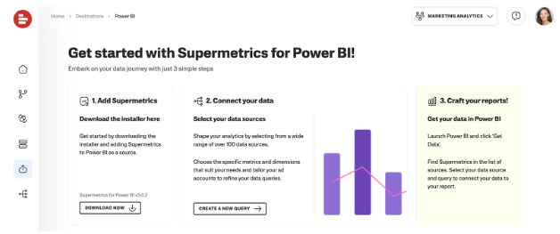
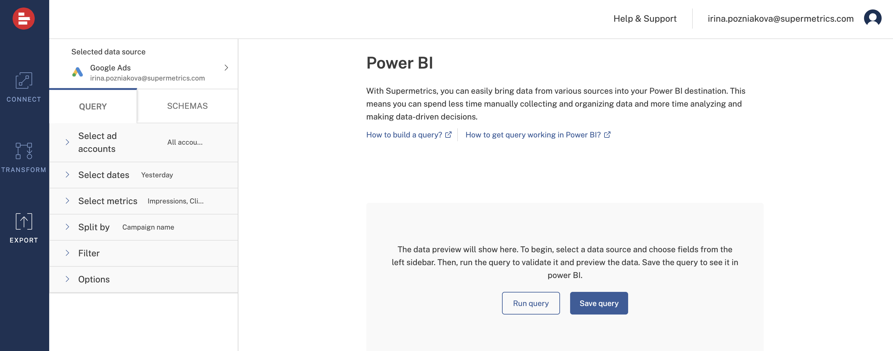
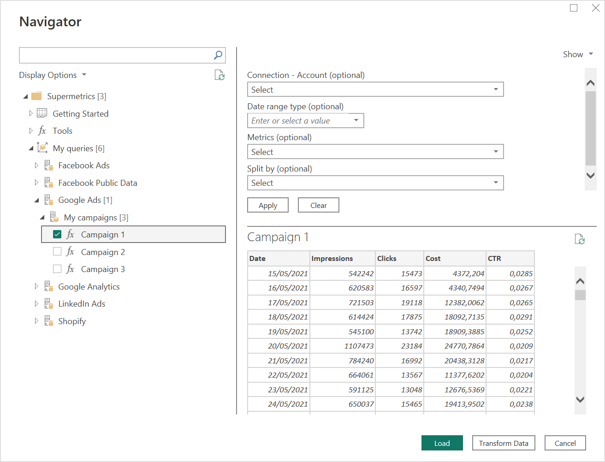

# Supermetrics Power Query custom connector user documentation 

## Support note

>[!Note]
>The following connector article is provided by Supermetrics, the owner of this connector and a member of the Microsoft Power Query Connector Certification Program. If you have questions regarding the content of this article or have changes you would like to see made to this article, visit the https://supermetrics.com/ website and use the support channels there.

## Summary
| Item | Description                                                                       |
| ---- |-----------------------------------------------------------------------------------|
| Release State | Preview                                                                     |
| Products | Power BI (Datasets) Power BI (Dataflows)  Power Apps (Dataflows) |
| Authentication Types Supported | OAuth                                  |
| Function reference docs | N/A |

>[!Note]
>Some capabilities may be present in one product but not others due to deployment schedules and host-specific capabilities.

## Prerequisites
>Before using the connector, you need to log in to the  [Supermetrics Hub](https://hub.supermetrics.com) — doing this will automatically create an account for you —  and save at least one query. 

Follow these steps to create and save a query:

1. [Log in to the Supermetrics Hub](https://hub.supermetrics.com/) using SSO (via either a Microsoft account or a Google Account).

2. Click Export > Power BI in the left-hand navigation.

3. Click **“Create new query”** to get started.

4. Select a data source and log in to your account to create a connection between your data source and Supermetrics. [Find detailed instructions in our support center](https://supermetrics.com/docs/product-power-bi-getting-started/).
   Some public data sources, including Facebook Public Data, don’t need you to log in. If you’re using one of these, skip this step.

5. Define the query settings for the data you’d like to see in your reports:
    - Pick accounts to fetch data from.
    - Define a date range — use a flexible date range, for example “last 2 months”, and always get data for the previous two months. Please note that you can change the date range for a particular report using the connector.
    - Enter metrics like Impressions or Clicks. [See our full list of metrics and dimensions](https://supermetrics.com/docs/).
    - Choose how to split the records, e.g. by date or campaign name.

6. Click **Run** to check if you get the expected records and click **Save**. Name your query and schema and confirm. Schema is like a folder to your queries.

The queries you save in the Hub will be available to you in Power BI Desktop once you sign in to the Supermetrics connector. Feel free to connect multiple data sources and save queries in each to be able to create a combined report, say, from your Ads accounts across multiple marketing sources.

## Capabilities Supported
* Import 
* Data import from multiple sources

## Connection instructions
To connect to Supermetrics
1. Open Power BI Desktop.

2. Navigate to the **Home** ribbon and click **Get Data**.

3. Search for Supermetrics. Select it, and click **Connect**.

4. If you’re connecting to Supermetrics for the first time, you’ll see a third-party notice. Select **Don't warn me again with this connector** if you don't want this message to be displayed again, and then click **Continue**.

5. Click **Sign in** to log in to your Supermetrics account.  

6. Use single sign-on (SSO) in the Supermetrics window that appears: click **Sign in with Microsoft** or **Sign in with Google** and choose the account that you used to sign in to the Supermetrics Hub.

7. Once you’ve signed in, click **Continue**.

8. Click **Connect**.  

9. Once the Navigator dialog box loads, you’ll be able to preview all the queries you saved in your Supermetrics account on the Hub. They'll be organized in folders by the data source on the left. Select the checkboxes next to any queries with data you’d like to use for your report.  
  
   The preview will load with the saved query settings, however, you can make some changes before loading the data to your report by using the settings above the preview:
   - Under “Connection - Account'' you can choose a different set of accounts for the same query settings. If you have multiple connections, you can change it here as well.  Please make sure you always select accounts within only one data source connection. Click **Ok** and **Apply** to load data with the changes.
   - If you want to check the data for a different time period than the one specified in the saved query, select the necessary option in the “Date range type” field and click **Apply**. When you select options like “This month” or “Year to date”, the refreshes will always bring the latest data to your report.
   - You can choose a new set of metrics or change how you split the records using the “Metrics” or “Dimensions” fields respectively. Remember to click **Ok** and **Apply** the changes.

    If you make changes to only one of the fields, other settings will remain the same as you saved them on the Hub.

    Once you see the dataset you’d like to use, click **Load** to use it in Power BI Desktop, or **Transform** to refine it in the Power Query Editor first.

## Limitations
- Query manager must be used to create and manage queries
- The timeout limit for polling the query results is 30 minutes

## Known issues

*Query authentication "email@domain.com" is no longer available.*

Possible reasons:
- The connection between Supermetrics and the data source expired. You need to reconnect in Supermetrics Hub.

## Next steps

You may also find the following Supermetrics information useful:

* [Supermetrics for Power BI: Getting started](https://supermetrics.com/docs/product-power-bi-getting-started/)
