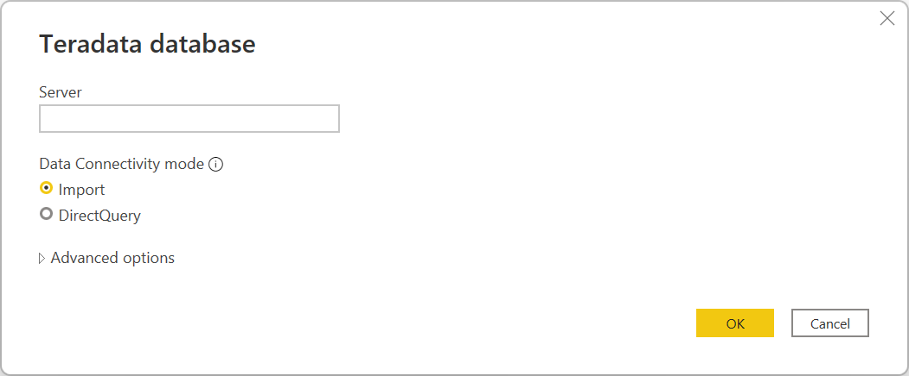
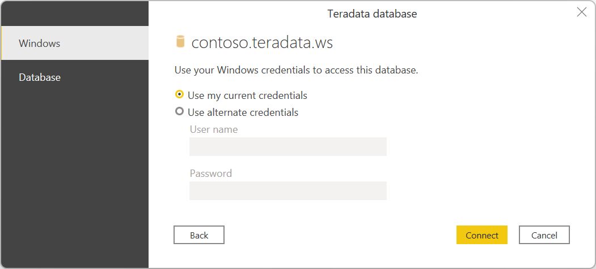

# Teradata database

## Summary

| Item | Description |
| ---- | ----------- |
| Release State | General Availability |
| Products | Excel Power BI (Datasets) Power BI (Dataflows) Fabric (Dataflow Gen2) Power Apps (Dataflows) Dynamics 365 Customer Insights Analysis Services |
| Authentication Types Supported | Database Windows |
| Function Reference Documentation | [Teradata.Database](/powerquery-m/teradata-database) |

> [!NOTE]
> Some capabilities may be present in one product but not others due to deployment schedules and host-specific capabilities.

## Prerequisites

Before you can connect to a Teradata database, you need the [.NET Data Provider for Teradata](https://downloads.teradata.com/download/connectivity/net-data-provider-for-teradata) installed on your computer.

## Capabilities Supported

* Import
* DirectQuery (Power BI Datasets)
* Advanced options
  * Command timeout in minutes
  * SQL statement
  * Include relationship columns
  * Navigate using full hierarchy

## Connect to a Teradata database from Power Query Desktop

To make the connection, take the following steps:

1. Select the **Teradata database** option from **Get Data**. More information: [Where to get data](../where-to-get-data.md)

2. Specify the Teradata server to connect to in **Server**.

   

3. If you're connecting from Power BI Desktop, select either the **Import** or **DirectQuery** data connectivity mode. The rest of these example steps use the Import data connectivity mode. To learn more about DirectQuery, go to [Use DirectQuery in Power BI Desktop](/power-bi/connect-data/desktop-use-directquery).

4. Select **OK**.

5. If this is the first time you're connecting to this Teradata database, select the authentication type you want to use, enter your credentials, and then select **Connect**. For more information about using and managing authentication, go to [Authentication with a data source](../connectorauthentication.md).

   

6. In **Navigator**, select the data you require, then either select **Load** to load the data or **Transform Data** to transform the data.

   

## Connect to a Teradata database from Power Query Online

To make the connection, take the following steps:

1. Select the **Teradata database** option in the **Choose data source** page. More information: [Where to get data](../where-to-get-data.md)

2. Specify the Teradata server to connect to in **Server**.

3. Select the name of your on-premises data gateway.

   > [!NOTE]
   > You must select an on-premises data gateway for this connector, whether the Teradata database is on your local network or online.

4. If this is the first time you're connecting to this Teradata database, select the type of credentials for the connection in **Authentication kind**. Choose **Basic** if you plan to use an account that's created in the Teradata database instead of Windows authentication. For more information about using and managing authentication, go to [Authentication with a data source](../connectorauthentication.md).

5. Enter your credentials.

6. Select **Use Encrypted Connection** if you want to use an encrypted connection, or clear the option if you want to use an unencrypted connection.

   

7. Select **Next** to continue.

8. In **Navigator**, select the data you require, then select **Transform data** to transform the data in the Power Query editor.

   

## Connect using advanced options

Power Query provides a set of advanced options that you can add to your query if needed.

The following table lists all of the advanced options you can set in Power Query.

| Advanced option | Description |
| --------------- | ----------- |
| Command timeout in minutes | If your connection lasts longer than 10 minutes (the default timeout), you can enter another value in minutes to keep the connection open longer. |
| SQL statement | For information, go to [Import data from a database using native database query](../native-database-query.md). |
| Include relationship columns | If checked, includes columns that might have relationships to other tables. If this box is cleared, you won’t see those columns. |
| Navigate using full hierarchy | If checked, the navigator displays the complete hierarchy of tables in the database you're connecting to. If cleared, the navigator displays only the tables whose columns and rows contain data. |

Once you've selected the advanced options you require, select **OK** in Power Query Desktop or **Next** in Power Query Online to connect to your Teradata database.
