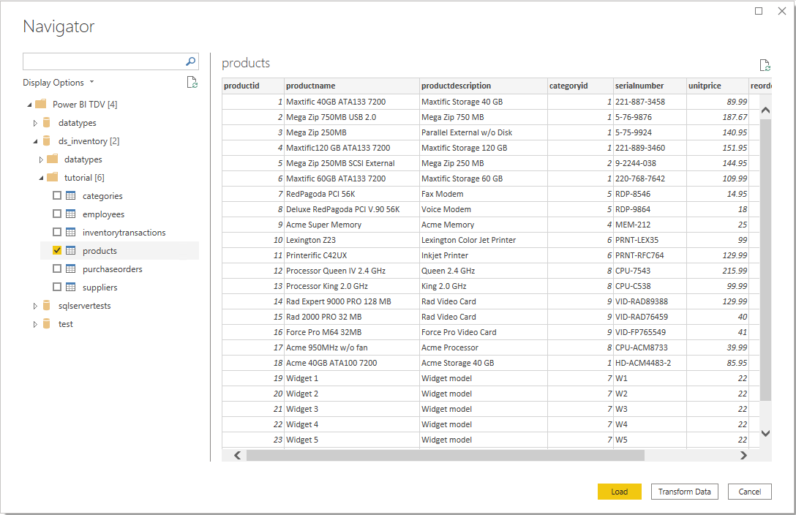

# TIBCO(R) Data Virtualization

> [!NOTE]
>The following connector article is provided by TIBCO, the owner of this connector and a member of the Microsoft Power Query Connector Certification Program. If you have questions regarding the content of this article or have changes you would like to see made to this article, visit the TIBCO website and use the support channels there.

## Summary

| Item | Description |
| ---- | ----------- |
| Release State | General Availability |
| Products | Power BI (Datasets) Power BI (Dataflows) Fabric (Dataflow Gen2) |
| Authentication Types Supported | Database (Username/Password) Windows Authentication (NTLM/Kerberos) |
| Function Reference Documentation | &mdash; |

## Prerequisites

To access the TIBCO eDelivery site, you must have purchased TIBCO software. There's no TIBCO license required for the TIBCO(R) Data Virtualization (TDV) software&mdash;a TIBCO customer only needs to have a valid contract in place. If you don't have access, then you'll need to contact the TIBCO admin in your organization.

The Power BI Connector for TIBCO(R) Data Virtualization must first be downloaded from [https://edelivery.tibco.com](https://edelivery.tibco.com) and installed on the machine running Power BI Desktop. The eDelivery site downloads a ZIP file (for example, TIB_tdv_drivers_\<_VERSION_>_all.zip*.zip where \<_VERSION_>=TDV Version) that contains an installer program that installs all TDV client drivers, including the Power BI Connector.

Once the connector is installed, configure a data source name (DSN) to specify the connection properties needed to connect to the TIBCO(R) Data Virtualization server.

> [!NOTE]
> The DSN architecture (32-bit or 64-bit) needs to match the architecture of the product where you intend to use the connector.

>[!NOTE]
>Power BI Connector for TIBCO(R) Data Virtualization is the driver used by the TIBCO(R) Data Virtualization connector to connect Power BI Desktop to TDV.

## Capabilities Supported

- Import
- DirectQuery (Power BI Datasets)
- Advanced Connection Properties
- Advanced
  - Native SQL statement

## Connect to a TIBCO(R) Data Virtualization server from Power Query Desktop

Once the matching connector is installed and a DSN is configured, you can connect to a TIBCO(R) Data Virtualization server. To make the connection, take the following steps:

1. Select the **TIBCO(R) Data Virtualization** option in the connector selection.

2. In the **Power BI Connector for TIBCO(R) Data Virtualization** dialog that appears, provide the Data Source Name.

   

3. Select either the **Import** or **DirectQuery** data connectivity mode.

4. If this is the first time you're connecting to this database, select the authentication type. If applicable, enter the needed credentials. Then select **Connect**.
   - **Anonymous**: Uses the credentials stored in the DSN.
   - **Basic**: Username/password are submitted when creating the connection.
   - **Windows**: Authenticates using the current Windows user.  This authentication type requires the **SSO** connection property to be set.  When using Kerberos, the **Use Platform Kerberos API** must be set to true to use the current Windows user.

    

5. In **Navigator**, select the database information you want, then either select **Load** to load the data or **Transform Data** to continue transforming the data in Power Query Editor.

   

## Connect using advanced options

Power Query Desktop provides a set of advanced options that you can add to your query if needed.

The following table lists all of the advanced options you can set in Power Query Desktop.

| Advanced option | Description |
| --------------- | ----------- |
| Advanced Connection Properties | Takes a semi-colon separated list of connection properties. This option is used to specify other connection properties not configured in the DSN. |
| SQL statement | For information, go to [Import data from a database using native database query](../native-database-query.md). |

Once you've selected the advanced options you require, select **OK** in Power Query Desktop to connect to your TIBCO(R) Data Virtualization Server.

## Kerberos-based single sign-on (SSO) for TIBCO(R) Data Virtualization

The TIBCO(R) Data Virtualization connector now supports Kerberos-based single sign-on (SSO).

To use this feature:

1. Sign in to your Power BI account, and navigate to the **Gateway management** page.

2. Add a new data source under the gateway cluster you want to use.

3. Select the connector in the **Data Source Type** list.

4. Expand the **Advanced Settings** section.

5. Select the option to **Use SSO via Kerberos for DirectQuery queries** or **Use SSO via Kerberos for DirectQuery and Import queries**.

   

More information: [Configure Kerberos-based SSO from Power BI service to on-premises data sources](/power-bi/connect-data/service-gateway-sso-kerberos)
