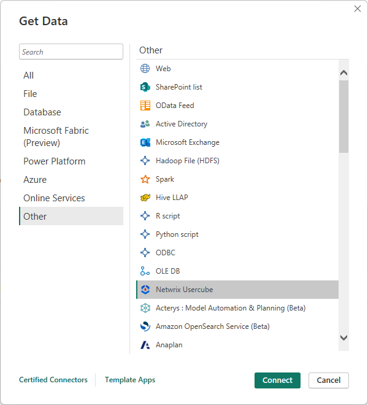
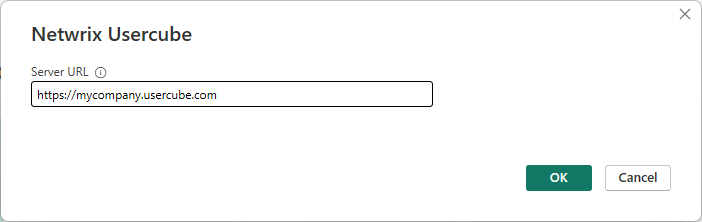
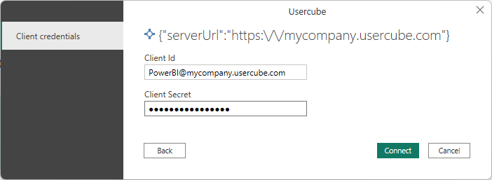
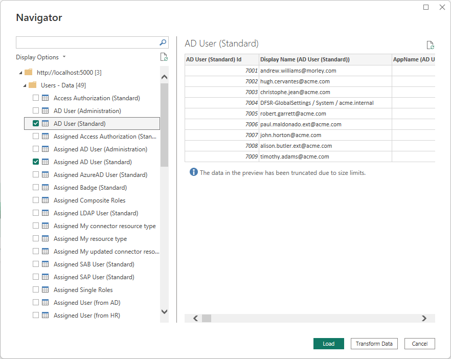

# Netwrix Usercube

>[!Note]
>The following connector article is provided by Netwrix, the owner of this connector and a member of the Microsoft Power Query Connector Certification Program. If you have questions regarding the content of this article or have changes you would like to see made to this article, visit the Netwrix website and use the support channels there.
 
## Summary

| Item                             | Description                                                                  |
| -------------------------------- | ---------------------------------------------------------------------------- |
| Release State                    | General Availability                                                         |
| Products                         | Power BI (Datasets) Power BI (Dataflows)                                 |
| Authentication Types Supported   | Client Credentials                                                           |
| Function Reference Documentation | &mdash;                                                                      |

## Prerequisites

You must have a Netwrix Usercube instance with the *PowerBI* option.

## Capabilities supported

- Import

## Connect to Netwrix Usercube from Power Query Desktop

To connect to a Netwrix Usercube server:

1. Launch Power BI Desktop and enter the **Get Data** experience.

2. From the **Other** category, select **Netwrix Usercube**, and then select **Connect**.

   

3. You'll be prompted to specify your Netwrix Usercube server's URL.

   

4. Enter the client credentials. The *Client Id* must be built from the *Identifier* of an *OpenIdClient* element. This element is defined in the configuration of your Netwrix Usercube instance. To this identifier, you must concatenate the `@` character and the domain name of the Netwrix Usercube instance.

   

5. In **Navigator**, select the data you require. Then, either select **Transform data** to transform the data in the Power Query Editor, or choose **Load** to load the data in Power BI.

   