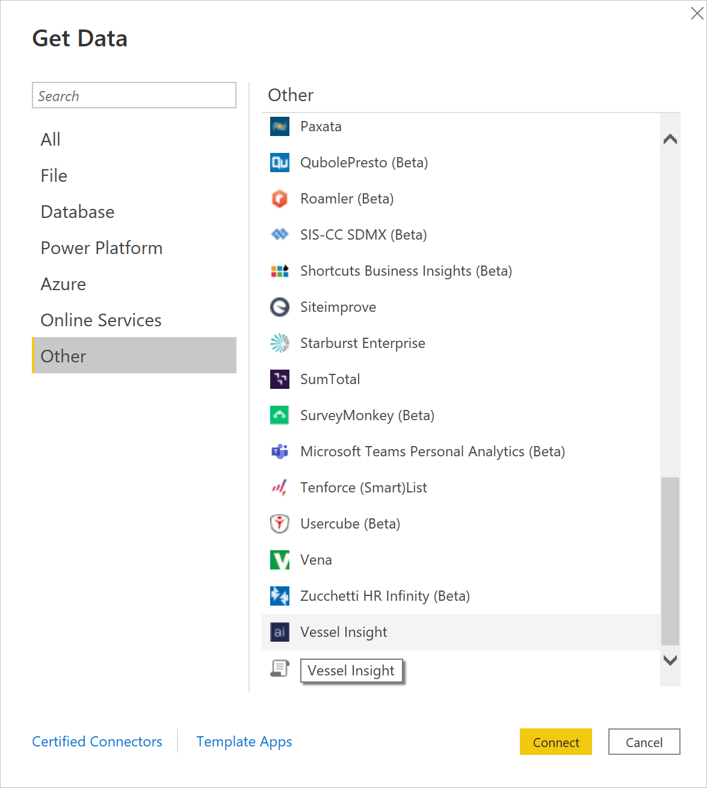
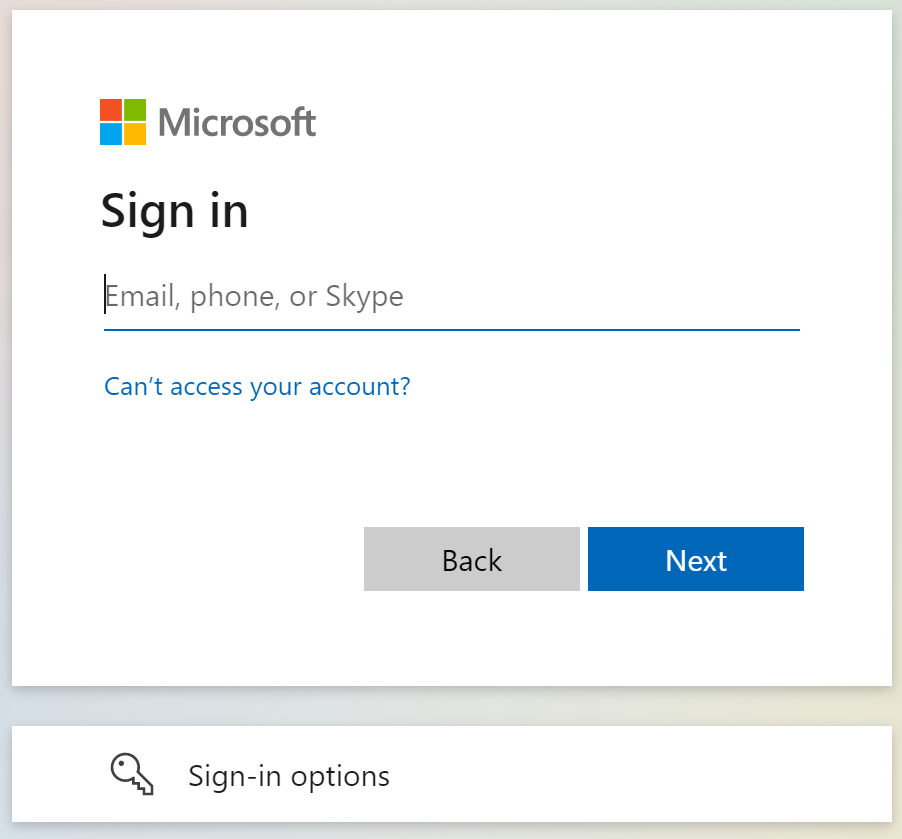
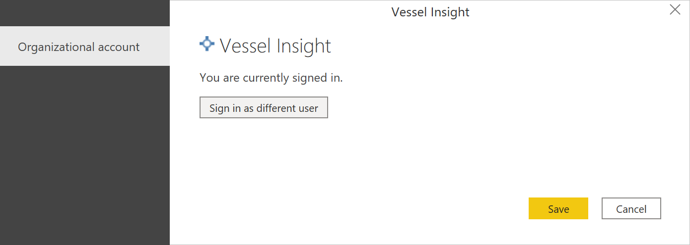
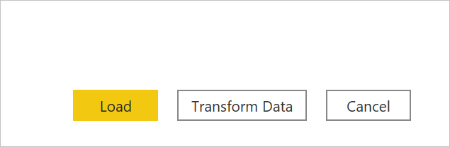

# Vessel Insight

>[!Note]
>The following connector article is provided by Kongsberg, the owner of this connector and a member of the Microsoft Power Query Connector Certification Program. If you have questions regarding the content of this article or have changes you would like to see made to this article, visit the Kongsberg website and use the support channels there.

## Summary

| Item | Description |
| ---- | ----------- |
| Release State | General Availability |
| Products | Power BI (datasets) Power BI (Dataflows) |
| Authentication Types Supported | Organizational account |

## Prerequisites

Before you can sign in to Vessel Insight, you must have an organization account (username/password) connected to a tenant.

## Capabilities Supported

* Import

## Connect to Vessel Insight

To connect to Vessel Insight:

1. Select **Get Data** from the **Home** ribbon in Power BI Desktop. Select **Other** from the categories on the left, select **Vessel Insight**, and then select **Connect**.

   

2. If this is the first time you're getting data through the Vessel Insight connector, a third-party notice will be displayed. Select **Don't warn me again with this connector** if you don't want this message to be displayed again, and then select **Continue**.

3. To sign in to your Vessel Insight account, select **Sign in**.

   

4. In the window that appears, provide your Vessel Insight tenant URL in the format `*[companyname]*.kognif.ai`. Then select **Validate**.

    

5. In the window that appears, provide your credentials to sign in to your Vessel Insight account.

   

   If you entered an email address and password, select **Continue**.

6. Once you've successfully signed in, select **Save**.

   

Once the connection is established, you can preview and select data within the **Navigator** dialog box to create a single tabular output.

You can select the following options in the navigator:

* **Advanced**: Write custom Time series Query Language (TQL) queries (native). For advanced Kongsberg users.
* **Vessel Insight Data (deprecated)**: Time series data for your fleets in the old asset hierarchy.
* **Vessel Insight Data 2.0**: Time series data for your fleets in the new asset hierarchy. Only tags with data will be shown.
* **Voyage**: Voyage history and location data from Automatic Identification System (AIS).

You can provide any optional input parameters required for the selected items. For more information about these parameters, go to [Optional input parameters](#optional-input-parameters).

If you don't input parameters for **Vessel Insight Data 2.0**, you'll get the latest value by default.

For **Voyage**, you need to input IMOs that you want to fetch data for.

You can **Load** the selected time series data, which brings the one table for each selected time series tag into Power BI Desktop, or you can select **Transform Data** to edit the query, which opens the Power Query editor. You can then filter and refine the set of data you want to use, and then load that refined set of data into Power BI Desktop.

## Optional input parameters

### Vessel Insight Data 2.0

When you import time series data through the Vessel Insight Data 2.0 node and you've selected the tags you want to load or transform in the Power Query **Navigator**, you can also limit the amount of data by selecting a set of optional input parameters.

These input parameters are:

* **Interval** (optional): How you want the data to be aggregated when displayed (1s, 5s, >=30s, 1m, 1h, 1d).
* **Time** (optional): Set the time filter type if you want to filter on time.
  * **Latest**: Get latest value only. Returns one value.
  * **Period**: Filter on the time range. Requires setting the **Start** and **End** date described below.
  * **Custom**: Custom query to filter on the number of values to return.
* **Start (Time: Period), e.g. 2019-10-08T00:00:00Z** (optional): Filter on range by inserting the start date and time here. Possible to set **yesterday** and **today**. Requires setting **Time: Period**.
* **End (Time: Period), e.g. 2019-10-08T01:00:00Z** (optional): Filter on range by inserting the end date and time here. Possible to set **today** and **now**. Requires setting **Time: Period**.
* **Custom (Time: Custom), e.g. |> takebefore now 5** (optional): Add a custom query to filter on the number of values. **|> takebefore now 5** means take five values before the time now. Requires **Time: Custom**.

When importing aggregated timeseries, the connector will return avg, min, max, and count by default.

If you're importing multiple tags, it can be cumbersome to input the parameters manually for each tag. In this case, we recommend you use **Power Query parameters** for **Start** and **End** date in the Power Query Editor. More information: [Power Query parameters](../power-query-query-parameters.md)

### Voyage

When you import voyage data through the **Voyage** node, you can limit the amount of data for the **History** and **Location History** table by setting a set of optional input parameters.

These input parameters are:

* **Comma Separated IMOs**: Input one or multiple IMO numbers you want voyage data for.
* **Start (Time: Period), e.g. 2019-10-08T00:00:00Z** (optional): Filter on range by inserting the start date and time here. Possible to set **yesterday** and **today**. Requires setting **Time: Period**.
* **End (Time: Period), e.g. 2019-10-08T01:00:00Z** (optional): Filter on range by inserting the end date and time here. Possible to set **today** and **now**. Requires setting **Time: Period**.

## Limitations and issues

You should be aware of the following limitations and issues associated with accessing Vessel Insight data.

* There's a general limit of 1-GB data that's imported into Power BI, unless the workspace is in a Power BI Premium capacity. We recommend that you aggregate and choose a short date range when importing time series data, as it can become heavy.

* Each time series tag with associated values is outputted in a separate table in Power BI. If it's necessary to combine tags and values into one table, the tags and their values need to be merged in the Power Query editor or with TQL queries.

* The time series data is currently stored in Couchbase, which might have weaknesses that impact the Power BI connector.

* The API request timeout is, by default, one minute.

For more guidelines on accessing Vessel Insight data, go to [The Getting started guide](https://view.officeapps.live.com/op/view.aspx?src=https%3A%2F%2Fwww.kongsberg.com%2Fglobalassets%2Fdigital%2Fsolutions%2Fvessel-insight%2Fpowerbi-gsx.pptx&wdOrigin=BROWSELINK).

## Recommended content

You might also find the following Vessel Insight information useful:

* [About Vessel Insight Power BI connector](https://www.kongsberg.com/digital/solutions/vessel-insight/vessel-insight-power-bi-connector/)
* [About Vessel Insight](https://www.kongsberg.com/digital/solutions/vessel-insight/)
* [Vessel Insight API](https://developer.kognif.ai/)
