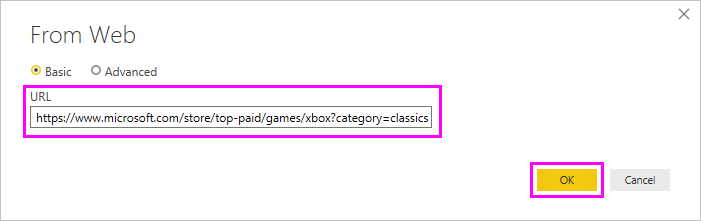
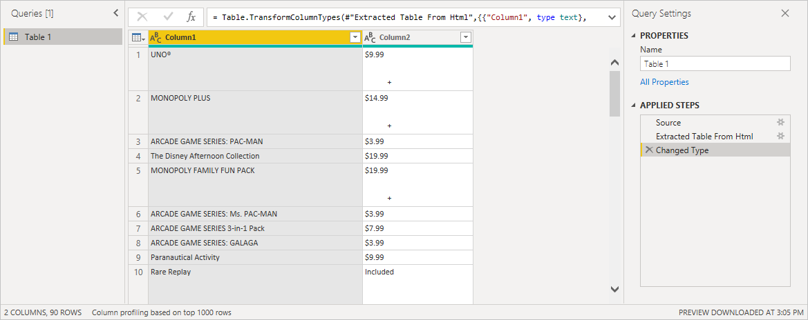

# Get webpage data by providing examples

Getting data from a web page lets users easily extract data from web pages. Often however, data on Web pages aren't in tidy tables that are easy to extract. Getting data from such pages can be challenging, even if the data is structured and consistent.

There's a solution. With the *Get Data from Web by example* feature, you can essentially show Power Query data you want to extract by providing one or more examples within the connector dialog. Power Query gathers other data on the page that match your examples. With this solution you can extract all sorts of data from Web pages, including data found in tables *and* other non-table data.

> [!NOTE]
>Prices listed in the images are for example purposes only.

## Using Get Data from Web by example

Select the **Web** option in the connector selection, and then select **Connect** to continue.

In **From Web**, enter the URL of the Web page from which you'd like to extract data. In this article, we'll use the Microsoft Store Web page, and show how this connector works.

If you want to follow along, you can use the [Microsoft Store URL](https://www.microsoft.com/en-us/store/top-paid/games/xbox?category=classics) that we use in this article:

&nbsp;&nbsp;&nbsp;&nbsp;&nbsp;&nbsp;[https://www.microsoft.com/store/top-paid/games/xbox?category=classics](https://www.microsoft.com/en-us/store/top-paid/games/xbox?category=classics)

When you select **OK**, you're taken to the **Navigator** dialog box where any autodetected tables from the Web page are presented. In the case shown in the image below, no tables were found. Select **Add table using examples** to provide examples.

**Add table using examples** presents an interactive window where you can preview the content of the Web page. Enter sample values of the data you want to extract.

In this example, you'll extract the *Name* and *Price* for each of the games on the page. You can do that by specifying a couple of examples from the page for each column. As you enter examples, Power Query extracts data that fits the pattern of example entries using smart data extraction algorithms.

> [!NOTE]
> Value suggestions only include values less than or equal to 128 characters in length.

Once you're happy with the data extracted from the Web page, select **OK** to go to Power Query Editor. You can then apply more transformations or shape the data, such as combining this data with other data sources.

### See also

* [Add a column from examples](../../column-from-example.md)
* [Shape and combine data](/power-query/power-query-ui)
* [Getting data](../../get-data-experience.md)
* [Troubleshooting the Power Query Web connector](web-troubleshoot.md)
