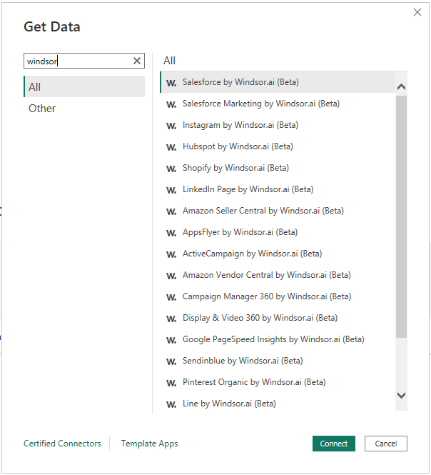

# Windsor&#46;ai

>[!Note]
>The following connector article is provided by Windsor.ai, the owner of this connector and a member of the Microsoft Power Query Connector Certification Program. If you have questions regarding the content of this article or have changes you would like to see made to this article, visit the Windsor.ai website and use the support channels there.

## Summary

| Item | Description |
| ---- | ----------- |
| Release State | General Availability |
| Products | Power BI (Datasets) Power BI (Dataflows) |
| Authentication Types Supported | Anonymous |

## Prerequisites

To use the Windsor&#46;ai connector, you need a Windsor&#46;ai account. Windsor&#46;ai helps you connect all your marketing data and integrate it into your favourite analytic tool, like Power BI. 

Connect your data to [Windsor.ai](https://windsor.ai) and get your API Key: 
1. [Register](https://onboard.windsor.ai/register) for a free trial or [Login](https://onboard.windsor.ai/login) if you already have an account. 
2. Once logged-in on [Windsor.ai](https://onboard.windsor.ai), from the left-side panel, choose the platform that you want to bring data from and connect to it using the provided instructions. 
3. Click on **Preview and Destination** from the upper side of the screen. 
4. Choose **Power BI Web** from the Destinations panel at the bottom of the screen. 
5. You'll see your **API Key**, which you can copy and use when connecting from Power BI (Web or Desktop). 

## Capabilities Supported

This connector enables you to directly access the data sources that you've previously connected to Windsor&#46;ai. 

* Supported data sources: Instagram, Pinterest, HubSpot, Shopify, Stripe, Amazon Seller Central, Amazon Vendor Central, AppsFlyer, Active Campaign, Google Campaign Manager 360, Google Display & Video 360, Google Pagespeed, Sendinblue, Line, Salesforce, Salesforce Marketing, Twitter, Pipedrive. 
* Table navigation based on pre-defined objects, allowing you to bring the data into a Power BI model without any transformations required from your side. 

## Connect to Windsor&#46;ai from Power Query Desktop

To connect to Windsor&#46;ai:

1. Select **Get Data** from the **Home** ribbon in Power BI Desktop, then search for **Windsor**. 
   
   

2. Choose the data source that you want to connect to (i.e. Twitter by Windsor&#46;ai) and click *Connect*.

3. If this is the first time you're getting data through the Windsor&#46;ai connector, a third-party notice will be displayed. Select **Don't warn me again with this connector** if you don't want this message to be displayed again, and then click on **Continue**.

4. Enter your [Windsor.ai API Key](<https://onboard.windsor.ai>) and choose the desired **Date Range**. 
   
   

5. In the **Navigator** dialog box you'll now see all the available objects for the chosen data source. Clicking on a table will allow you to preview the available data. 
Check one or more tables from the list and click on **Load**. 
   
   

## Known issues and limitations

* Windsor&#46;ai serves as a gateway between your connected data source and Power BI and it does not store any data (except for a caching layer allowing faster performance for identical queries). 
* If no data is available for a specific object and date range, you'll see just one row with all columns NULL. Try adjusting the date range to a longer period. 

For more information, check our [Power BI dedicated section](https://windsor.ai/destinations/microsoft-power-bi/).
If you don't want to start from scratch in building your Marketing dashboards, you can check our [Power BI Templates](https://windsor.ai/powerbi-templates/) and our [Power BI Web Apps](https://appsource.microsoft.com/en-en/marketplace/apps?exp=ubp8&search=windsor.ai&page=1). 
