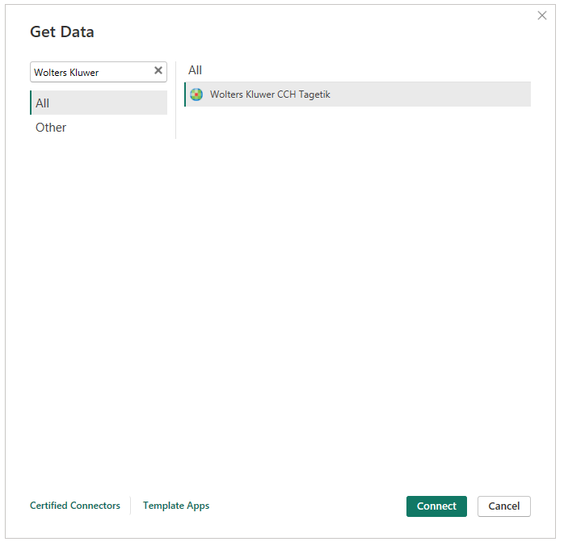
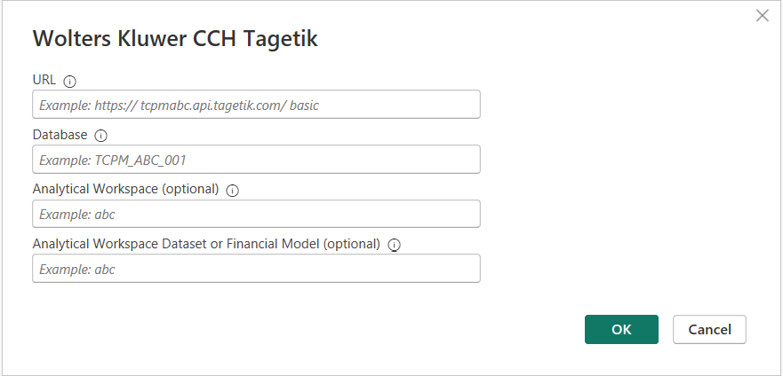
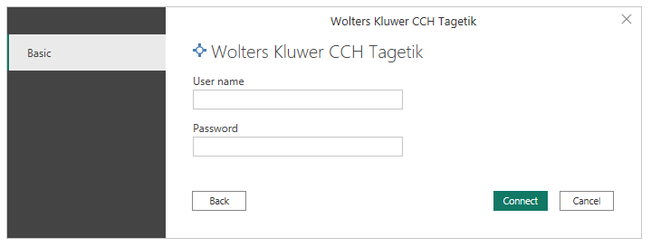
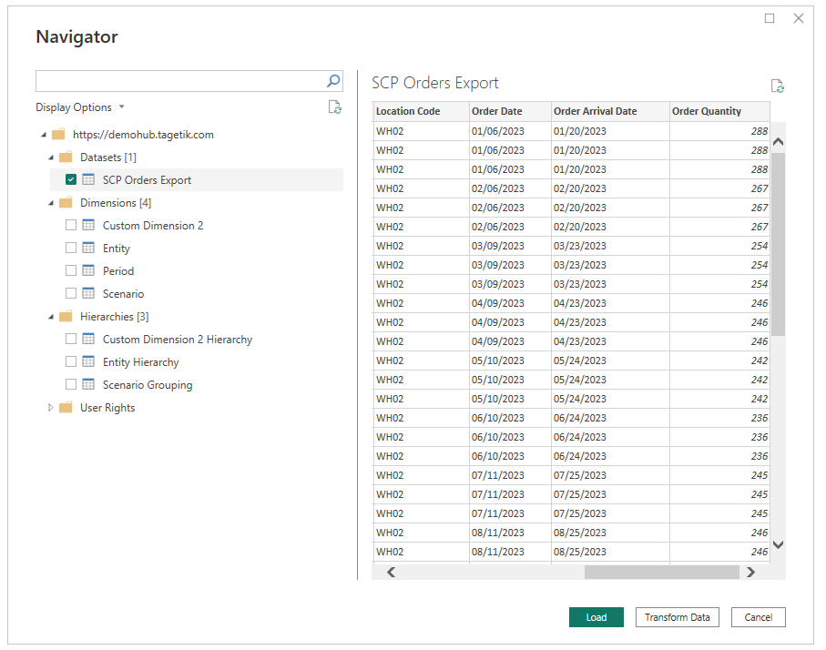
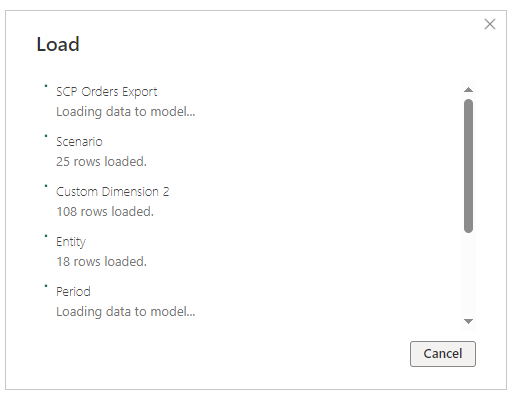
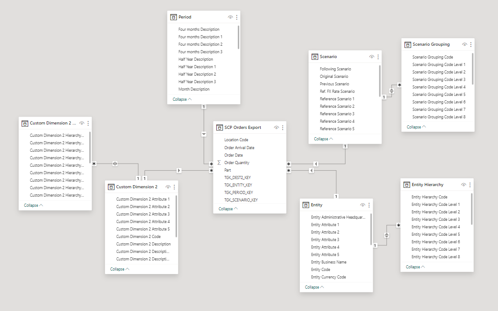
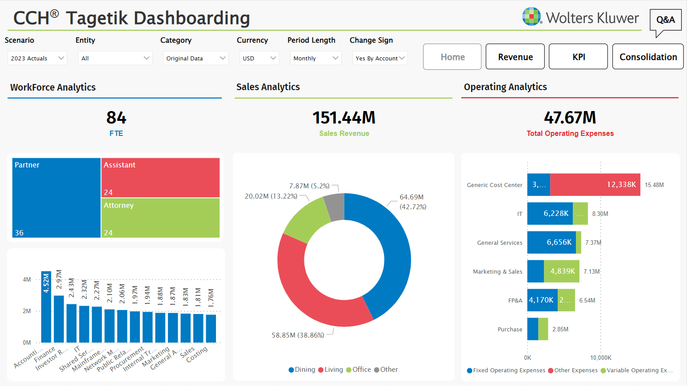

# Wolters Kluwer CCH Tagetik 

>[!Note]
>The following connector article is provided by Wolters Kluwer CCH Tagetik, the owner of this connector and a member of the Microsoft Power Query Connector Certification Program. If you have questions regarding the content of this article or have changes you would like to see made to this article, visit the Wolters Kluwer website and use the support channels there.

## Summary

| Item | Description |
| ---- | ----------- |
| Release State | General Availability |
| Products | Power BI (Semantic Models)|
| Authentication Types Supported | Basic |

## Prerequisites

Verify the [system requirements](https://www.microsoft.com/download/details.aspx?id=58494) before you install Microsoft Power BI Desktop.

To use the Wolters Kluwer CCH Tagetik connector, you need to configure the CCH Tagetik environment from which you want to read data.

## Capabilities supported

* Import
* Data loading from CCH Tagetik financial and analytical layer

## Connect to Wolters Kluwer CCH Tagetik data

To connect to Wolters Kluwer CCH Tagetik data:

1. Select **Get data** from the **Home** ribbon in Power BI Desktop and select **More**.
2. Search for **Wolters Kluwer CCH Tagetik** in the list of connectors.

   

3. Select **Connect**.
4. Enter the parameters to connect to the CCH Tagetik environment:

   * **URL** is your Wolters Kluwer CCH Tagetik environment endpoint.
   * **Database** is the code of the database.
   * **Analytical Workspace** (optional) is the code of the analytical workspace.
   * **Analytical Workspace Dataset** (optional) is the code of the analytical workspace dataset.

    
   
6. Enter the basic credentials and select **Connect**.

    The connector uses ad-hoc credentials (username and password) defined in CCH Tagetik to access and retrieve data through OData APIs.

    

7. Once authentication is complete, the connector displays the **Navigator** dialog containing a list of sources based on the parameters previously entered.

   

8. Select a single source to display a preview.
9. **Check** the box for one or more sources.
10. Select **Load** to import the data into Power BI. 

   

11. Once loaded, the tables appear in the model view. Begin exploring the attributes in the Power BI Fields dialog.

    

12. Start to build your report.

    
