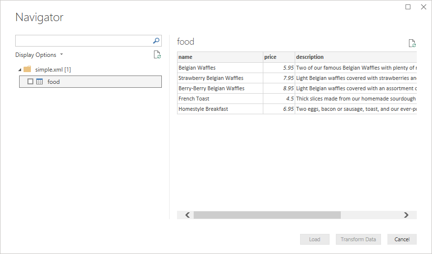

# XML

## Summary

| Item | Description |
| ---- | ----------- |
| Release State | General Availability |
| Products | Excel<br/>Power BI (Datasets)<br/>Power BI (Dataflows)<br/>Fabric (Dataflow Gen2)<br/>Power Apps (Dataflows)<br/>Dynamics 365 Customer Insights<br/>Analysis Services |
| Function Reference Documentation | [Xml.Tables](/powerquery-m/xml-tables)<br/>[Xml.Document](/powerquery-m/xml-document) |

> [!NOTE]
>Some capabilities may be present in one product but not others due to deployment schedules and host-specific capabilities.

## Capabilities supported

* Import

## Load a local XML file from Power Query Desktop

To load a local XML file:

1. Select the **XML** option in the **Get Data** selection. This action will launch a local file browser and allow you to select your XML file.

   

2. Browse to the directory containing the local XMl file you want to load, and then select **Open**.

3. In **Navigator**, select the data you want, and then either select **Load** to load the data, or **Transform Data** to continue transforming the data in Power Query Editor.

   

## Load a local XML file from Power Query Online

To load a local XML file:

1. From the **Data sources** page, select **XML**.

2. Enter the path to the local XML file.

   

3. Select an on-premises data gateway from **Data gateway**.

4. If authentication is required, enter your credentials.

5. Select **Next**.

Loading the XML file will automatically launch the Power Query Editor. From the editor, you can then transform the data if you want, or you can just save and close to load the data.


## Load an XML file from the web

If you want to load an XML file from the web, instead of selecting the XML connector you can select the Web connector. Paste in the address of the desired file and you'll be prompted with an authentication selection, since you're accessing a website instead of a static file. If there's no authentication, you can just select **Anonymous**. As in the local case, you'll then be presented with the table that the connector loads by default, which you can Load or Transform.

## Troubleshooting

### Data Structure

Due to the fact that many XML documents have ragged or nested data, you may have to do extra data shaping to get it in the sort of form that will make it convenient to do analytics. This holds true whether you use the UI accessible `Xml.Tables` function, or the `Xml.Document` function. Depending on your needs, you may find you have to do more or less data shaping.

### Text versus nodes

If your document contains a mixture of text and non-text sibling nodes, you may encounter issues.

For example if you have a node like this:

```xml
<abc>
    Hello <i>world</i>
</abc>
```

`Xml.Tables` will return the "world" portion but ignore "Hello". Only the element(s) are returned, not the text. However, `Xml.Document` will return "Hello \<i>world\</i>". The entire inner node is turned to text, and structure isn't preserved.
