# Using custom functions

If you find yourself in a situation where you need to apply the same set of transformations to different queries or values, creating a Power Query custom function that can be reused as many times as you need could be beneficial. A Power Query custom function is a mapping from a set of input values to a single output value, and is created from native M functions and operators. 

While you can manually create your own Power Query custom function using code as shown in [Understanding Power Query M functions](https://docs.microsoft.com/powerquery-m/understanding-power-query-m-functions), the Power Query user interface offers you features to speed up, simplify, and enhance the process of creating and managing a custom function. 
This article focuses on this experience provided only through the Power Query user interface and how to get the most out of it.

## Create a custom function from a table reference

You can follow along with this example by downloading the sample files used in this article from the following [download link](https://aka.ms/PQCombineFilesSample). For simplicity, this article will be using the Folder connector. To learn more about the Folder connector, see [Folder](Connectors/folder.md). The goal of this example is to create a custom function that can be applied to all the files in that folder before combining all of the data from all files into a single table.

After connecting to the folder where your files are located, right-click on the **Binary** value of your choice from the **Content** field and select the **Add as New Query** option. For this example, you'll see that the selection was made for the first file from the list, which happens to be the file *April 2019.csv*.


This option will effectively create a new query with a navigation step directly to that file as a Binary, and the name of this new query will be the file path of the selected file. Rename this query to be **Sample File**.


[Create a new parameter](power-query-query-parameters.md#creating-a-parameter) with the name **File Parameter**. Use the **Sample File** query as the **Current Value**, as shown in the following image.


>[!NOTE]
>We recommend that you read the article on [Parameters](power-query-query-parameters.md) to better understand how to create and manage parameters in Power Query.
>
>Custom functions can be created using any parameters type. There's no requirement for any custom function to have a binary as a parameter.
>
>It's possible to create a custom function without a parameter. This is commonly seen in scenarios where an input can be inferred from the environment where the function is being invoked. For example, a function that takes the environment's current date and time, and creates a specific text string from those values.  

Right-click **File Parameter** from the **Queries** pane. Select the **Reference** option.


Rename the newly created query from **File Parameter (2)** to **Transform Sample file**.

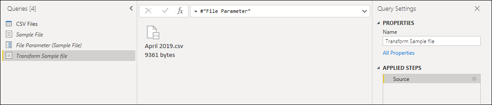

Right-click this new **Transform Sample file** query and select the **Create Function** option. 


This operation will effectively create a new function that will be linked with the **Transform Sample file** query. Any changes that you make to the **Transform Sample file** query will be automatically replicated to your custom function. During the creation of this new function, use **Transform file** as the **Function name**.


After creating the function, you'll notice that a new group will be created for you with the name of your function. This new group will contain:
* All parameters that were referenced in your **Transform Sample file** query.
* Your **Transform Sample file** query, commonly known as the *sample query*.
* Your newly created function, in this case **Transform file**.


### Applying transformations to a sample query

With your new function created, select the query with the name **Transform Sample file**. This query is now linked with the **Transform file** function, so any changes made to this query will be reflected in the function. This is what is known as the concept of a sample query linked to a function.

The first transformation that needs to happen to this query is one that will interpret the binary. You can right-click the binary from the preview pane and select the **CSV** option to interpret the binary as a CSV file.


The format of all the CSV files in the folder is the same. They all have a header that spans the first top four rows. The column headers are located in row five and the data starts from row six downwards, as shown in the next image.

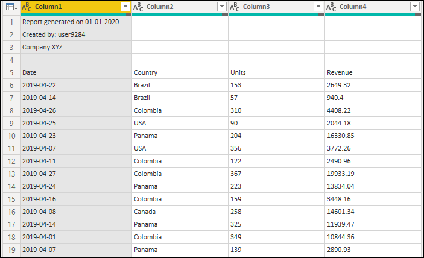

The next set of transformation steps that need to be applied to the **Transform Sample file** are:
1. **Remove the top four rows**&mdash;This action will get rid of the rows that are considered part of the header section of the file.

   

   >[!NOTE]
   > To learn more about how to remove rows or filter a table by row position, see [Filter by row position](filter-row-position.md).

2. **Promote headers**&mdash;The headers for your final table are now in the first row of the table. You can promote them as shown in the next image.

   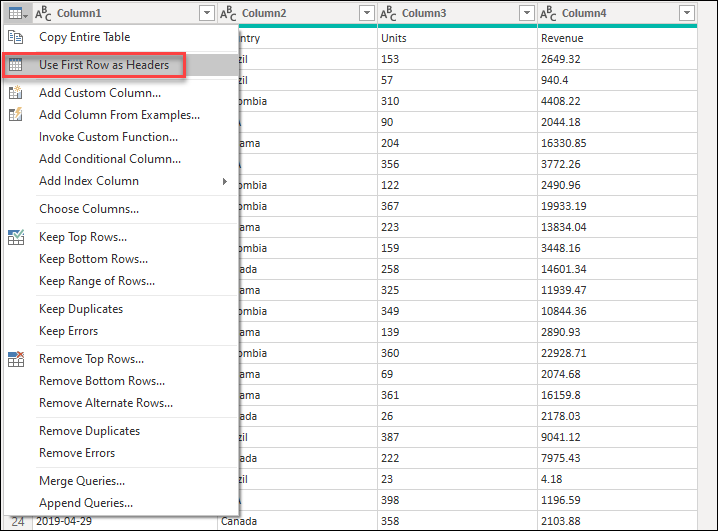

Power Query by default will automatically add a new **Changed Type** step after promoting your column headers that will automatically detect the data types for each column. Your **Transform Sample file** query will look like the next image.

>[!NOTE]
> To learn more about how to promote and demote headers, see [Promote or demote column headers](table-promote-demote-headers.md).

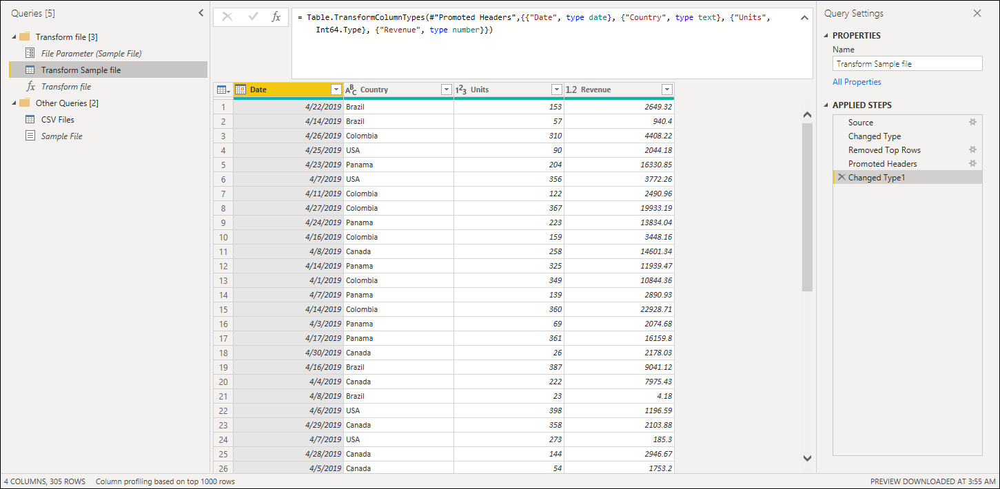

>[!CAUTION]
>Your **Transform file** function relies on the steps performed in the **Transform Sample file** query. However, if you try to manually modify the code for the **Transform file** function, you'll be greeted with a warning that reads `The definition of the function 'Transform file' is updated whenever query 'Transform Sample file' is updated. However, updates will stop if you directly modify function 'Transform file'.`  

### Invoke a custom function as a new column

With the custom function now created and all the transformation steps incorporated, you can go back to the original query where you have the list of files from the folder. Inside the **Add Column** tab in the ribbon, select **Invoke Custom Function** from the **General** group. Inside the **Invoke Custom Function** window, enter **Output Table** as the **New column name**. Select the name of your function, **Transform file**, from the **Function query** dropdown. After selecting the function from the dropdown menu, the parameter for the function will be displayed and you can select which column from the table to use as the argument for this function. Select the **Content** column as the value / argument to be passed for the **File Parameter**.


After you select **OK**, a new column with the name **Output Table** will be created. This column has **Table** values in its cells, as shown in the next image. For simplicity, remove all columns from this table except **Name** and **Output Table**.

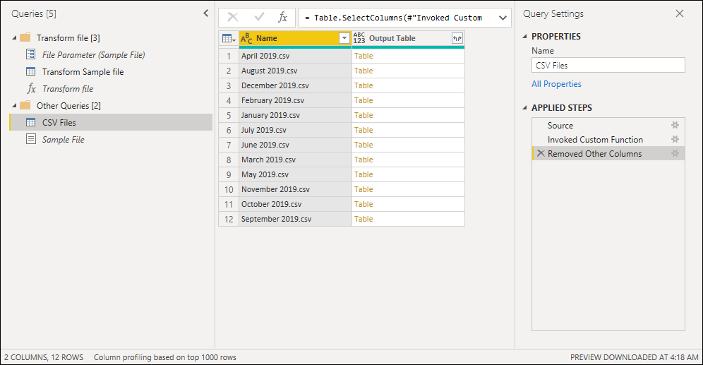

>[!NOTE]
> To learn more about how to choose or remove columns from a table, see [Choose or remove columns](choose-remove-columns.md).


Your function was applied to every single row from the table using the values from the **Content** column as the argument for your function. Now that the data has been transformed into the shape that you're looking for, you can expand the **Output Table** column, as shown in the image below, without using any prefix for the expanded columns.

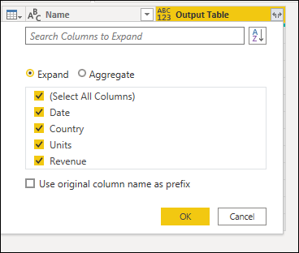

You can verify that you have data from all files in the folder by checking the values in the **Name** or **Date** column. For this case, you can check the values from the **Date** column, as each file only contains data for a single month from a given year. If you see more than one, it means that you've successfully combined data from multiple files into a single table.

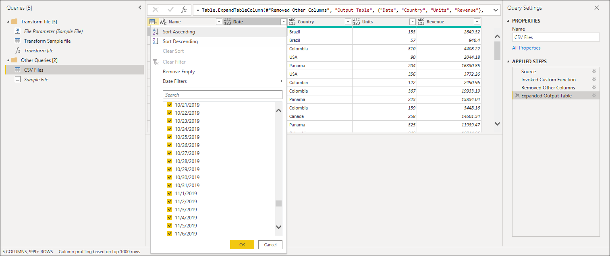

>[!NOTE]
>What you've read so far is fundamentally the same process that happens during the **Combine files** experience, but done manually.
>
>We recommend that you also read the  article on [Combine files overview](combine-files-overview.md) and [Combine CSV files](combine-files-csv.md) to further understand how the combine files experience works in Power Query and the role that custom functions play.


### Add new parameter to existing custom function

Imagine that there's a new requirement on top of what you've built. The new requirement requires that before you combine the files, you filter the data inside them to only get the rows where the Country is equals to *Panama*.

To make this requirement happen, create a new parameter called **Market** with the text data type. For the **Current Value**, enter the value **Panama**.

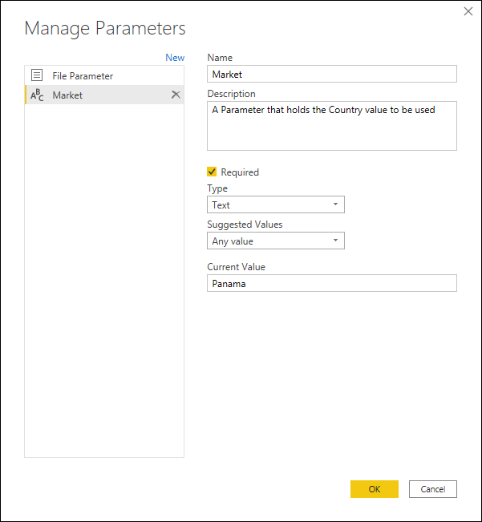

With this new parameter, select the **Transform Sample file** query and filter the **Country** field using the value from the **Market** parameter.


>[!NOTE]
> To learn more about how to filter columns by values, see [Filter values](filter-values.md).

Applying this new step to your query will automatically update the **Transform file** function, which will now require two parameters based on the two parameters that your **Transform Sample file** uses.


But the **CSV files** query has a warning sign next to it. Now that your function has been updated, it requires two parameters. So the step where you invoke the function results in error values, since only one of the arguments was passed to the **Transform file** function during the **Invoked Custom Function** step.

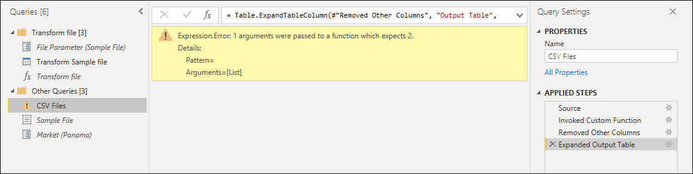

To fix the errors, double-click **Invoked Custom Function** in the **Applied Steps** to open the **Invoke Custom Function** window. In the **Market** parameter, manually enter the value **Panama**.

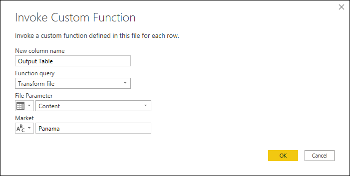

You can now check your query to validate that only rows where **Country** is equal to **Panama** show up in the final result set of the **CSV Files** query.

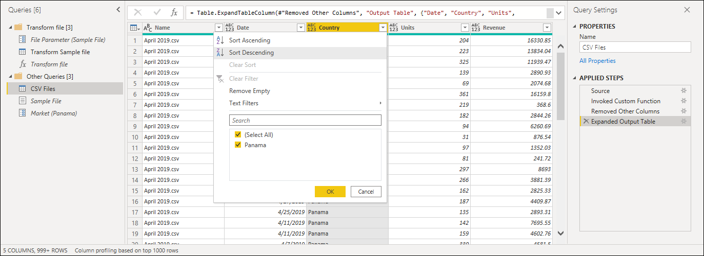

## Create a custom function from a reusable piece of logic

If you have multiple queries or values that require the same set of transformations, you could create a custom function that acts as a reusable piece of logic. Later, this custom function can be invoked against the queries or values of your choice. This custom function could save you time and help you in managing your set of transformations in a central location, which you can modify at any moment.

For example, imagine a query that has several codes as a text string and you want to create a function that will decode those values.

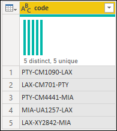

You start by having a parameter that has a value that serves as an example. For this case, it will be the value **PTY-CM1090-LAX**.


From that parameter, you create a new query where you apply the transformations that you need. For this case, you want to split the code *PTY-CM1090-LAX* into multiple components:
* **Origin** = PTY
* **Destination** = LAX
* **Airline** = CM
* **FlightID** = 1090


The M code for that set of transformations is shown below.

```powerquery-m
let
    Source = code,
    SplitValues = Text.Split( Source, "-"),
    CreateRow = [Origin= SplitValues{0}, Destination= SplitValues{2}, Airline=Text.Start( SplitValues{1},2), FlightID= Text.End( SplitValues{1}, Text.Length( SplitValues{1} ) - 2) ],
    RowToTable = Table.FromRecords( {  CreateRow } ),
    #"Changed Type" = Table.TransformColumnTypes(RowToTable,{{"Origin", type text}, {"Destination", type text}, {"Airline", type text}, {"FlightID", type text}})
in
    #"Changed Type"
```

>[!NOTE]
> To learn more about the Power Query M formula language, see [Power Query M formula language](https://docs.microsoft.com/powerquery-m) 

You can then transform that query into a function by doing a right-click on the query and selecting **Create Function**. Finally, you can invoke your custom function into any of your queries or values, as shown in the next image.

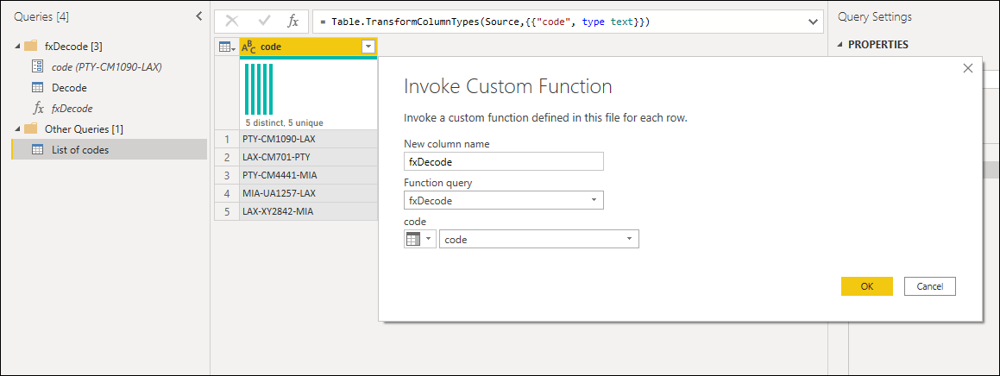

After a few more transformations, you can see that you've reached your desired output and leveraged the logic for such a transformation from a custom function.

 [ 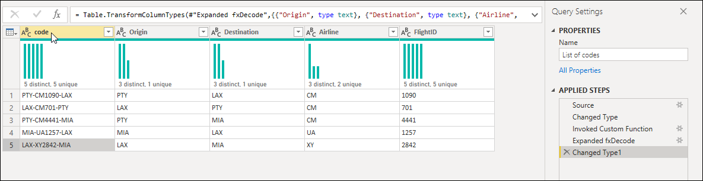 ](images/me-invoked-custom-function.png#lightbox)
