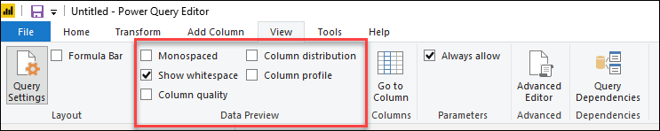
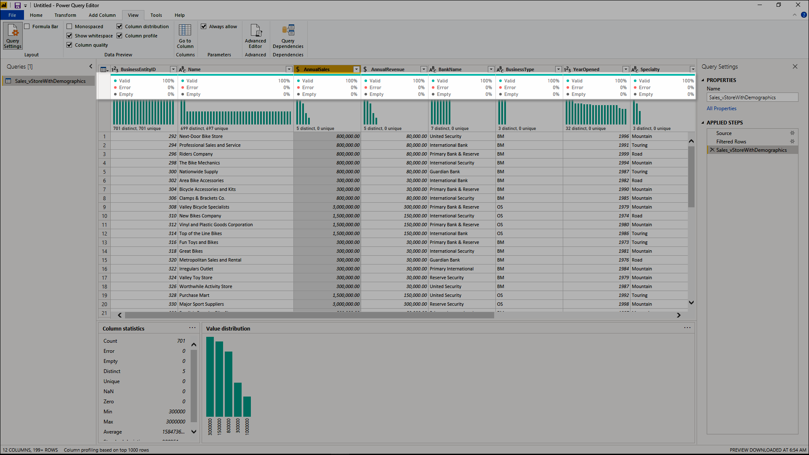
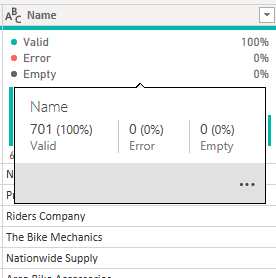
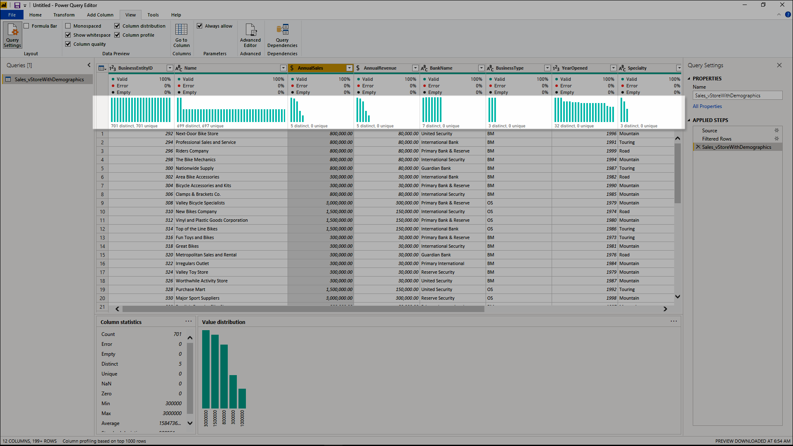
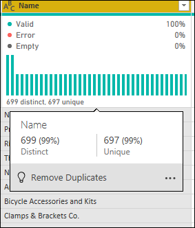
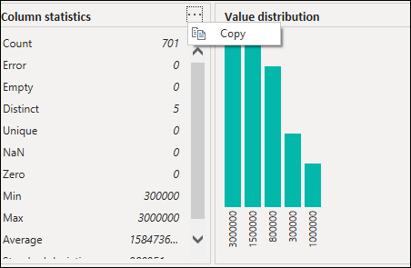
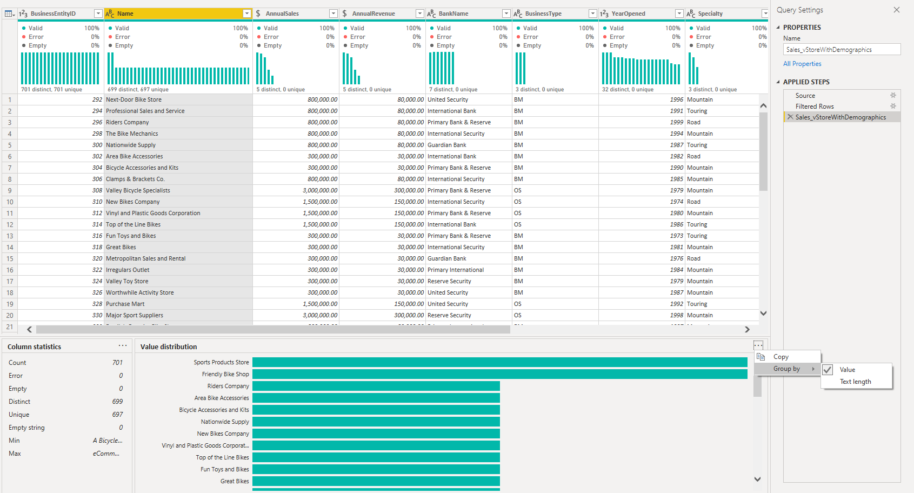
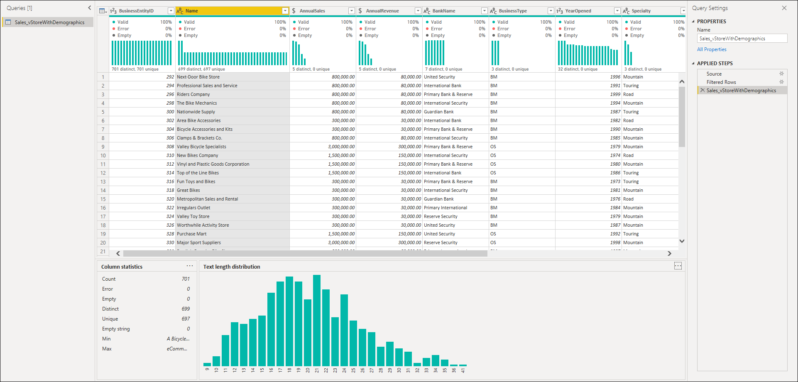

# Data preview tools

The main objective of the data preview tools is to provide the user with new and intuitive ways to clean, transform, and understand their data within the Power Query Editor window.

These data preview tools are:

* Column quality

* Column distribution

* Column profile

To enable the data preview tools, select the **View** tab from the ribbon and navigate to the **Data Preview** section. Enable the options you want as shown in the following image.

Once enabled, the following image shows how they'll be seen inside Power Query Editor.

Each tool is independent from the other. This means that you can select which ones to enable and which ones you would like to keep as disabled.

>[!NOTE] 
>By default, Power Query will perform these data preview features over the first 1,000 rows of your data. To enable these, check the bottom left query of your editor window to change how the column profiling is performed.

## Column quality
The column quality feature provides the user with a simple visual that labels values in rows with values in three categories:

* **Valid**&mdash;shown in green

* **Error**&mdash;shown in red

* **Empty**&mdash;shown in dark grey

These indicators are displayed right underneath the name of the column as part of a small bar chart, as shown in the following image.

Also, a percentage the number of records within each column quality category is also displayed.

By hovering over any of the columns, you can see the numerical distribution of the quality of values throughout the column. Additionally, selecting the ellipsis button (...) opens some quick action buttons for operations on the values.

## Column distribution

This feature provides a set of visuals underneath the names of the columns that showcases the frequency and distribution of the values in each of the columns. The data inside these visualizations is sorted in descending order from the value with the higher frequency.

Besides giving information on the overall data inside the column (with distinct count and unique values), hover over operations are also available.

## Column profile

This feature provides a more in-depth look at the data within a column. Apart from the column distribution chart, there's also a column statistics chart. This information is displayed underneath the data preview section as shown in the following image.

### Filter by value

You can interact with the value distribution chart on the right and select any of the bars by hovering over the parts of the chart.  

Right-click to display a set of available transformations for that value.

### Copy data

On the top right-hand corner of both the column statistics and value distribution sections, there's an ellipsis button (...). When you select the button, a contextual menu is displayed. In this menu, there's an option to copy the contents of the data displayed in either section to the clipboard.

### Group by value

When you select the ellipsis on the top right-hand corner of the value distribution chart, you'll also get the option to use the **Group by** feature. This feature groups your values in the chart by a set of available options. 

The image below demonstrates grouping a column of product names by the text length. Once the values have been grouped in the chart, you can interact with it as described in [Filter by value](#filter-by-value).

