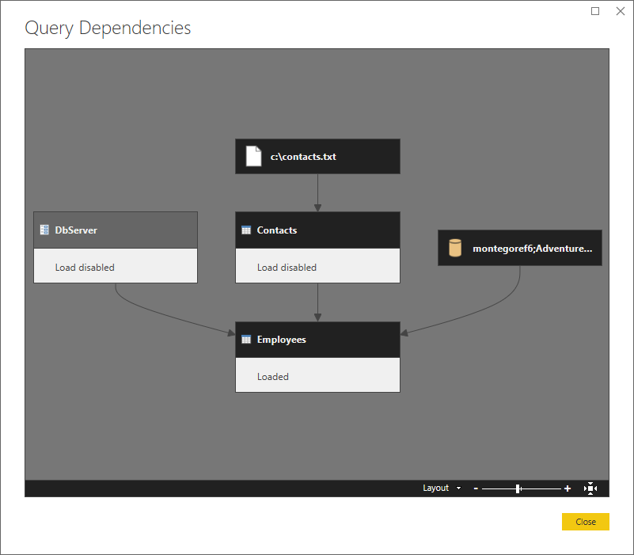
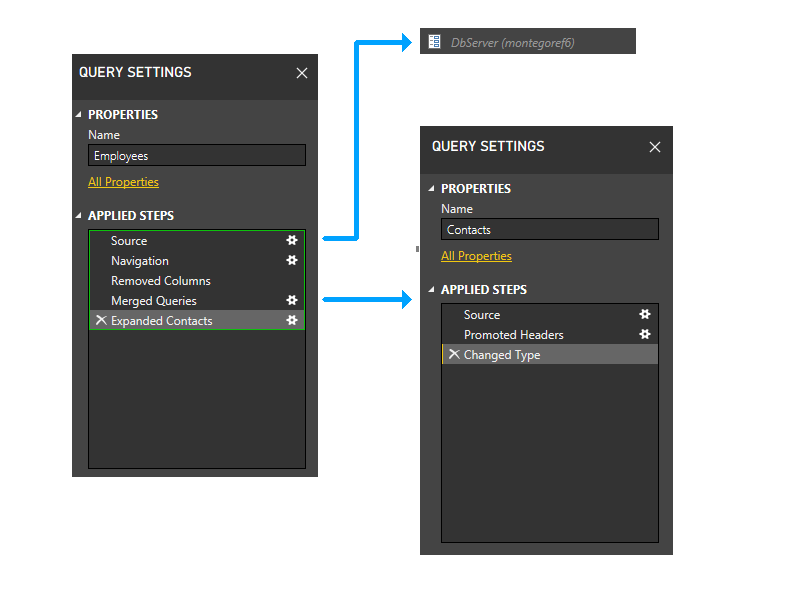

# Behind the scenes of the Data Privacy Firewall

>[!NOTE]
>Privacy levels are currently unavailable in Power Platform dataflows. The product team is working towards enabling this functionality in the future.

If you've used Power Query for any length of time, you've likely experienced it. There you are, querying away, when you suddenly get an error that no amount of online searching, query tweaking, or keyboard bashing can remedy. An error like:

`Formula.Firewall: Query 'Query1' (step 'Source') references other queries or steps, so it may not directly access a data source. Please rebuild this data combination.`

Or maybe:

`Formula.Firewall: Query 'Query1' (step 'Source') is accessing data sources that have privacy levels which cannot be used together. Please rebuild this data combination.`

These `Formula.Firewall` errors are the result of Power Query's Data Privacy Firewall (also known as the Firewall), which at times may seem like it exists solely to frustrate data analysts the world over. Believe it or not, however, the Firewall serves an important purpose. In this article, we'll delve under the hood to better understand how it works. Armed with greater understanding, you'll hopefully be able to better diagnose and fix Firewall errors in the future.

## What is it?

The purpose of the Data Privacy Firewall is simple: it exists to prevent Power Query from unintentionally leaking data between sources.

Why is this needed? I mean, you could certainly author some M that would pass a SQL value to an OData feed. But this would be intentional data leakage. The mashup author would (or at least should) know they were doing this. Why then the need for protection against unintentional data leakage?

The answer? Folding.

## Folding?

_Folding_ is a term that refers to converting expressions in M (such as filters, renames, joins, and so on) into operations against a raw data source (such as SQL, OData, and so on). A huge part of Power Query's power comes from the fact that PQ can convert the operations a user performs via its user interface into complex SQL or other backend data source languages, without the user having to know said languages. Users get the performance benefit of native data source operations, with the ease of use of a UI where all data sources can be transformed using a common set of commands.

As part of folding, PQ sometimes may determine that the most efficient way to execute a given mashup is to take data from one source and pass it to another. For example, if you're joining a small CSV file to a huge SQL table, you probably don't want PQ to read the CSV file, read the entire SQL table, and then join them together on your local computer. You probably want PQ to inline the CSV data into a SQL statement and ask the SQL database to perform the join.

This is how unintentional data leakage can happen.

Imagine if you were joining SQL data that included employee Social Security Numbers with the results of an external OData feed, and you suddenly discovered that the Social Security Numbers from SQL were being sent to the OData service. Bad news, right?

This is the kind of scenario the Firewall is intended to prevent.

## How does it work?

The Firewall exists to prevent data from one source from being unintentionally sent to another source. Simple enough.

So how does it accomplish this mission?

It does this by dividing your M queries into something called partitions, and then enforcing the following rule:

* A partition may either access compatible data sources, or reference other partitions, but not both.

Simple…yet confusing. What's a partition? What makes two data sources "compatible"? And why should the Firewall care if a partition wants to access a data source and reference a partition?

Let's break this down and look at the above rule one piece at a time.

### What's a partition?

At its most basic level, a partition is just a collection of one or more query steps. The most granular partition possible (at least in the current implementation) is a single step. The largest partitions can sometimes encompass multiple queries. (More on this later.)

If you're not familiar with steps, you can view them on the right of the Power Query Editor window after selecting a query, in the **Applied Steps** pane. Steps keep track of everything you've done to transform your data into its final shape.

### Partitions that reference other partitions

When a query is evaluated with the Firewall on, the Firewall divides the query and all its dependencies into partitions (that is, groups of steps). Anytime one partition references something in another partition, the Firewall replaces the reference with a call to a special function called `Value.Firewall`. In other words, the Firewall doesn't allow partitions to access each other directly. All references are modified to go through the Firewall. Think of the Firewall as a gatekeeper. A partition that references another partition must get the Firewall's permission to do so, and the Firewall controls whether or not the referenced data will be allowed into the partition.

This all may seem pretty abstract, so let's look at an example.

Assume you have a query called Employees, which pulls some data from a SQL database. Assume you also have another query (EmployeesReference), which simply references Employees.

```powerquery-m
shared Employees = let
    Source = Sql.Database(…),
    EmployeesTable = …
in
    EmployeesTable;

shared EmployeesReference = let
    Source = Employees
in
    Source;
```

These queries will end up divided into two partitions: one for the Employees query, and one for the EmployeesReference query (which will reference the Employees partition). When evaluated with the Firewall on, these queries will be rewritten like so:

```powerquery-m
shared Employees = let
    Source = Sql.Database(…),
    EmployeesTable = …
in
    EmployeesTable;

shared EmployeesReference = let
    Source = Value.Firewall("Section1/Employees")
in
    Source;
```

Notice that the simple reference to the Employees query has been replaced by a call to `Value.Firewall`, which is provided the full name of the Employees query.

When EmployeesReference is evaluated, the call to `Value.Firewall("Section1/Employees")` is intercepted by the Firewall, which now has a chance to control whether (and how) the requested data flows into the EmployeesReference partition. It can do any number of things: deny the request, buffer the requested data (which prevents any further folding to its original data source from occurring), and so on.

This is how the Firewall maintains control over the data flowing between partitions.

### Partitions that directly access data sources

Let's say you define a query Query1 with one step (note that this single-step query corresponds to one Firewall partition), and that this single step accesses two data sources: a SQL database table and a CSV file. How does the Firewall deal with this, since there's no partition reference, and thus no call to `Value.Firewall` for it to intercept? Let's review to the rule stated earlier:

* A partition may either access compatible data sources, or reference other partitions, but not both.

In order for your single-partition-but-two-data-sources query to be allowed to run, its two data sources must be "compatible". In other words, it needs to be okay for data to be shared bidirectionally between them. This means that the privacy levels of both sources need to be Public, or both be Organizational, since these are the only two combinations that allow sharing in both directions. If both sources are marked Private, or one is marked Public and one is marked Organizational, or they're marked using some other combination of privacy levels, then bidirectional sharing isn't allowed, and it's thus not safe for them to both be evaluated in the same partition. Doing so would mean unsafe data leakage could occur (due to folding), and the Firewall would have no way to prevent it.

What happens if you try to access incompatible data sources in the same partition?

`Formula.Firewall: Query 'Query1' (step 'Source') is accessing data sources that have privacy levels which cannot be used together. Please rebuild this data combination.`

Hopefully you now better understand one of the error messages listed at the beginning of this article.

Note that this _compatibility_ requirement only applies within a given partition. If a partition is referencing other partitions, the data sources from the referenced partitions don't have to be compatible with one another. This is because the Firewall can buffer the data, which will prevent any further folding against the original data source. The data will be loaded into memory and treated as if it came from nowhere.

### Why not do both?

Let's say you define a query with one step (which will again correspond to one partition) that accesses two other queries (that is, two other partitions). What if you wanted, in the same step, to also directly access a SQL database? Why can't a partition reference other partitions and directly access compatible data sources?

As you saw earlier, when one partition references another partition, the Firewall acts as the gatekeeper for all the data flowing into the partition. To do so, it must be able to control what data is allowed in. If there are data sources being accessed within the partition, and data flowing in from other partitions, it loses its ability to be the gatekeeper, since the data flowing in could be leaked to one of the internally accessed data sources without it knowing about it. Thus the Firewall prevents a partition that accesses other partitions from being allowed to directly access any data sources.

So what happens if a partition tries to reference other partitions and also directly access data sources?

`Formula.Firewall: Query 'Query1' (step 'Source') references other queries or steps, so it may not directly access a data source. Please rebuild this data combination.`

Now you hopefully better understand the other error message listed at the beginning of this article.

### Partitions in-depth

As you can probably guess from the above information, how queries are partitioned ends up being incredibly important. If you have some steps that are referencing other queries, and other steps that access data sources, you now hopefully recognize that drawing the partition boundaries in certain places will cause Firewall errors, while drawing them in other places will allow your query to run just fine.

So how exactly do queries get partitioned?

This section is probably the most important for understanding why you're seeing Firewall errors, and understanding how to resolve them (where possible).

Here's a high-level summary of the partitioning logic.

* Initial Partitioning
  * Creates a partition for each step in each query
* Static Phase
  * This phase doesn't depend on evaluation results. Instead, it relies on how the queries are structured.
    * Parameter Trimming
      * Trims parameter-esque partitions, that is, any one that:
        * Doesn't reference any other partitions
        * Doesn't contain any function invocations
        * Isn't cyclic (that is, it doesn't refer to itself)
      * Note that "removing" a partition effectively includes it in whatever other partitions reference it.
      * Trimming parameter partitions allows parameter references used within data source function calls (for example, `Web.Contents(myUrl)`) to work, instead of throwing "partition can't reference data sources and other steps" errors.
    * Grouping (Static)
      * Partitions are merged in bottom-up dependency order. In the resulting merged partitions, the following will be separate:
        * Partitions in different queries
        * Partitions that don't reference other partitions (and are thus allowed to access a data source)
        * Partitions that reference other partitions (and are thus prohibited from accessing a data source)
* Dynamic Phase
  * This phase depends on evaluation results, including information about data sources accessed by various partitions.
  * Trimming
    * Trims partitions that meet all the following requirements:
      * Doesn't access any data sources
      * Doesn't reference any partitions that access data sources
      * Isn't cyclic
  * Grouping (Dynamic)
    * Now that unnecessary partitions have been trimmed, try to create Source partitions that are as large as possible.
    * Merge all partitions with their input partitions if each of its inputs:
      * Is part of the same query
      * Doesn't reference any other partitions
      * Is only referenced by the current partition
      * Isn't the result (that is, final step) of a query
      * Isn't cyclic

## What does all this mean?

Let's walk through an example to illustrate how the complex logic laid out above works.

Here's a sample scenario. It's a fairly straightforward merge of a text file (Contacts) with a SQL database (Employees), where the SQL server is a parameter (DbServer).

### The three queries

Here's the M code for the three queries used in this example.

```powerquery-m
shared DbServer = "montegoref6" meta [IsParameterQuery=true, Type="Text", IsParameterQueryRequired=true];
```

```powerquery-m
shared Contacts = let

    Source = Csv.Document(File.Contents("C:\contacts.txt"),[Delimiter="   ", Columns=15, Encoding=1252, QuoteStyle=QuoteStyle.None]),

    #"Promoted Headers" = Table.PromoteHeaders(Source, [PromoteAllScalars=true]),

    #"Changed Type" = Table.TransformColumnTypes(#"Promoted Headers",{{"ContactID", Int64.Type}, {"NameStyle", type logical}, {"Title", type text}, {"FirstName", type text}, {"MiddleName", type text}, {"LastName", type text}, {"Suffix", type text}, {"EmailAddress", type text}, {"EmailPromotion", Int64.Type}, {"Phone", type text}, {"PasswordHash", type text}, {"PasswordSalt", type text}, {"AdditionalContactInfo", type text}, {"rowguid", type text}, {"ModifiedDate", type datetime}})

in

    #"Changed Type";
```

```powerquery-m
shared Employees = let

    Source = Sql.Databases(DbServer),

    AdventureWorks = Source{[Name="AdventureWorks"]}[Data],

    HumanResources_Employee = AdventureWorks{[Schema="HumanResources",Item="Employee"]}[Data],

    #"Removed Columns" = Table.RemoveColumns(HumanResources_Employee,{"HumanResources.Employee(EmployeeID)", "HumanResources.Employee(ManagerID)", "HumanResources.EmployeeAddress", "HumanResources.EmployeeDepartmentHistory", "HumanResources.EmployeePayHistory", "HumanResources.JobCandidate", "Person.Contact", "Purchasing.PurchaseOrderHeader", "Sales.SalesPerson"}),

    #"Merged Queries" = Table.NestedJoin(#"Removed Columns",{"ContactID"},Contacts,{"ContactID"},"Contacts",JoinKind.LeftOuter),

    #"Expanded Contacts" = Table.ExpandTableColumn(#"Merged Queries", "Contacts", {"EmailAddress"}, {"EmailAddress"})

in

    #"Expanded Contacts";
```

Here's a higher-level view, showing the dependencies.



### Let's partition

Let's zoom in a bit and include steps in the picture, and start walking through the partitioning logic. Here's a diagram of the three queries, showing the initial firewall partitions in green. Notice that each step starts in its own partition.


Next, we trim parameter partitions. Thus, DbServer gets implicitly included in the Source partition.


Now we perform the static grouping. This maintains separation between partitions in separate queries (note for instance that the last two steps of Employees don't get grouped with the steps of Contacts), and between partitions that reference other partitions (such as the last two steps of Employees) and those that don't (such as the first three steps of Employees).


Now we enter the dynamic phase. In this phase, the above static partitions are evaluated. Partitions that don't access any data sources are trimmed. Partitions are then grouped to create source partitions that are as large as possible. However, in this sample scenario, all the remaining partitions access data sources, and there isn't any further grouping that can be done. The partitions in our sample thus won't change during this phase.

### Let's pretend

For the sake of illustration, though, let's look at what would happen if the Contacts query, instead of coming from a text file, were hard-coded in M (perhaps via the **Enter Data** dialog).

In this case, the Contacts query wouldn't access any data sources. Thus, it would get trimmed during the first part of the dynamic phase.


With the Contacts partition removed, the last two steps of Employees would no longer reference any partitions except the one containing the first three steps of Employees. Thus, the two partitions would be grouped.

The resulting partition would look like this.



## Example: Passing data from one data source to another

Okay, enough abstract explanation. Let's look at a common scenario where you're likely to encounter a Firewall error and the steps to resolve it.

Imagine you want to look up a company name from the Northwind OData service, and then use the company name to perform a Bing search.

First, you create a **Company** query to retrieve the company name.

```powerquery-m
let
    Source = OData.Feed("https://services.odata.org/V4/Northwind/Northwind.svc/", null, [Implementation="2.0"]),
    Customers_table = Source{[Name="Customers",Signature="table"]}[Data],
    CHOPS = Customers_table{[CustomerID="CHOPS"]}[CompanyName]
in
    CHOPS
```

Next, you create a **Search** query that references **Company** and passes it to Bing.

```powerquery-m
let
    Source = Text.FromBinary(Web.Contents("https://www.bing.com/search?q=" & Company))
in
    Source
```

At this point you run into trouble. Evaluating **Search** produces a Firewall error.

`Formula.Firewall: Query 'Search' (step 'Source') references other queries or steps, so it may not directly access a data source. Please rebuild this data combination.`

This is because the Source step of **Search** is referencing a data source (bing.com) and also referencing another query/partition (**Company**). It's violating the rule mentioned above ("a partition may either access compatible data sources, or reference other partitions, but not both").

What to do? One option is to disable the Firewall altogether (via the Privacy option labeled **Ignore the Privacy Levels and potentially improve performance**). But what if you want to leave the Firewall enabled?

To resolve the error without disabling the Firewall, you can combine Company and Search into a single query, like this:

```powerquery-m
let
    Source = OData.Feed("https://services.odata.org/V4/Northwind/Northwind.svc/", null, [Implementation="2.0"]),
    Customers_table = Source{[Name="Customers",Signature="table"]}[Data],
    CHOPS = Customers_table{[CustomerID="CHOPS"]}[CompanyName],
    Search = Text.FromBinary(Web.Contents("https://www.bing.com/search?q=" & CHOPS))
in
    Search
```

Everything is now happening inside a _single_ partition. Assuming that the privacy levels for the two data sources are compatible, the Firewall should now be happy, and you'll no longer get an error.

## That's a wrap

While there's much more that could be said on this topic, this introductory article is already long enough. Hopefully it's given you a better understanding of the Firewall, and will help you to understand and fix Firewall errors when you encounter them in the future.
