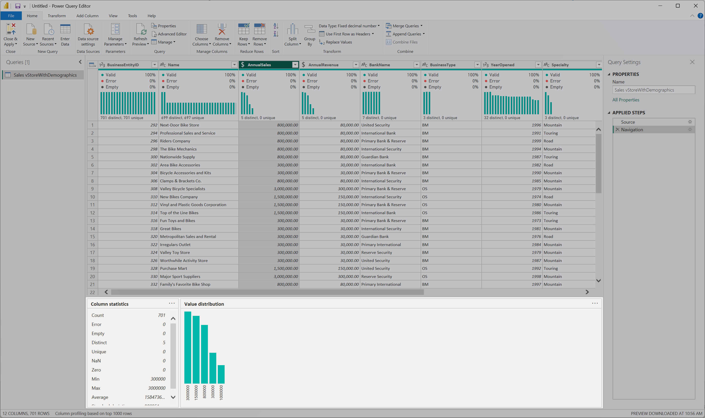
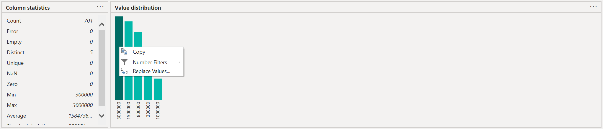

# Using the data profiling tools

The data profiling tools provide new and intuitive ways to clean, transform, and understand data in Power Query Editor. They include:

* Column quality

* Column distribution

* Column profile

To enable the data profiling tools, go to the **View** tab on the ribbon. Enable the options you want in the **Data preview** group, as shown in the following image.

After you enable the options, you'll see something like the following image in Power Query Editor.

>[!NOTE]
>By default, Power Query will perform this data profiling over the first 1,000 rows of your data. To have it operate over the entire dataset, check the lower-left corner of your editor window to change how column profiling is performed.

## Column quality

The column quality feature labels values in rows in five categories:

* **Valid**, shown in green.

* **Error**, shown in red.

* **Empty**, shown in dark grey.

* **Unknown**, shown in dashed green. Indicates when there are errors in a column, the quality of the remaining data is unknown.

* **Unexpected error**, shown in dashed red.

These indicators are displayed directly underneath the name of the column as part of a small bar chart, as shown in the following image.

The number of records in each column quality category is also displayed as a percentage.

By hovering over any of the columns, you are presented with the numerical distribution of the quality of values throughout the column. Additionally, selecting the ellipsis button (...) opens some quick action buttons for operations on the values.

, zero errors and zero empty, with quick action commands displayed")

## Column distribution

This feature provides a set of visuals underneath the names of the columns that showcase the frequency and distribution of the values in each of the columns. The data in these visualizations is sorted in descending order from the value with the highest frequency.

By hovering over the distribution data in any of the columns, you get information about the overall data in the column (with distinct count and unique values). You can also select the ellipsis button and choose from a menu of available operations.

## Column profile

This feature provides a more in-depth look at the data in a column. Apart from the column distribution chart, it contains a column statistics chart. This information is displayed underneath the data preview section, as shown in the following image.

### Filter by value

You can interact with the value distribution chart on the right side and select any of the bars by hovering over the parts of the chart.  

Right-click to display a set of available transformations for that value.

### Copy data

In the upper-right corner of both the column statistics and value distribution sections, you can select the ellipsis button (...) to display a **Copy** shortcut menu. Select it to copy the data displayed in either section to the clipboard.

### Group by value

When you select the ellipsis button (...) in the upper-right corner of the value distribution chart, in addition to **Copy** you can select **Group by**. This feature groups the values in your chart by a set of available options.

The image below shows a column of product names that have been grouped by text length. After the values have been grouped in the chart, you can interact with individual values in the chart as described in [Filter by value](#filter-by-value).

