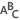
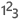
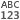
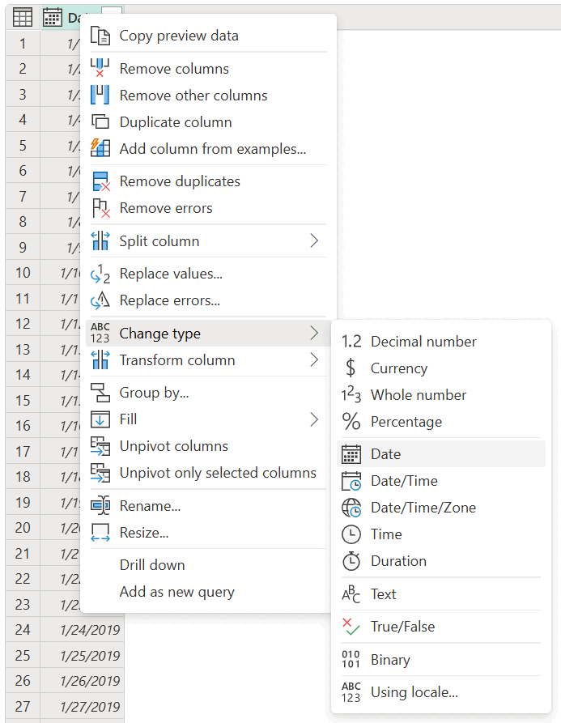
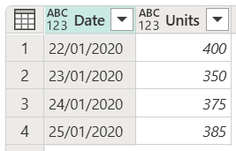
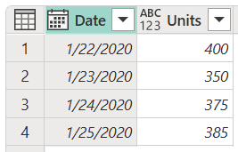

# Data types in Power Query

Data types in Power Query are used to classify values to have a more structured data set. Data types are defined at the field level&mdash;values inside a field are set to ***conform*** to the data type of the field.

The data type of a column is displayed on the left side of the column heading with an icon that symbolizes the data type.

:::image type="content" source="media/data-types/data-types-icons.png" alt-text="Shows common data type icons displayed on the left side of the table column heading in the data preview pane.":::

>[!NOTE]
>Power Query provides a set of contextual transformations and options based on the data type of the column. For example, when you select a column with a data type of Date, you get transformations and options that apply to that specific data type. These transformations and options occur throughout the Power Query interface, such as on the **Transform** and **Add column** tabs and the smart filter options. 

The most common data types used in Power Query are listed in the following table. Although beyond the scope of this article, you can find the complete list of data types in the Power Query M formula language [Types article](/powerquery-m/m-spec-types).

|Data type | Icon | Description|
----------|------|------------|
|**Text**|   |A Unicode character data string. Can be strings, numbers, or dates represented in a text format. Maximum string length is 268,435,456 Unicode characters (where each Unicode character is two bytes) or 536,870,912 bytes.|
|**True/False**| |A Boolean value of either True or False.|
| **Decimal number**|  |Represents a 64-bit (eight-byte) floating-point number. It's the most common number type, and corresponds to numbers as you usually think of them. Although designed to handle numbers with fractional values, it also handles whole numbers. The Decimal Number type can handle negative values from &ndash;1.79E +308 through &ndash;2.23E &ndash;308, 0, and positive values from 2.23E &ndash;308 through 1.79E + 308. For example, numbers like 34, 34.01, and 34.000367063 are valid decimal numbers. The largest precision that can be represented in a Decimal Number type is 15 digits long. The decimal separator can occur anywhere in the number. The Decimal Number type corresponds to how Excel stores its numbers. Note that a binary floating-point number can't represent all numbers within its supported range with 100% accuracy. Thus, minor differences in precision might occur when representing certain decimal numbers.|
|**Fixed decimal number** |  | Also known as the Currency type, this data type has a fixed location for the decimal separator. The decimal separator always has four digits to its right and allows for 19 digits of significance. The largest value it can represent is 922,337,203,685,477.5807 (positive or negative). Unlike Decimal Number, the Fixed Decimal Number type is always precise and is thus useful in cases where the imprecision of floating-point notation might introduce errors.|
|**Whole number** |   | Represents a 64-bit (eight-byte) integer value. Because it's an integer, it has no digits to the right of the decimal place. It allows for 19 digits; positive or negative whole numbers between &ndash;9,223,372,036,854,775,807 (&ndash;2^63+1) and 9,223,372,036,854,775,806 (2^63&ndash;2). It can represent the largest possible precision of the various numeric data types. As with the Fixed Decimal Number type, the Whole Number type can be useful in cases where you need to control rounding. |
|**Percentage** | | Fundamentally the same as a Decimal Number type, but it has a mask to format the values in the column as a percentage in the Power Query Editor window.|
|**Date/Time** |   |Represents both a date and time value. Underneath the covers, the Date/Time value is stored as a Decimal Number type, so you can actually convert between the two. The time portion of a date is stored as a fraction to whole multiples of 1/300 seconds (3.33 ms). Dates between the years 1900 and 9999 are supported.|
|**Date** |  | Represents just a date (no time portion). When converted into the model, a Date is the same as a Date/Time value with zero for the fractional value.|
|**Time**|   |Represents just time (no date portion). When converted into the model, a Time value is the same as a Date/Time value with no digits to the left of the decimal place.|
|**Date/Time/Timezone** |  |Represents a UTC Date/Time with a time-zone offset. It's converted into Date/Time when loaded into the model.| 
|**Duration**|  | Represents a length of time, which is converted into a Decimal Number type when loaded into the model. As a Decimal Number type, it can be added or subtracted from a Date/Time field with correct results. Because it's a Decimal Number type, you can easily use it in visualizations that show magnitude.|
|**Binary**|  |The Binary data type can be used to represent any other data with a binary format.|
|**Any**| |The Any data type is the status given to a column that doesn't have an explicit data type definition. Any is the data type that classifies all values. We recommend that you always explicitly define the column data types for your queries from unstructured sources, and avoid having any columns with the Any data type as the output of your query.|

## Data type detection

Data type detection occurs automatically when connecting to:

* **Structured data sources such as databases**, Power Query reads the table schema from the data source and automatically displays the data by using the correct data type for each column.

* **Unstructured sources such as Excel, CSV, and text files**, Power Query automatically detects data types by inspecting the values in the table. By default, automatic data type detection is enabled in Power Query for unstructured sources.

You can also use the **Detect data type** command in the **Any column** group on the **Transform** tab to automatically detect the data types of the columns in your table.

:::image type="content" source="media/data-types/detect-data-type-icon-any-column.png" alt-text="Detect data type command on the Transform tab.":::

## How to define a column data type

You can define or change the data type of a column in any of four places:

* On the **Home** tab, in the **Transform** group, on the **Data type** drop-down menu.

   :::image type="content" source="media/data-types/home-tab.png" alt-text="Data type menu on the Home tab.":::

* On the **Transform** tab, in the **Any column** group, on the **Data type** drop-down menu.

   :::image type="content" source="media/data-types/transform-tab.png" alt-text="Data type menu on the Transform tab.":::

* By selecting the icon on the left side of the column heading.

   :::image type="content" source="media/data-types/column-header-icon.png" alt-text="Data type menu in the column heading.":::

* On the column shortcut menu, under **Change Type**.

   

### Automatic detection of column data type and headers

This setting is specifically for unstructured sources. It helps you by automatically inspecting and detecting column types and headers based on the first 200 rows of your table. When this setting is enabled, Power Query automatically adds two steps to your query:

* **Promote column headers**: Promotes the first row of the table to be the column header.
* **Changed type**: Converts the values from the Any data type to a data type based on the inspection of the values from each column.

By default, this setting is enabled. To disable or enable this setting, follow the steps that apply to your Power Query experience.
<!--markdownlint-disable MD036-->
**To configure automatic data type detection in Power Query Online**

On the **Home** tab, select **Options**, and then select **Project options**. In the **Project options** window, select the **Automatically detect column types and headers for unstructured sources** check box.

   :::image type="content" source="media/data-types/project-options-auto-detect.png" alt-text="Automatically detect data type option in project options.":::

**To configure automatic data type detection in Power Query for Desktop**

You can define this behavior both at the global and per-file level in the **Options** window (in the Power Query Editor, on the **File** tab, select **Options and settings** > **Options**).

* **Global**: On the left pane under **Global**, select **Data load**. On the right pane under **Type detection**, you can select any of three type detection configurations that will be applied to every new file created in your application:

  * **Always detect column types and headers for unstructured sources**
  * **Detect column types and headers for unstructured sources according to each file's setting**
  * **Never detect column types and headers for unstructured sources**

   :::image type="content" source="media/data-types/power-query-desktop-options-global-auto-detect.png" alt-text="Global type detection.":::

* **Current file**: On the left pane under **Current file**, select **Data load**. On the right pane under **Type detection**, select whether you want to enable or disable type detection for the current file.

   :::image type="content" source="media/data-types/power-query-desktop-options-auto-detect.png" alt-text="Automatically detect data type option in Power Query for Desktop.":::

## Document or project locale

Power Query handles two distinct components that manage the way that things look and are interpreted:

* Localization: the component that tells Power Query in what language it should be displayed.
* Globalization: the component that handles the formatting of the values, in addition to the interpretation of text values.

*Locale* is a single value that holds both the localization and globalization components. Locale is used to interpret text values and convert them into other data types. For example, the locale **English (United States)** means that the *localization* is in United States English and the *globalization*, or format of the value, is based on the standards used in the United States.

When Power Query defines a column data type or converts from one data type to another, it has to interpret the values to be converted before it can transform them to a different data type.

* In Power Query Online, this interpretation is defined in **Project options**, under **Locale**.

   :::image type="content" source="media/data-types/project-options-locale.png" alt-text="Locale setting in Power Query Online.":::

* In Power Query for Desktop, Power Query automatically recognizes your operating system regional format and uses that to interpret the values for data type conversion. To override this locale configuration, open the query **Options** window, and in the left pane under **Current file**, select **Regional settings**. From here, you can change the locale to the setting you want.

   :::image type="content" source="media/data-types/power-query-desktop-locale.png" alt-text="Locale setting in Power Query for Desktop.":::

This locale setting is important for interpreting text values into a specific data type. For example, imagine that you have your locale set as **English (United States)**, but a column in one of your CSV files has dates formatted in the United Kingdom format of day/month/year.

When you try setting the data type of the **Date** column to be **Date**, you get error values.

:::image type="content" source="media/data-types/locale-sample-error.png" alt-text="Data type conversion error.":::

These errors occur because the locale being used is trying to interpret the date in the English (United States) format, which is month/day/year. Because there's no month 22 in the calendar, it causes an error.

Instead of trying to just select the Date data type, you can right-click the column heading, select **Change type**, and then select **Using locale**.

:::image type="content" source="media/data-types/locale-sample-right-click.png" alt-text="Using locale on the column shortcut menu.":::

In the **Change column type with locale** dialog box, you select the data type that you want to set, but you also select which locale to use, which in this case needs to be **English (United Kingdom)**.

:::image type="content" source="media/data-types/change-column-type-locale.png" alt-text="Change column type with locale.":::

Using this locale, Power Query will be able to interpret values correctly and convert those values to the right data type.

**To verify final date values**

The formatting of the values is driven by the globalization value. If you have any doubts about the value displayed by Power Query, you can verify the conversion of date values by adding new columns for the day, month, and year from the value. To do this, select the **Date** column and go to the **Add column** tab on the ribbon. In the **Date and time column** group, you'll see the options for a date column.

:::image type="content" source="media/data-types/power-query-add-column-date.png" alt-text="Selecting portions of the date column value to be placed in a new column.":::

From here, you can extract parts of the date value, such as the year number, the month number, the day number, or even more columns extracted from the **Date** column.

:::image type="content" source="media/data-types/power-query-add-column-date-parts.png" alt-text="Date parts.":::

By using these columns, you can verify that your date value has been converted correctly.

## Data type conversion matrix

The following matrix is designed to give you a quick look at the feasibility of data type conversion of a value from one data type to another.

>[!NOTE]
> Conversion in this matrix starts with the original data type in the **Data types** column. Each result of a conversion to the new type is shown in the original data type’s row.

| Data Types         |  |  |  |  |  |  |  |  |  |  |  |
|--------------------|----------------|----------|--------------|------------|-----------|------|------|--------------------|----------|------|------------|
|   Decimal number     |  &mdash;           |         |             |           |          |     |    |                  |         |     |           |
|  Currency           |               |  &mdash;     |             |           |          |     |    |                  |         |     |           |
|  Whole number       |               |         |    &mdash;      |           |          |    |    |                  |         |     |           |
|  Percentage         |               |         |             |   &mdash;       |          |     |    |                  |         |     |           |
|  Date/Time          |               |         |             |           |   &mdash;    |     |     |                  |        |     |          |
|  Date |               |         |             |           |          |  &mdash;  |    |                  |        |     |          |
|  Time               |               |         |             |           |         |    |   &mdash;  |                  |        |     |          |
|  Date/Time/Timezone |               |         |             |           |          |     |     |       &mdash;         |        |     |          |
|  Duration           |               |         |             |           |         |    |    |                  |    &mdash;   |     |          |
|  Text               |               |         |             |           |          |     |     |                   |         |  &mdash;   |           |
|  True/False         |               |         |             |           |         |    |    |                  |        |     |    &mdash;   |

| Icon | Description |
|------|-------------|
|   | Possible |
|  | Not possible|
|  | Possible, but it adds values to the original value |
|   | Possible, but it truncates the original value |
