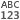
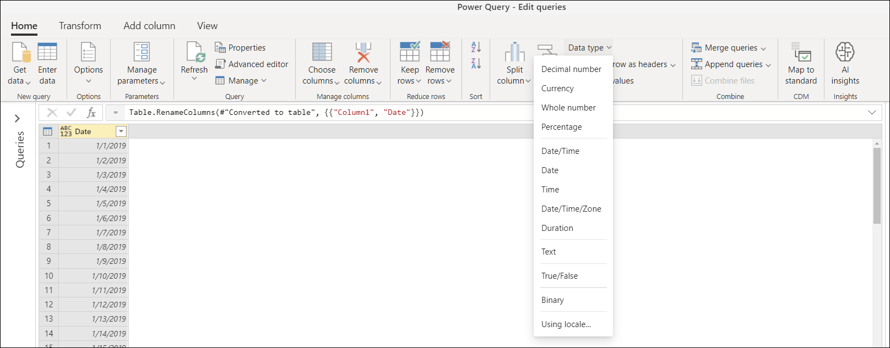
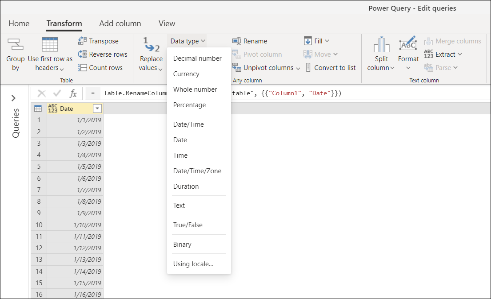
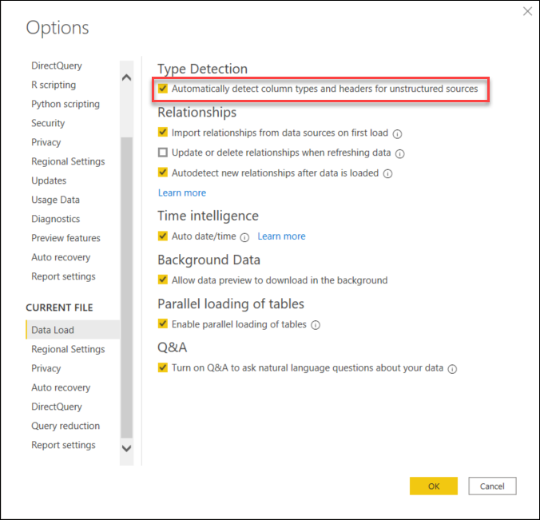
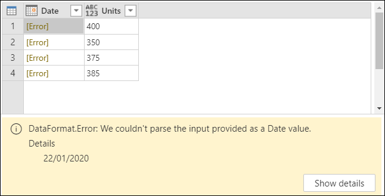
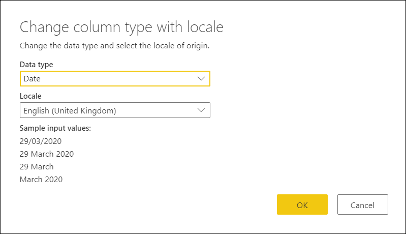
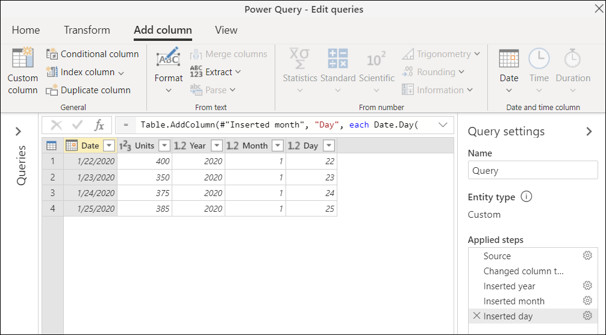

# Data types in Power Query

Data types in Power Query are used to classify the type of content to have a more structured data set. A data type is said to ***conform*** to that data type. 

The data type of a column is displayed on the left-hand side of the column header with an icon image that symbolizes the data type:

>[!Note]
>Power Query provides a set of contextual transformations and options based on the data types of the columns. For example, when you select a column with a data type of Date, you get transformations and options that are contextual to that specific data type. These transformations and options occur throughout the Power Query interface, such as in the *Transform* and *Add Column* tab, as well as in the smart filter options. 

The most common data types used in Power Query are:

|Data Type | Icon | Description|
----------|------|------------|
|**Text**|   |A Unicode character data string. Can be strings, numbers, or dates represented in a text format. Maximum string length is 268,435,456 Unicode characters (256 mega characters) or 536,870,912 bytes.|
|**True/False**| |A Boolean value of either a True or False.|
| **Decimal Number**|  |Represents a 64 bit (eight-byte) floating point number. It’s the most common number type and corresponds to numbers as you usually think of them. Although designed to handle numbers with fractional values, it also handles whole numbers. The Decimal Number type can handle negative values from -1.79E +308 through -2.23E -308, 0, and positive values from 2.23E -308 through 1.79E + 308. For example, numbers like 34, 34.01, and 34.000367063 are valid decimal numbers. The largest precision that can be represented in a Decimal Number type is 15 digits long. The decimal separator can occur anywhere in the number. The Decimal Number type corresponds to how Excel stores its numbers.|
|**Fixed Decimal number** |  | Also known as the Currency type, has a fixed location for the decimal separator. The decimal separator always has four digits to its right and allows for 19 digits of significance. The largest value it can represent is 922,337,203,685,477.5807 (positive or negative). The Fixed Decimal Number type is useful in cases where rounding might introduce errors. When you work with many numbers that have small fractional values, they can sometimes accumulate and force a number to be slightly off. Since the values past the four digits to the right of decimal separator are truncated, the Fixed Decimal type can help you avoid these kinds of errors. | 
|**Whole Number** |   | Represents a 64 bit (eight-byte) integer value. Because it’s an integer, it has no digits to the right of the decimal place. It allows for 19 digits; positive or negative whole numbers between -9,223,372,036,854,775,807 (-2^63+1) and 9,223,372,036,854,775,806 (2^63-2). It can represent the largest possible precision of the various numeric data types. As with the Fixed Decimal type, the Whole Number type can be useful in cases where you need to control rounding. |
|**Percentage** | | Fundamentally the same as a **Decimal Number** type, but it has a mask to format the values in the column as a percentage in the Power Query Editor Window.|
|**Date/Time** |   |Represents both a date and time value. Underneath the covers, the Date/Time value is stored as a Decimal Number Type. So you can actually convert between the two. The time portion of a date is stored as a fraction to whole multiples of 1/300 seconds (3.33 ms). Dates between years 1900 and 9999 are supported.|
|**Date** |  | Represents just a Date (no time portion). When converted into the model, a Date is the same as a Date/Time value with zero for the fractional value.|
|**Time**|   |Represents just Time (no Date portion). When converted into the model, a Time value is the same as a Date/Time value with no digits to the left of the decimal place.|
|**Date/Time/Timezone** |  |Represents a UTC Date/Time with a timezone offset. It’s converted into Date/Time when loaded into the model.| 
|**Duration**|  | Represents a length of time. It’s converted into a Decimal Number Type when loaded into the model. As a Decimal Number type it can be added or subtracted from a Date/Time field with correct results. As a Decimal Number type, you can easily use it in visualizations that show magnitude.|
|**Binary**|  |The Binary data type can be used to represent any other data with a binary format.|
|**Any**| |The *any* data type is the status given to a column without an explicit data type definition. *Any* is the data type that classifies all values. We recommended that you always explicitly define the column data types for your queries from unstructured sources and avoid columns with the *any* data type as the output of your query.|

## Data type detection

**When connecting to structured data sources such as databases**, Power Query will read the table schema from the data source and automatically display the data with the correct data type for each column.

**When connecting to unstructured sources such as Excel, CSV, and text files**, Power Query can automatically detect data types by inspecting the values inside the table. By default, automatic data type detection is enabled in Power Query for unstructured sources.
## How to define a column data type
You can define or change the data type of a column from four places:

* **Home tab**&mdash;in the **Data Type** dropdown menu inside the **Transform** group.

* **Transform tab**&mdash;in the **Data Type** dropdown menu inside the **Any Column** group.

* **Column header icon**&mdash;left of the column header shown as an icon.

* **Column right-click** - as the **Change Type** option.

### Automatic column data type and headers detection

This setting is specific for unstructured sources. It helps you by automatically inspecting and detecting the column types and headers based on the first 200 rows of your table. 

By default, this setting is enabled. To disable or enable this setting:

* **In Power Query Online**, go to the **Home > Options** menu and select **Project options**. Inside the Project options window, you'll see the option to **Automatically detect column types and headers for unstructured sources**.

   

* **In Power Query for Desktop**, you have the ability to define this behavior at both the global and per file level inside the *Options* window.
    - **Global**&mdash;Inside the **Global** menu, go to the **Data Load** item and then go to the **Type Detection** section on the right. From here you can select any of the three type detection configurations that will be applied on every new file created in your application:
        - Always detect column types and headers for unstructured sources
        - Detect column types and headers for unstructured sources according to each file's setting
        - Never detect column types and headers for unstructured sources

       

    - **Current File**&mdash;Inside the **Current File** menu, go to the **Data Load** item and then go to the **Type Detection** section on the right. This setting allows you to define if the type detection should be enabled or disabled for the current file.    

       

When this setting is enabled, Power Query will automatically detect the column headers and data types of unstructured data sources. Power Query will do this by automatically adding two steps to your query:

* **Promote column headers**&mdash;promotes the first row of the table to be the column header.
* **Changed Type**&mdash;converts the values from any* data type to a data type based on the inspection of the values from each column.

## Document or project locale

Power Query handles two distinct components that manage the way that things look and are interpreted:
* **Localization**&mdash;the component that tells Power Query in what language it should be displayed.
* **Globalization**&mdash;the component that handles the formatting of the values, as well as the interpretation of text values.

The *locale* is a single value that holds both the localization and globalization components. Locale is used to interpret text values and convert them into other data types. For example, a locale such as "English (United States)" means that the *localization*, or language, is English and the *globalization*, or format of the value, is based in the standards used in the United States. 

When Power Query defines a column data type or converts from one data type to another, it has to interpret the values to be converted before it can transform them to a different data type.

* **In Power Query Online**, this interpretation is defined inside **Project options**, under the **Locale** option.

   

* **In Power Query for Desktop**, Power Query automatically recognizes your operating system regional format and uses that to interpret the values for data type conversion. To override this locale configuration, open the **Query Options** window, and then select the **Regional Settings** option inside the **Current File** menu. This will display the locale being used, which you can also change.

   

This **Locale** setting is important for interpreting text values into a specific data type. For example, imagine that you have your locale set as English (United States), but one of your columns from one of your csv files has dates in the UK format day/month/year.

When you try setting the data type of the **Date** column to be **Date**, you only get error values.

These errors occur because the locale being used is trying to interpret the date under the English (United States) format, which is month/date/year. Since there is no month 22 in the calendar, it yields an error.

Instead of trying to just select the Date data type, you can right-click the column and select the **Using Locale** option from the **Change type** menu.

In **Change column type with locale**, you select the data type that you want to set, but you also select which locale to use, which for this case has to be English (United Kingdom).

Using this locale, Power Query will be able to interpret the values correctly and convert those values to the desired data type.

#### Verifying the final date values

The formatting of the values is driven by the globalization value. If you have any doubts about the value displayed by Power Query, you can verify your conversion on date values by adding new columns for the day, month, and year from the value. To do this, select the **Date** column and go to the **Add column** tab. In the **Date and time column** group, you'll see the options for a date column. 

From here you can select to extract parts of the date value, such as the year number, the month number, the day number, or even more columns extracted from the **Date** column.

With these columns, you can verify that your date value has been converted correctly.

## Data type conversion matrix

The following matrix is designed to give you a quick look at the feasibility of data type conversion of a value from one data type to another.

| Data Types         |  |  |  |  |  |  |  |  |  |  |  |
|--------------------|----------------|----------|--------------|------------|-----------|------|------|--------------------|----------|------|------------|
|   Decimal Number     |                |         |             |           |          |     |    |                  |         |     |           |
|  Currency           |               |          |             |           |          |     |    |                  |         |     |           |
|  Whole Number       |               |         |              |           |          |    |    |                  |         |     |           |
|  Percentage         |               |         |             |            |          |     |    |                  |         |     |           |
|  Date/Time          |               |         |             |           |           |     |     |                  |        |     |          |
|  Date |               |         |             |           |          |      |    |                  |        |     |          |
|  Time               |               |         |             |           |         |    |      |                  |        |     |          |
|  Date/Time/Timezone |               |         |             |           |          |     |     |                    |        |     |          |
|  Duration           |               |         |             |           |         |    |    |                  |          |     |          |
|  Text               |               |         |             |           |          |     |     |                   |         |      |           |
|  True/False         |               |         |             |           |         |    |    |                  |        |     |            |

| Icon | Description |
|------|-------------|
|  | Possible |
| | Not possible|
|  | Possible, but it adds values to the original value |
|   | Possible, but it truncates the original value |
