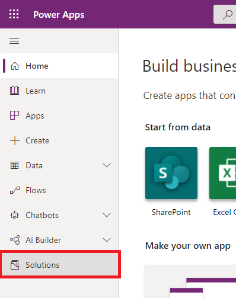
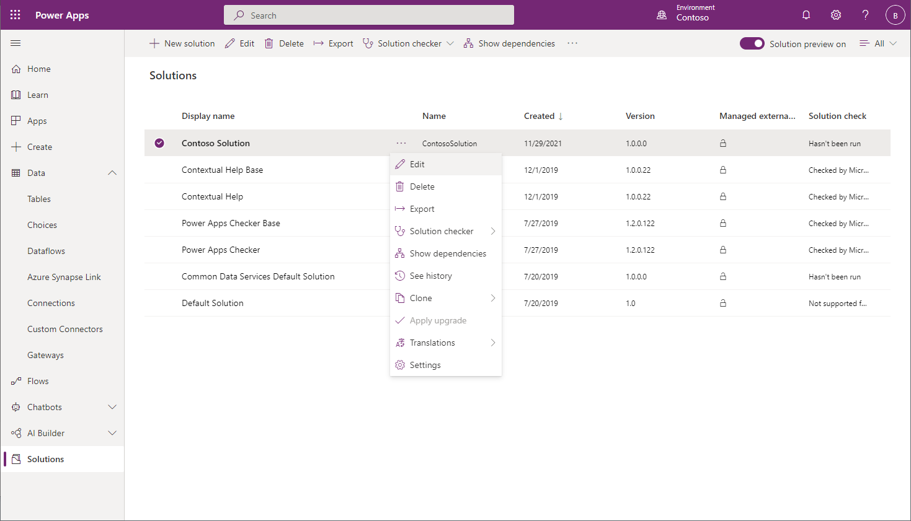
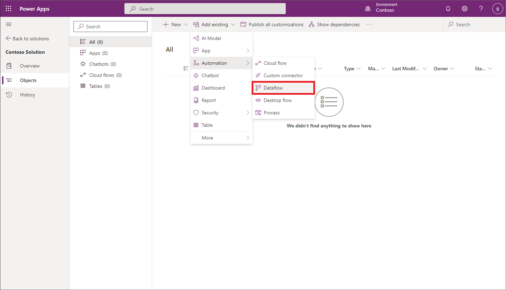
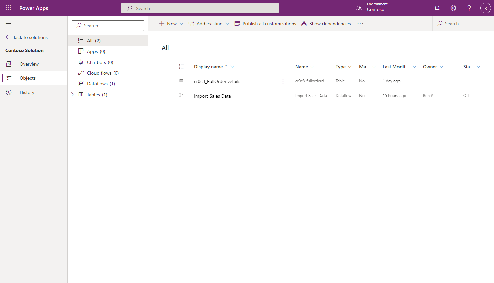
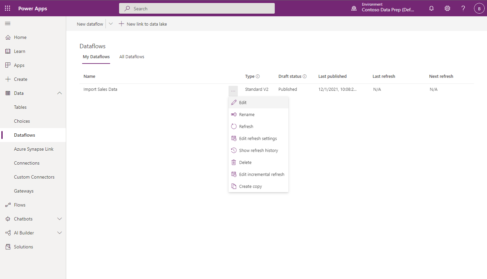
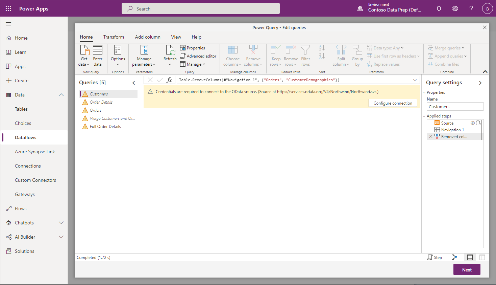
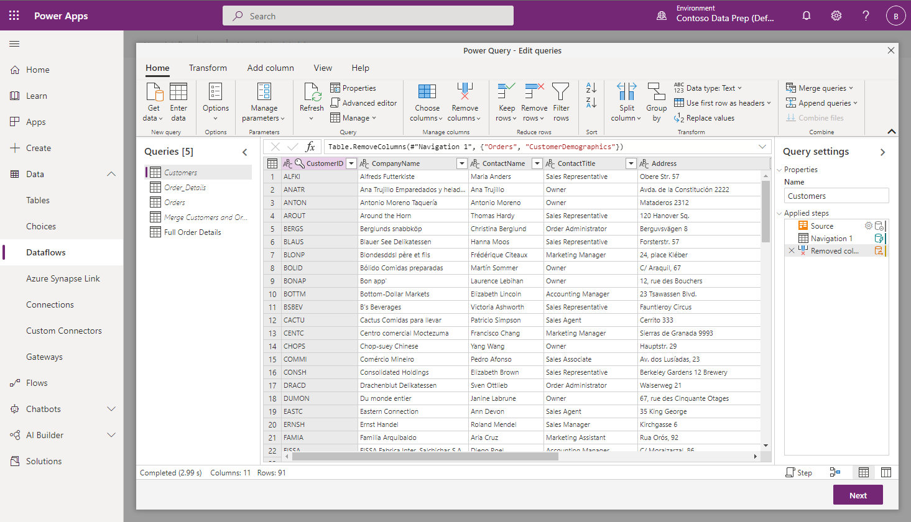
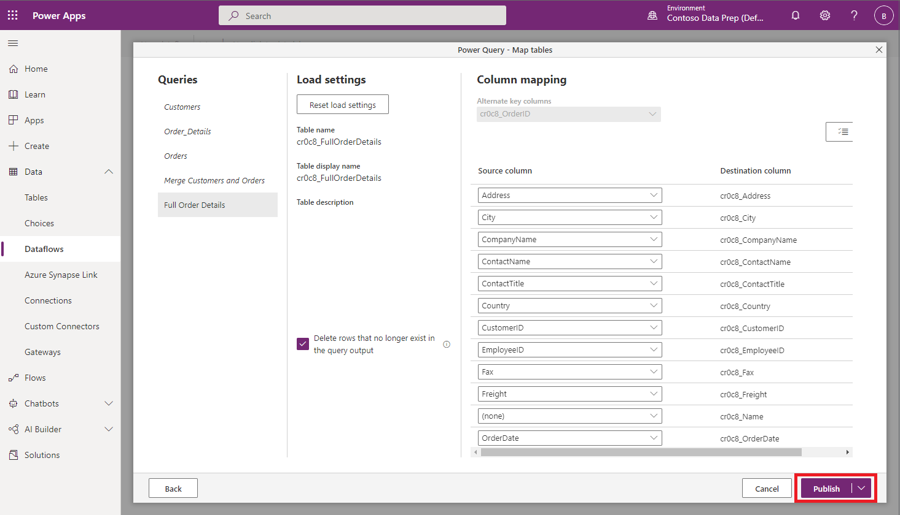

# Overview of solution-aware dataflows

When you include your dataflows in a solution, their definitions become portable, making it easier to move them from one environment to another, saving time required to author the dataflow.

A typical use case is for an independent software vendor (ISV) to develop a solution containing a dataflow, that extracts and transforms data from a data source to Dataverse tables, in a sandbox environment. The ISV would then move that dataflow and destination tables to a test environment to test with their test data source to validate that the solution works well and is ready for production. After testing completes, the ISV would provide the dataflow and tables to clients who will import them into their production environment to operate on client’s data. This process is much easier when you add both the dataflows and tables they load data to into solutions, and then move the solutions and their contents between environments.

Dataflows added to a solution are known as *solution-aware* dataflows. You can add multiple dataflows to a single solution.

> [!NOTE]
>
> * Only dataflows created in Power Platform environments can be solution-aware.
> * The data loaded by dataflows to their destination isn't portable as part of solutions, only the dataflow definitions are. To recreate the data after a dataflow was deployed as part of a solution, you need to refresh the dataflow.

## Add an existing dataflow to a solution

Follow these steps to add a dataflow to a solution.

### Prerequisites

* You need to have created a solution before you can add a dataflow to it. More information: [Create solutions](/powerapps/maker/data-platform/create-solution)
* You need to be the owner of at least one dataflow in the environment. More information: [Create dataflows](/data-integration/dataflows/dataflows-integration-overview)

### Add the dataflow

1. Sign in to [Power Apps](https://powerapps.microsoft.com).
2. Select **Solutions** from the navigation bar.

   

3. Select the solution you'll add your dataflow to, and from the context menu select **Edit**.

   

4. Select **Add Exiting** > **Automation** > **Dataflow**.

   

5. Optional: If your dataflow loads data into a custom Dataverse table, add the custom table to the solution as well.

   In this example, the dataflow you added to the solution loads data into a custom table called **Full Order Details**, which you want to also include in the solution with the dataflow.

   Once both the dataflow and table it loads data to are added to the solution, it has the two artifacts added to the solution. In this case, the artifacts are **cr0c8_FullOrderDetails** and **Import Sales Data**.

    

   To save your work, be sure to publish all customizations. Now, the solution is ready for you to export from the source environment and import to the destination environment.

## Exporting and importing solutions containing dataflows

Exporting and importing solutions containing dataflows is identical to doing the same operations for other artifacts. For the most up-to-date instructions, go to the documentation on [exporting](/powerapps/maker/data-platform/export-solutions) and [importing](/powerapps/maker/data-platform/import-update-export-solutions) solutions.

## Updating a dataflow's connections after solution import

For security reasons, credentials of connections used by dataflows aren't persisted by solutions. Once a dataflow is deployed as part of a solution, you'll need to edit its connections before it can be scheduled to run.

1. On the left navigation pane, select the down arrow next to **Dataverse** and select **Dataflows**. Identify the dataflow that was imported, and select **Edit** from the context menu.

   

2. In the Dataflow list, locate and double-click the dataflow that was added as part of the solution you’ve imported.

3. You'll be asked to enter credentials required for the dataflow.

   

   Once the credentials for the connection have been updated, all queries that use that connection automatically load.

4. If your dataflow loads data in Dataverse tables, select **Next** to review the mapping configuration.

   

5. The mapping configuration is also saved as part of the solution. Since you also added the destination table to the solutions, there's no need to recreate the table in this environment and you can publish the dataflow.

   

   That's it. Your dataflow now refreshes and loads data to the destination table.

## Known limitations

* Dataflows can't be created from within solutions. To add a dataflow to a solution, follow the steps outlined in this article.
* Dataflows can't be edited directly from within solutions. Instead, the dataflow must be edited in the dataflows experience.
* Dataflows can't use connection references for any connector.
* Environment variables can't be used by dataflows.
* Dataflows don't support adding required components, such as custom tables they load data to. Instead, the custom table should be manually added to the solution.
* Dataflows can't be deployed by application users (service principals).
* Incremental refresh configuration isnt supported when deploying solutions. After deployment of the dataflow via solution, the incremental refresh configuration should be reapplied.
* Linked tables to other dataflows aren't supported when deploying solutions. After deployment of the dataflow via solution, please edit the dataflow and edit the connection to the linked dataflow. 
