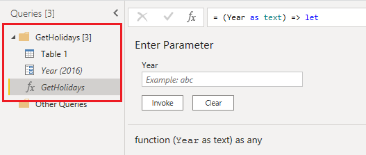

# Best practices for designing and developing complex dataflows

If the dataflow you're developing is getting bigger and more complex, here are some things you can do to improve on your original design.

## Break it into multiple dataflows

Don't do everything in one dataflow. Not only does a single, complex dataflow make the data transformation process longer, it also makes it harder to understand and reuse the dataflow. Breaking your dataflow into multiple dataflows can be done by separating entities in different dataflows, or even one entity into multiple dataflows. You can use the concept of a computed entity or linked entity to build part of the transformation in one dataflow, and reuse it in other dataflows.

## Split data transformation dataflows from staging/extraction dataflows

Having some dataflows just for extracting data (that is, [staging dataflows](best-practices-for-dimensional-model-using-dataflows.md#staging-dataflows)) and others just for transforming data is helpful not only for creating a multilayered architecture, it's also helpful for reducing the complexity of dataflows. Some steps just extract data from the data source, such as get data, navigation, and data type changes. By separating the staging dataflows and transformation dataflows, you make your dataflows simpler to develop.

:::image type="complex" source="media/best-practices-developing-complex-dataflows/multi-layered-dataflow.png" alt-text="Multilayered dataflow architecture.":::
   Image showing data being extracted from a data source to staging dataflows, where the enities are either stored in Dataverse or Azure Data Lake storage, then the data is moved to transformation dataflows where the data is transformed and converted to the data warehouse structure, and then the data is moved to the dataset.
:::image-end:::

## Use custom functions

Custom functions are helpful in scenarios where a certain number of steps have to be done for a number of queries from different sources. Custom functions can be developed through the graphical interface in Power Query Editor or by using an M script. Functions can be reused in a dataflow in as many entities as needed.

Having a custom function helps by having only a single version of the source code, so you don't have to duplicate the code. As a result, maintaining the Power Query transformation logic and the whole dataflow will be much easier. For more information, see the following blog post: [Custom Functions Made Easy in Power BI Desktop](https://radacad.com/custom-functions-made-easy-in-power-bi-desktop#:~:text=It%20is%20easy%20to%20consume,the%20output%20column%20as%20Holidays.).

> [!NOTE]
> Sometimes you might notice a notification that tells you a premium capacity is required to refresh a dataflow with a custom function. You can ignore this message and reopen the dataflow editor. This usually solves your problem unless your function refers to a "load enabled" query.

## Place queries into folders

Using folders for queries helps to group related queries together. When developing the dataflow, spend a little more time to arrange queries in folders that make sense. Using this approach, you can find queries more easily in the future and maintaining the code will be much easier.

## Use computed entities

Computed entities not only make your dataflow more understandable, they also provide better performance. When you use a computed entity, the other entities referenced from it are getting data from an "already-processed-and-stored" entity. The transformation will be much simpler and faster.

## Take advantage of the enhanced compute engine

For dataflows developed in Power BI admin portal, ensure that you make use of the enhanced compute engine by performing joins and filter transformations first in a computed entity before doing other types of transformations.

## Break many steps into multiple queries

It's hard to keep track of a large number of steps in one entity. Instead, you should break a large number of steps into multiple entities. You can use **Enable Load** for other queries and disable them if they're intermediate queries, and only load the final entity through the dataflow. When you have multiple queries with smaller steps in each, it's easier to use the dependency diagram and track each query for further investigation, rather than digging into hundreds of steps in one query.

## Add properties for queries and steps

Documentation is the key to having easy-to-maintain code. In Power Query, you can add properties to the entities and also to steps. The text that you add in the properties will show up as a tooltip when you hover over that query or step. This documentation will help you maintain your model in the future. With a glance at a table or step, you can understand what's happening there, rather than rethinking and remembering what you've done in that step.

## Ensure that capacity is in the same region

Dataflows don't currently support multiple countries or regions. The Premium capacity must be in the same region as your Power BI tenant.

## Separate on-premises sources from cloud sources

We recommend that you create a separate dataflow for each type of source, such as on-premises, cloud, SQL Server, Spark, and Dynamics 365. Separating dataflows by source type facilitates quick troubleshooting and avoids internal limits when you refresh your dataflows.

## Separate dataflows based on the scheduled refresh required for entities

If you have a sales transaction table that gets updated in the source system every hour and you have a product-mapping table that gets updated every week, break these two into two dataflows with different data refresh schedules.

## Avoid scheduling refresh for linked entities in the same workspace

If you're regularly being locked out of your dataflows that contain linked entities, it might be caused by a corresponding, dependent dataflow in the same workspace that's locked during dataflow refresh. Such locking provides transactional accuracy and ensures that both dataflows are successfully refreshed, but it can block you from editing.

If you set up a separate schedule for the linked dataflow, dataflows can be refreshed unnecessarily and block you from editing the dataflow. There are two recommendations to avoid this:

- Don't set a refresh schedule for a linked dataflow in the same workspace as the source dataflow.
- If you want to configure a refresh schedule separately and want to avoid the locking behavior, move the dataflow to a separate workspace.
