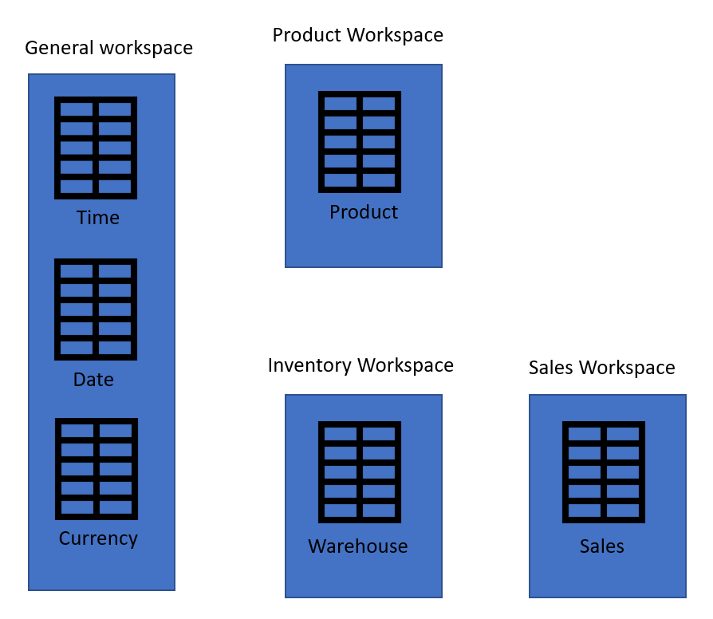

# Best practices for reusing dataflows across environments and workspaces

This article discusses a collection of best practices for resuing dataflows effectively and efficiently. Read this article to avoid design pitfalls and potential performance issues, while developing dataflows for reuse.

## Separate data transformation (T), and staging (or extraction E) dataflows

If a dataflow performs all actions, then it is hard to reuse its entities in other dataflows or for other purposes. The best dataflows to reuse are those dataflows doing only a few actions. Creating dataflows that specialize in one specific task is one of the best ways of reusing them. If you have a set of dataflows as staging dataflows, their only action is to extract data "as is" from the source system. These dataflows can be reused in multiple other dataflows.

If you have data transformation dataflows, you can split them into dataflows that perform common transformations. Each dataflow can perform a few actions. This ensures that the output of that dataflow is reusable by other dataflows.

## Use multiple workspaces

Each workspace (or environment) is available only for members of that workspace. If you build all your dataflows in one workspace, you're minimizing the reuse of your dataflows. You can have some generic workspaces for dataflows that are processing company-wide entities. You can also have some workspace for dataflows to process entities across multiple departments. And you can also have some workspaces for dataflows to be used only in specific departments.

### Set the correct access levels on workspaces

To give access to dataflows in other workspaces to use the output of the dataflow in a workspace, you just need to give them the View access in the workspace. To learn more about other roles in a Power BI workspace, see [Roles in the new workspaces](https://docs.microsoft.com/power-bi/collaborate-share/service-new-workspaces#roles-in-the-new-workspaces).

## Endorsement on the dataflow in Power BI

There can be many dataflows created under the tenant. It would be hard for the users of the dataflow to know which dataflow is more reliable to use. That's why there's a system of endorsement. Authors of a dataflow, or those who have edit access to it, can endorse the dataflow at three levels: no endorsement, promoted, and certified. 

The levels of endorsement are helpful for users to find reliable dataflows easier and faster. The dataflow with a higher endorsement level appears first. The Power BI administrator can delegate the ability to endorse dataflows to the certified level to other people. To learn more about endorsement on dataflows, see [Promote or certify dataflows (preview)](https://docs.microsoft.com/power-bi/transform-model/service-dataflows-promote-certify).

## Separate entities in multiple dataflows

You can have multiple entities in one dataflow. One of the reasons you might split entities in multiple dataflows is what you learned earlier in this article about separating the data ingestion and data transformation dataflows. Another good reason to have entities in multiple dataflows is when you want a different refresh schedule that other tables. 

In the example below, the Sales table needs to be refreshed every four hours. The date table needs to be refreshed only once a day to keep the current date record updated. And a product mapping table just needs to be refreshed once a week. If you have all of these tables in one dataflow, you have only one refresh option for them all. However, if you split those into multiple dataflows, you can schedule the refresh of each dataflow separately.

## Good table candidates for dataflow entities

When you develop solutions using Power Query in the desktop tools, you might ask yourself; which of these tables are good candidates to be moved to a dataflow? The best tables to be moved to the dataflow are those that need to be used in more than one solution, or more than one environment or service. For example; The Date table in the below example, needs to be used in two separate Power BI files. Instead of duplicating that table into each file, you can build the table in a dataflow as an entity, and re-use it in those Power BI files.

