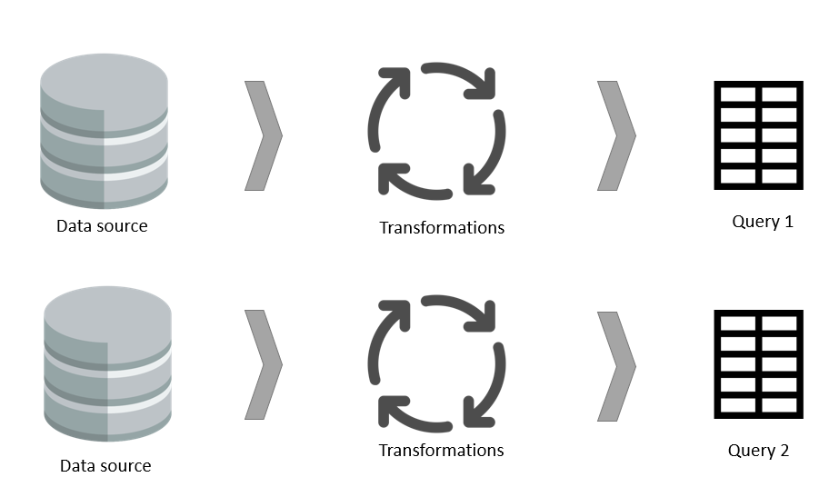

# Computed entity scenarios and use cases

There are benefits to using [computed entities](computed-entities.md) in a dataflow. This article describes use cases for computed entities and describes how they work behind the scenes.

## What is a computed entity?

An entity represents the data output of a query created in a dataflow, after the dataflow has been refreshed. It represents data from a source and, optionally, the transformations that were applied to it. Sometimes, you might want to create new entities that are a function of a previously ingested entity.

Although it's possible to repeat the queries that created an entity and apply new transformations to them, this approach has drawbacks: data is ingested twice, and the load on the data source is doubled.

Computed entities solve both problems. Computed entities are similar to other entities in that they get data from a source and you can apply further transformations to create them. But their data originates from the storage dataflow used, and not the original data source. That is, they were previously created by a dataflow and then reused.

Computed entities can be created by referencing an entity in the same dataflow or by referencing an entity created in a different dataflow.

## Why use a computed entity?

Performing all transformation steps in one entity can be slow. There can be many reasons for this slowdown&mdash;the data source might be slow, or the transformations that you're doing might need to be replicated in two or more queries. It might be advantageous to first ingest the data from the source and then reuse it in one or more entities. In such cases, you might choose to create two entities: one that gets data from the data source, and another&mdash;a computed entity&mdash;that applies additional transformations to data already written into the data lake used by a dataflow. This can increase performance and reusability of data, saving time and resources.

For example, if two entities share even a part of their transformation logic, without a computed entity the transformation will have to be done twice.

However, if a computed entity is used, then the common (shared) part of the transformation will be processed once and stored in Azure Data Lake Storage. The remaining transformations will then be processed from the output of the common transformation. Overall, this processing is much faster.

A computed entity provides one place as the source code for the transformation and speeds up the transformation because it need only be done once instead of multiple times. The load on the data source is also reduced.

## Example scenario for using a computed entity

If you're building an aggregated table in Power BI to speed up the data model, you can build the aggregated table by referencing the original table and applying additional transformations to it. By using this approach, you don't need to replicate your transformation from the source (the part that is from the original table).

For example, the following figure shows an Orders entity.

Using a reference from this entity, you can build a computed entity.

:::image type="complex" source="media/ordersentityreferenced.png" alt-text="Creating a computed entity.":::
   Image showing how to create a computed entity from the Orders entity. First right-click the Orders entity in the Queries pane, select the Reference option from the drop-down menu, which creates the computed entity, which is renamed here to Orders aggregated.
:::image-end:::

The computed entity can have further transformations. For example, you can use **Group By** to aggregate the data at the customer level.

This means that the Orders Aggregated entity will be getting data from the Orders entity, and not from the data source again. Because some of the transformations that need to be done have already been done in the Orders entity, performance is better and data transformation is faster.

## Computed entity in other dataflows

You can also create a computed entity in other dataflows. It can be created by getting data from a dataflow with the Microsoft Power Platform dataflow connector.

:::image type="complex" source="media/getdatafromppdataflows.png" alt-text="<Get data from Power Platform dataflows>":::
   Image emphasizes the Power Platform dataflows connector from the Power Query choos data source window, with a description that states that one dataflow entity can be built on top of the data from another dataflow entity, which is already persisted in storage.
:::image-end:::

The concept of the computed entity is to have a table persisted in storage, and other tables sourced from it, so that you can reduce the read time from the data source and share some of the common transformations. This can be achieved by getting data from other dataflows through the dataflow connector or referencing another query in the same dataflow.

## Computed entity: With transformations, or without?

Now that you know computed entities are great for improving performance of the data transformation, a good question to ask is whether transformations should always be deferred to the computed entity or whether they should be applied to the source entity. That is, should data always be ingested into one entity and then transformed in a computed entity? What are the pros and cons?

### Load data without transformation for Text/CSV files

When a data source doesn't support query folding (such as Text/CSV files), there's little benefit in applying transformations when getting data from the source, especially if data volumes are large. The source entity should just load data from the Text/CSV file without applying any transformations. Then, computed entities can get data from the source entity and perform the transformation on top of the ingested data.

You might ask, what's the value of creating a source entity that only ingests data? Such an entity can still be useful, because if the data from the source is used in more than one entity, it reduces the load on the data source. In addition, data can now be reused by other people and dataflows. Computed entities are especially useful in scenarios where the data volume is large, or when a data source is accessed through an on-premises data gateway, because they reduce the traffic from the gateway and the load on data sources behind them.

### Doing some of the common transformations for a SQL table

If your data source supports query folding, it's good to perform some of the transformations in the source entity because the query will be folded to the data source, and only the transformed data will be fetched from it. This improves overall performance. The set of transformations that will be common in downstream computed entities should be applied in the source entity, so they can be folded to the source. Other transformations that only apply to downstream entities should be done in computed entities.