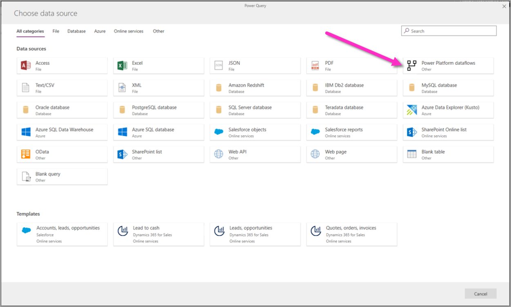

# Create and use dataflows in the Power Platform

Using dataflows with Power Platform makes data preparation easier, and lets you reuse your data preparation work in subsequent reports, apps, and models. 

In the world of ever-expanding data, data preparation can be difficult and expensive, consuming as much as 60%-80% of the time and cost for a typical analytics project. Such projects can require wrangling fragmented and incomplete data, complex system integration, data with structural inconsistency, and a high skillset barrier. 

To make data preparation easier and to help you get more value out of your data, Power Query and Power Platform dataflows were created.

With dataflows, Microsoft brings Power Query’s self-service data preparation capabilities into the Power BI and Power Apps online services, and **expands** existing capabilities in the following ways:

* **Self-service data prep for big data with Dataflows**&mdash;Dataflows can be used to easily ingest, cleanse, transform, integrate, enrich, and schematize data from a large and ever growing array of transactional and observational sources, encompassing all data preparation logic. Previously, extract, transform, load (ETL) logic could only be included within datasets in Power BI, copied over and over between datasets and bound to dataset management settings. 

With dataflows, ETL logic is elevated to a first-class artifact within Power Platform services and includes dedicated authoring and management experiences. Business analysts, BI professionals, and data scientists can use dataflows to handle the most complex data preparation challenges and build on each other’s work, thanks to a revolutionary model-driven calculation engine, which takes care of all the transformation and dependency logic—cutting time, cost, and expertise to a fraction of what’s traditionally been required for those tasks. You can create dataflows using the well-known, self-service data preparation experience of Power Query. Dataflows are created and easily managed in app workspaces or environments, in the Power BI or Power Apps portal respectively, enjoying all the capabilities these services have to offer, such as permission management, scheduled refreshes, and more.

* **Load data to Common Data Service or Azure Data Lake Storage Gen2**&mdash;Depending on your use case, you can store data prepared by Power Platform dataflows in the Common Data Service or your organizations Azure Data Lake Gen2 storage account: 

    * **Common Data Service** lets you securely store and manage data that's used by business applications within a set of entities. An *entity* is a set of records used to store data, similar to how a table stores data within a database. Common Data Service includes a base set of standard entities that cover typical scenarios, but you can also create custom entities specific to your organization and populate them with data using dataflows. App makers can then use Power Apps and Flow to build rich applications using this data.

    * **Azure Data Lake Storage Gen2** lets you collaborate with people in your organization using Power BI, Azure Data, and AI services, or using custom built Line of Business Applications that read data from the lake. Dataflows that load data to the an Azure Data Lake Gen2 Storage account store data in Common Data Model (CDM) folders. CDM folders contain schematized data and metadata in a standardized format, to facilitate data exchange and to enable full interoperability across services that produce or consume data stored in an organization’s Azure Data Lake Storage account as the shared storage layer.

* **Advanced Analytics and AI with Azure**&mdash;Power Platform dataflows store data in Common Data Service or Azure Data Lake Storage Gen2 – which means that data ingested through dataflows is now available to data engineers and data scientists to leverage the full power of Azure Data Services, such as Azure Machine Learning, Azure Databricks, and Azure SQL Datawarehouse for advanced analytics and AI. This enables business analysts, data engineers, and data scientists to collaborate on the same data within their organization.

* **Support for the Common Data Model**&mdash;The Common Data Model (CDM) is a set of a standardized data schemas and a metadata system to allow consistency of data and its meaning across applications and business processes. Dataflows support the CDM by offering easy mapping from any data in any shape into the standard CDM entities, such as Account, Contact, and so on. Dataflows also land the data, both standard and custom entities, in schematized CDM form. Business analysts can take advantage of the standard schema and its semantic consistency, or customize their entities based on their unique needs. The Common Data Model continues to evolve as part of the recently announced [Open Data Initiative](https://www.microsoft.com/en-us/open-data-initiative). 

## Dataflow capabilities in Power Platform services

Most dataflow capabilities are available in both Power Apps and Power BI portals. Dataflows are available as part of these services’ plans. Some dataflow features are either product specific or available in different product plans. The following table describes dataflow features and their availability.

|Dataflow capability  |Power Apps  |Power BI  |
|---------|---------|---------|
|Scheduled refresh     |Up to 48 per day         |Up to 48 per day         |
|Dataflow authoring with Power Query Online     |Yes         |Yes         |
|Dataflow management     |in Power Apps portal         |in Power BI portal         |
|New connectors     |Yes         |Yes         |
|Standardized schema / built-in support for the Common Data Model     |Yes         |Yes         |
|Dataflows Data Connector in Power BI Desktop     |For dataflows with Azure Data Lake Gen2 as the destination         |Yes         |
|Integration with the organization's Azure Data Lake Storage Gen2     |Yes         |Yes         |
|Integration with Common Data Service     |Yes         |No         |
|Dataflow linked entities     |For dataflows with Azure Data Lake Gen2 as the destination         |Yes         |
|Computed Entities (in-storage transfromations using M)     |For dataflows with Azure Data Lake Gen2 as the destination         |Power BI Premium only         |
|Dataflow incremental refresh     |For dataflows with Azure Data Lake Gen2 as the destination, requires Power Apps Plan2         |Power BI Premium only         |
|Running on Power BI Premium capacity / parallel execution of transforms     |No         |Yes         |

For more information about specific products, see the following articles:

Dataflows in Power Apps:

- [Self-service data prep in Power Apps](https://go.microsoft.com/fwlink/?linkid=2099972)
- [Creating and using dataflows in Power Apps](https://go.microsoft.com/fwlink/?linkid=2100076)
- [Connect Azure Data Lake Storage Gen2 for dataflow storage](https://go.microsoft.com/fwlink/?linkid=2099973)
- [Add data to an entity in Common Data Service](https://go.microsoft.com/fwlink/?linkid=2100075)
- Visit the PowerApps [dataflow community](https://go.microsoft.com/fwlink/?linkid=2099971) and share what you’re doing, ask questions, or [submit new ideas](https://go.microsoft.com/fwlink/?linkid=2100074)
- Visit the Power Apps dataflow community forum and share what you’re doing, ask questions, or [submit new ideas](https://go.microsoft.com/fwlink/?linkid=2100074)

Dataflows in Power BI:

* [Self-service data prep in Power BI](https://docs.microsoft.com/power-bi/service-dataflows-overview)
* [Create and use dataflows in Power BI](https://docs.microsoft.com/power-bi/service-dataflows-create-use)
* [Dataflows whitepaper](https://go.microsoft.com/fwlink/?linkid=2011419&clcid=0x409)
* Detailed [video](https://aka.ms/DataflowIntroVideo) of a dataflows walkthrough
* Visit the Power BI [dataflows community](https://community.powerbi.com/t5/Service/bd-p/power-bi-web-app) and share what you’re doing, ask questions or [submit new ideas](https://ideas.powerbi.com/forums/265200-power-bi-ideas?category_id=341638)

## Next steps

The following articles go into more detail about common usage scenarios for dataflows. 

* [Using incremental refresh with dataflows](incremental-refresh.md)
* [Creating computed entities in dataflows](computed-entities.md)
* [Connect to data sources for dataflows](data-sources.md)
* [Link entities between dataflows](linked-entities.md)

For more information about the Common Data Model and the CDM Folder standard, read the following articles:

* [Common Data Model - overview](https://docs.microsoft.com/powerapps/common-data-model/overview) 
* [CDM folders](https://go.microsoft.com/fwlink/?linkid=2045304)
* [CDM folder model file definition](https://go.microsoft.com/fwlink/?linkid=2045521)
