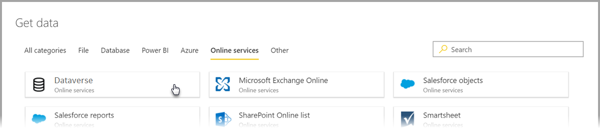
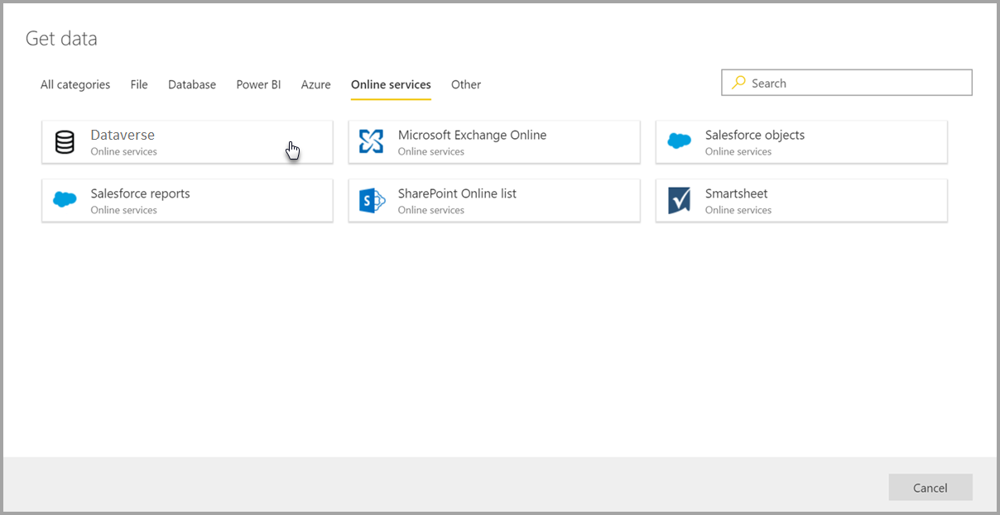
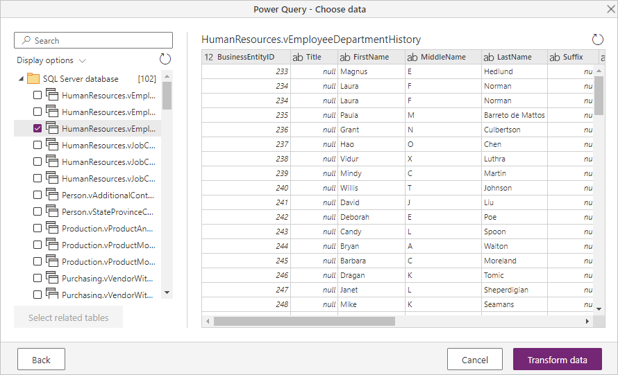
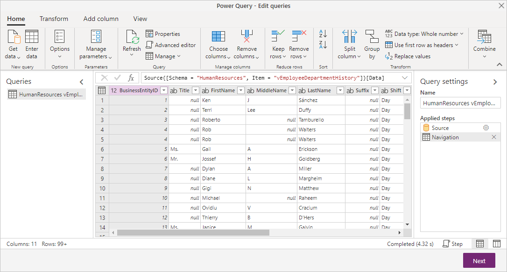
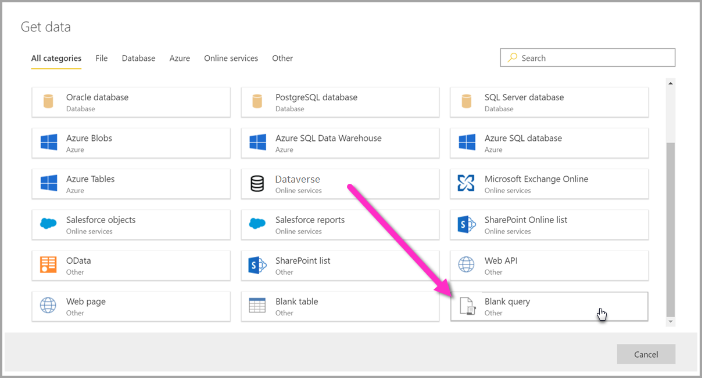
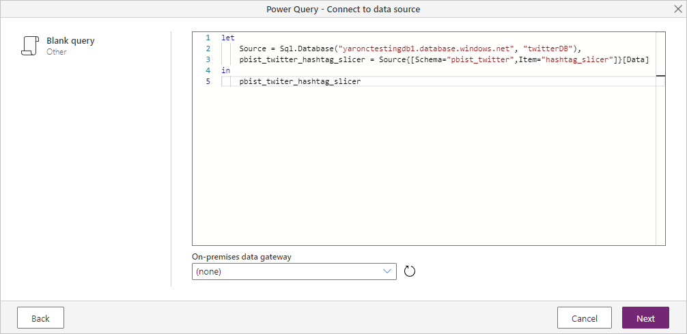

# Connect to data sources for dataflows

[!INCLUDE [CDS note](../includes/cc-data-platform-banner.md)]

With Microsoft Power Platform dataflows, you can connect to many different data sources to create new dataflows, or add new entities to an existing dataflow.

This article lists many available data sources for creating or adding to dataflows, and describes how to create those dataflows by using these data sources. For an overview of how to create and use dataflows, see [Creating and using dataflows in Power BI](/power-bi/service-dataflows-create-use).

## Create a dataflow entity from a data source

To connect to data, open the dataflow authoring tool, and then select **Get data**.

## Data sources for dataflows

You can view the available data sources by selecting **Get data** from the dataflow authoring tool, which then displays the **Choose data source** dialog box.

Data sources for dataflows are organized into the following categories, which appear as tabs in the **Choose data source** dialog box:

* All categories
* File
* Database
* Power Platform
* Azure
* Online Services
* Other

The **All categories** category contains all data sources, from all categories. 

The **File** category includes the following available data connections for dataflows:

* Excel
* Folder
* JSON
* PDF
* Parquet
* SharePoint Folder
* Text/CSV
* XML

The **Database** category includes the following available data connections for dataflows:

* Access
* Amazon Redshift
* Google BigQuery
* IBM DB2 database
* Impala
* MySQL database
* Oracle database
* PostgreSQL database
* SAP BW Application Server
* SAP BW Message Server
* SAP HANA database
* SQL Server database
* Snowflake
* Sybase database
* Teradata database
* Vertica

The **Power Platform** category includes the following available data connections for dataflows:

* Common Data Service (Legacy)
* Dataverse
* Power Platform dataflows

The **Azure** category includes the following available data connections for dataflows:

* Azure Blobs
* Azure Data Explorer (Kusto)
* Azure Data Lake Storage Gen2
* Azure HDInsight Spark
* Azure SQL database
* Azure Synapse Analytics (SQL DW)
* Azure Tables

The **Online Services** includes the following available data connections for dataflows:

* Microsoft Exchange Online
* Salesforce objects
* Salesforce reports
* SharePoint Online list
* Smartsheet

The **Other** category includes the following available data connections for dataflows:

* Active Directory
* FHIR
* OData
* Odbc
* SharePoint list
* Spark
* Web API
* Web page
* Blank table
* Blank Query

## Connect to a data source

To connect to a data source, select the data source. This section uses one example to show how the process works, but each data connection for dataflows is similar in process. Different connectors might require specific credentials or other information, but the flow is similar. In this example, **SQL Server database** is selected from the **Database** data connection category.

A connection window for the selected data connection is displayed. If credentials are required, you're prompted to provide them. The following image shows a server and database being entered to connect to a SQL Server database.

After the server URL or resource connection information is provided, enter the credentials to use for access to the data. You may also need to enter the name of an on-premises data gateway. Then select **Next**.

Power Query Online initiates and establishes the connection to the data source. It then presents the available tables from that data source in the **Navigator** window.

You can select tables and data to load by selecting the check box next to each in the left pane. To transform the data you've chosen, select **Transform data** from the bottom of the **Navigator** window. A Power Query Online dialog box appears, where you can edit queries and perform any other transformations you want to the selected data.

## Connecting to additional data sources

There are additional data connectors that aren't shown in the Power BI dataflows user interface, but are supported with a few additional steps.

You can take the following steps to create a connection to a connector that isn't displayed in the user interface:

1. Open Power BI Desktop, and then select **Get data**.
2. Open Power Query Editor in Power BI Desktop, right-click the relevant query, and then select **Advanced Editor**, as shown in the following image. From there, you can copy the M script that appears in the **Advanced Editor** window.

     

3. Open the Power BI dataflow, and then select **Get data** for a blank query.

     

4. Paste the copied query into the blank query for the dataflow.

     

Your script then connects to the data source you specified.

The following list shows which connectors you can currently use by copying and pasting the M query into a blank query:

* SAP Business Warehouse 
* Azure Analysis Services
* Adobe Analytics
* ODBC
* OLE DB
* Folder
* SharePoint Online folder
* SharePoint folder
* Hadoop HDFS
* Azure HDInsight (HDFS)
* Hadoop file HDFS
* Informix (beta)

## Next steps

This article showed which data sources you can connect to for dataflows. The following articles go into more detail about common usage scenarios for dataflows:

* [Self-service data prep in Power BI](create-use.md)
* [Using incremental refresh with dataflows](incremental-refresh.md)
* [Creating computed entities in dataflows](computed-entities.md)
* [Link entities between dataflows](linked-entities.md)

For information about individual Power Query connectors, go to the [connector reference list of Power Query connectors](../Connectors/index.md), and select the connector you want to learn more about.

Additional information about dataflows and related information can be found in the following articles:

* [Create and use dataflows in Power BI](/power-bi/service-dataflows-create-use)
* [Using dataflows with on-premises data sources](/power-bi/service-dataflows-on-premises-gateways)
* [Developer resources for Power BI dataflows](/power-bi/service-dataflows-developer-resources)
* [Dataflows and Azure Data Lake integration (Preview)](/power-bi/service-dataflows-azure-data-lake-integration)

For more information about Power Query and scheduled refresh, you can read these articles:
* [Query overview in Power BI Desktop](/power-bi/desktop-query-overview)
* [Configuring scheduled refresh](/power-bi/refresh-scheduled-refresh)

For more information about Common Data Model, you can read its overview article:
* [Common Data Model - overview ](/powerapps/common-data-model/overview)