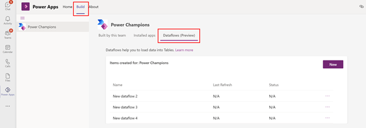
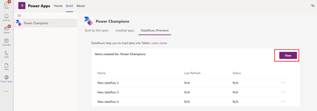
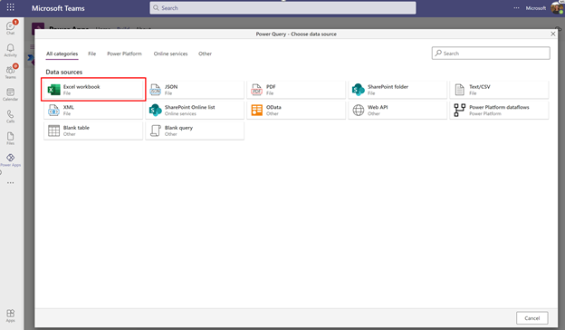
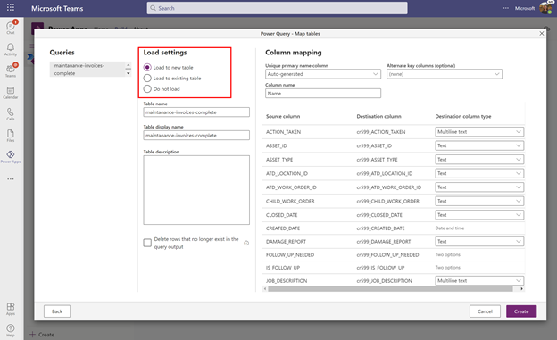
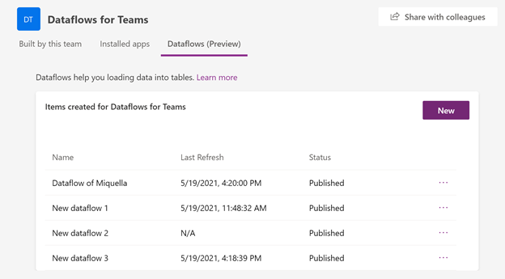
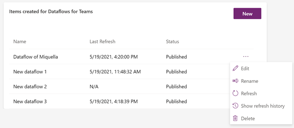

# Create and use dataflows in Microsoft Teams

With your master data already sitting in a different location, you can use Power Query dataflows to directly access your data through the connectors and load the data into Dataverse for Teams. When data is updated in your master data, you can refresh your dataflows by just one click and the data in Dataverse for Teams is updated too. You can also use the Power Query data transformations to easily validate and clean your data and enforce data quality for your Apps.

[Dataflows](https://docs.microsoft.com/power-query/dataflows/overview-dataflows-across-power-platform-dynamics-365) were introduced to help organizations retrieve data from disparate sources and prepare it for consumption. You can easily create dataflows using familiar, [self-service Power Query](https://docs.microsoft.com/en-us/power-query/power-query-what-is-power-query) experience  to ingest, transform, integrate, and enrich data. When creating a dataflow, you will; connect to data, transform the data and load data into Dataverse for Teams tables.  Once the dataflow is created, it will begin the process of importing data into the dataverse table. Then you can start building apps to leverage that data.

## Create a dataflow from the dataflwos page
In this example, we are going to load data from an Excel file that is located on OneDrive into Dataverse for Teams. You can follow this example with any other data source.

1.  Sign in to [Teams web](http://teams.microsoft.com/) version, and then select the link for **Power Apps**.

2.  Select the **Build** tab, and select **Dataflows (Preview)**.

 

3.  To create a new dataflow, click the **New** button.

 

4.  Select the **Excel workbook** connector or any of the other connectors.

 

5.  Enter a URL address in the text box or use the **Browse OneDrive** button to easily navigate through your OneDrive folders. When selected the right file, click the **Next** button. See the documentation for more details for using the [OneDrive conenction](https://docs.microsoft.com/power-query/sharepoint-onedrive-files) or [gettingg data](https://docs.microsoft.com/power-query/get-data-experience) from other sources.

6.  In this screen you can select the tables that are present in your Excel file. If your Excel file has multiple sheets and tables, you can select only the tables you are interested in. When you are done, click **Transform data**.

7.  [Clean and transform your data using Power Query](https://docs.microsoft.com/power-query/power-query-quickstart-using-power-bi). You can use the out-of-the box transformations to delete missing values, delete unnecessary columns or to filter your data. With Power Query you can apply more than 300 different transformations on your data. You can learn more about Power Query [here](https://docs.microsoft.com/power-query/power-query-what-is-power-query).

8.	Next, we create a new table in Dataverse for Teams by selecting the **Load to new table**. You can also choose to load your data into an existing table. In this screen you can specify a **Unique primary name column** and an **Alternate key column (optional)**. In this example, we leave this as the default values. To learn more about mapping your data and the different settings, [see the documentation](https://docs.microsoft.com/power-query/dataflows/get-best-of-standard-dataflows).

 

9.  Click **Create** to finish your dataflow. Once you’ve created your dataflow, data will begin loading into Dataverse for Teams. This process can take some time and you can use the management page to check the status. When a dataflow completes a run, its data is available to use. 

## Managing your dataflows
You can manage any dataflow you created from the Dataflows (Preview) tab. Here, you can see the status of all dataflows, when your dataflow was last refreshed and take action from the action bar. 

 

In the **Last Refresh** column, you can see when your data was last refreshed. If your refresh failed, an error indication appears. If you click on the error indication, the details of the error and recommended steps to address it will appear.

In the **Status** column you can see the current status of the dataflow. Possible states are:
* **Unpublished**. The dataflow is saved as a draft, and you can finish authoring your dataflow later.
* **Publishing in progress**. The dataflows is being published.
* **Published**. The dataflow is published and ready to load data into Dataverse . Only a published dataflows can be refreshed.
* **Refresh in progress**. The dataflow is extracting, transforming, and loading your data from the source to the Dataverse Tables. This process can take several minutes depending on the complexity of transformations and data source's performance. It is recommended to check the status of the dataflow frequently.

You can navigate to the action bar by clicking on the three dots “…” next to your dataflow.

 

Here you can:
* **Edit** your dataflow if you want to change your transformation logic or mapping.
* **Rename** your dataflow. At creation, an autogenerated name is assigned.
*	**Refresh** your dataflow. When you refresh your dataflows, the data will be updated.
* **Delete** your dataflow.
* **Show refresh history**. This gives you the results from the last refresh.

When clicking on **show refresh history** you can see information about the last refresh of your dataflow. When the dataflow refresh is successful, you can see how many rows were added or updated in Dataverse. When your dataflow refresh was not successful, you can investigate why with the help of the error message.

 

## Dataflows in Teams is a lightweight version.
Dataflows in Dataverse for Teams is a lightweight version of dataflows in the Maker Portal and can only load data into Dataverse for Teams. Dataflows in Dataverse for Teams are optimized for a one-time import of data, but you can refresh your data manually trough the refresh button in the dataflow management page. If you want full dataflows functionality, you can  [upgrade your environment](https://docs.microsoft.com/power-platform/admin/about-teams-environment#upgrade-process).

The use of data sources in Teams does not support a gateway. Supported data sources in Dataflows in Dataverse for Teams are:
* Excel (OneDrive)
* Text/CSV (OneDrive)
* PDF (OneDrive)
* SharePoint Online
* SharePoint Online list
* XML (OneDrive)
* JSON (OneDrive)
*	OData
*	Web API

The following table lists the major features differences between dataflows for Dataverse in Teams and dataflows in Dataverse.

| **Dataflow capability** | **Dataverse for Teams** | **Dataverse** |
| --- | --- | --- |
| Standard dataflows | Yes |  Yes |
| Analytical dataflows | No | Yes |
| Gateway support | No | Yes |
| Manual refresh | Yes | Yes |
| Scheduled refresh | No | Yes |
| Incremental refresh | No | Yes |
| Standard entities | No | Yes |
| Custom tables | Yes | Yes |
| Full PQ functionality | Yes | Yes |
| Supported connectors | [Subset of PQO connectors](https://docs.microsoft.com/power-query/connectors/)| [All PQO connectors](https://docs.microsoft.com/power-query/connectors/)|
| Small data volumes | Yes | Yes |
| Larger data volumes | No 1 | Yes |

1 Although there is no limitation on the amount of data you can load into Dataverse for Teams, we do not recommend this for large data volumes. For better performance in loading larger amounts of data, we recommend a Dataverse environment.
