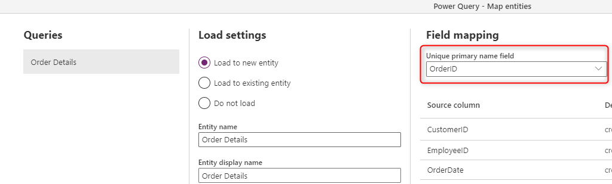
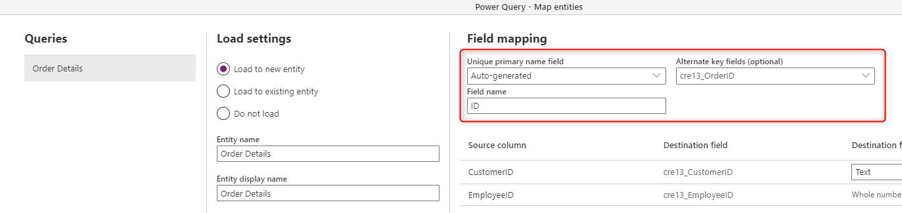
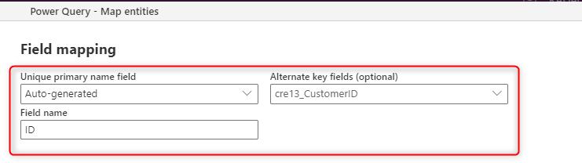

# Field Mapping considerations for standard dataflows

When you create dataflows that write their output into Microsoft Dataflex Pro, you can follow some guide lines and best practices to get the best outcome. In this article, some of those best practices are mentioned.

## Set the Primary Key field in the Entity

Having a primary key column in the entity helps in avoiding duplicates in the data rows. A primary key column is a column that is unique and deterministic of a data row in the entity. For example, In an Orders table, If the Order ID is the primary key column, you should not have two rows with the same Order ID, and one Order ID, Let's say order with the ID 345, should only represent one row in the entity.

The primary key column can be of any data type. The column can be populated from the source system using a dataflow, or it can be automatically generated using an auto number.

This is how you can choose the Key column to be populated from the source when you create a new entity in the dataflow;

If you don't have a unique field from the source system to be considered as the primary key, then you can let the field to be automatically generated.

In scenarios like the above, that you use the primary field to be automatically generated, make sure to choose a proper name for that field, such as ID, and also set an alternate key column. The alternate key is explained in the next section of this article.

Having a primary key in the entity ensures that even if you have duplicate data rows with the same value in the field that is mapped to the primary key, the duplicate entries won't be loaded into the entity, and entity will always have the high quality of the data. Having an entity with a high quality of data is essential in building reporting solutions based on it.

## What is the Alternate Key?

The alternate key is a key column from the source system, The difference between the Alternate key and the primary key you assign for the entity is that the alternate key is the key in the source system. The Primary Key is the key in the entity in the Microsoft Dataflex Pro. In many ocassions, these two can have the same cardinality, but there are scenarios that the Alternate Key and the Primary Key can be on a different cardinalities. The alternate key is also called as Natural key or Business key in the data warehousing terminologies.

### When alternate key and natural key can be the same

Imagine that you are populating Orders into an entity. Every order is represented by an OrderID, and you don't expect any change to happen on the order. Even if there is a change in the order, that would be added later on as another order. In this case, you can be assured that the OrderID (which is the key in the source system) can be used as the primary key in the entity. So the primary key and the alternate key are the same.

### When alternate key and natural key are different

Now imagine a different scenario. Let's assume you are populating Customer's information, each customer in the source system is represented by a CustomerID, and the CustomerID is the key field in the source system. However, in the data warehouse which is Microsoft Dataflex Pro, you intent to also capture the customer's changes. If a customer relocate from one city to another city, in the source system it means just an update in the City field of the same customer's record. However, by using CustomerID as an alternate key, and having another column (can be automatically generated) as a primary key, you can capture the change as a new row with the same CustomerID. This concept in the data warehousing terminologies called as Slowly Changing Dimension.

## Remove rows that no longer exists

If you wish to always have the data in your entity to be synchronized with the data from the source system, you can choose the option for "Delete rows that no longer exist in the query output". However, be mindful that this option will slow down the dataflow, because there is a need for a row comparison based on the primary key for this action to happen.

Having this option checked means that if there is a data row in the entity that does not exist in the next dataflow refresh's query output, that row will be removed from the entity.

