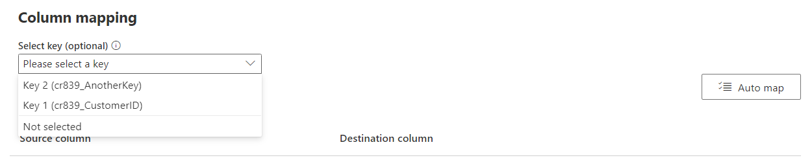
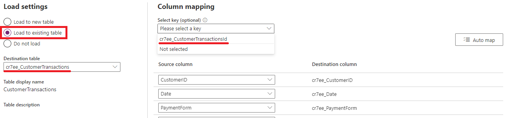
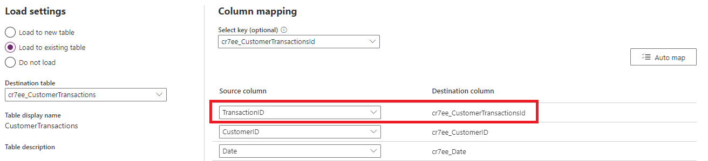

# Field mapping considerations for standard dataflows

When loading data into Dataverse tables, you'll need to map the source query's columns in the dataflow's editing experience to the destination Dataverse table columns. Beyond mapping of data, there are other considerations and best practices to take into account. In this article, we cover the different dataflow settings that control the behavior of dataflow refresh and as a result, the data in the destination table.

## Controlling whether dataflows create or upsert records each refresh

Each time you refresh a dataflow, it will fetch records from the source and load them into Dataverse. If you run the dataflow more than once&mdash;depending on how you configure the dataflow&mdash;you can:

* Create new records each dataflow refresh, even if such records already exist in the destination table.
* Create new records if they don't already exist in the table, or update existing records if they already exist in the table. This behavior is called _upsert_.

Using a key column will indicate to the dataflow to upsert records into the destination table, while not selecting a key will always create new records in the destination table.

A key column is a column that's unique and deterministic of a data row in the table. For example, in an Orders table, if the Order ID is a key column, you shouldn't have two rows with the same Order ID. Also, one Order ID&mdash;let's say an order with the ID 345&mdash;should only represent one row in the table. To choose the key column for the table in Dataverse from the dataflow, you need to set the key field in the Map Tables experience.

### Choosing a primary name and key field when creating a new table

The following image shows how you can choose the key column to be populated from the source when you create a new table in the dataflow.

> [!div class="mx-imgBorder"]
> 

The primary name field that you see in the field mapping is for a label field; this field doesn't need to be unique. The field that's used in the table for checking duplication will be the field that you set in the **Alternate Key** field.

Having a primary key in the table ensures that even if you have duplicate data rows with the same value in the field that's mapped to the primary key, the duplicate entries won't be loaded into the table, and the table will always have a high quality of the data. Having a table with a high quality of data is essential in building reporting solutions based on the table.

### The primary name field

The primary name field is a display field used in Dataverse. This field is used in default views to show the content of the table in other applications. This field isn't the primary key field, and shouldn't be considered as that. This field can have duplicates, because it's a display field. The best practice, however, is to use a concatenated field to map to the primary name field, so the name is fully explanatory.

The alternate key field is what is used as the primary key.

### Choosing a key field when loading to an existing table

When mapping a dataflow query to an existing Dataverse table, you can choose if and which key should be used when loading data into the destination table.

The following image shows how you can choose the key column to be used when upserting records to an existing Dataverse table:

> [!div class="mx-imgBorder"]
> 

### Setting a table’s Unique ID column and leveraging it as a key field for upserting records into existing Dataverse tables.

All Microsoft Dataverse table rows have unique identifiers defined as GUIDs. These are the primary key for each table. By default, a tables primary key cannot be set by dataflows, and is auto-generated by Dataverse when a record is created. There are advanced use cases where leveraging the primary key of a table is desirable, for example, integrating data with external sources while keeping the same primary key values in both the external table and Dataverse table. 

> [!NOTE]
>
> * This capability is only available when loading data to existing tables.
> * The unique identifier field only accepts string containing GUID values, any other data type or value will cause record creation to fail.

To leverage a table’s unique identifier field, select load to existing table in the **Map Tables** page while authoring a dataflow. In the example below, we would like to load data into the CustomerTransactions table, and leverage the TransactionID column from the data source as the Unique Identifier of the table.
 You will notice that in the **Select key** dropdown the unique identifier, which is always named “tablename + id”, of the table can be selected. Since the table name is “CustomerTransactions”, the unique identifier field will be name “CustomerTransactionId”:

> [!div class="mx-imgBorder"]
> 

Once selected, the column mapping section below will be updated to include the unique identifier as a destination column. You can then map the source column representing the unique identifier for each record:

> [!div class="mx-imgBorder"]
> 

## What are good candidates for the key field

The key field is a unique value representing a unique row in the table. It's important to have this field, because it helps you avoid having duplicate records in the table. This field can come from three sources:

* The primary key in the source system (such as OrderID in the example above).

* A concatenated field created through Power Query transformations in the dataflow.

  > [!div class="mx-imgBorder"]
  > 

* A combination of fields to be selected in the **Alternate Key** option. A combination of fields used as a key field is also called a _composite key_.

  

## Remove rows that no longer exist

If you want to have the data in your table always synchronized with the data from the source system, choose the **Delete rows that no longer exist in the query output** option. However, be aware that this option slows down the dataflow because there's a need for a row comparison based on the primary key (alternate Key in the field mapping of the dataflow) for this action to occur.

Having this option checked means that if there's a data row in the table that doesn't exist in the next dataflow refresh's query output, that row will be removed from the table.

> [!div class="mx-imgBorder"]
> 

## Known limitations
 
- Mapping to [polymorphic lookup](/powerapps/maker/canvas-apps/working-with-references#polymorphic-lookups) fields is currently not supported.
- Mapping to a multi-level lookup field, a lookup that points to another tables' lookup field, is currently not supported.
- Mapping to **Status** and **Status Reason** [fields](/powerapps/developer/data-platform/define-custom-state-model-transitions#what-is-the-state-model) is currently not supported.
- Mapping data into multi-line text that includes line break characters isn't supported and the line breaks will be removed. Instead, you could use the line break tag ` ` to load and preserve multi-line text.
- Mapping to Choices (Option Sets) columns using labels isn't supported. Instead, use a comma separated list of values (integers) containing the values of the labels. For example, if you have the labels "Choice1,Choice2,Choice3" with corresponding values of "1,2,3", then you should use "1,3" to select the first and last choices.
