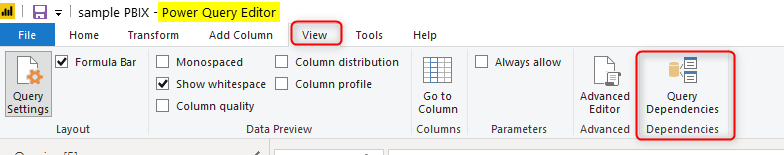
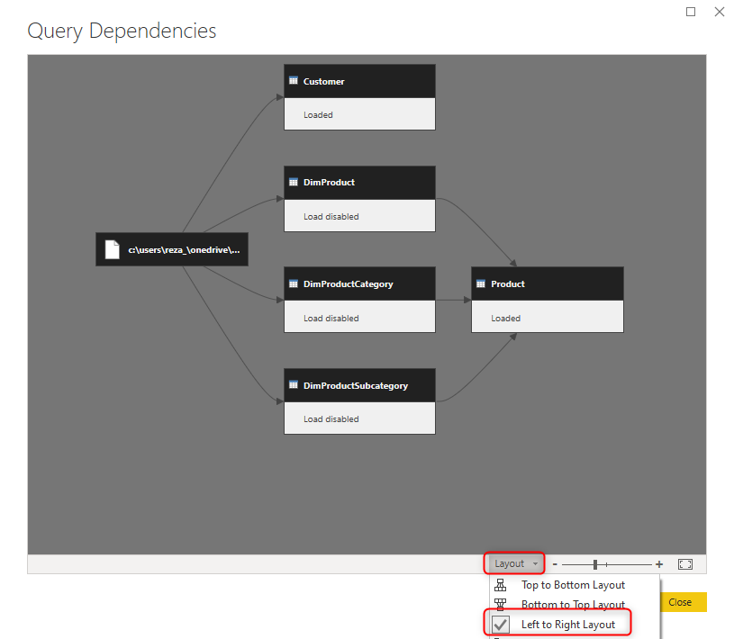
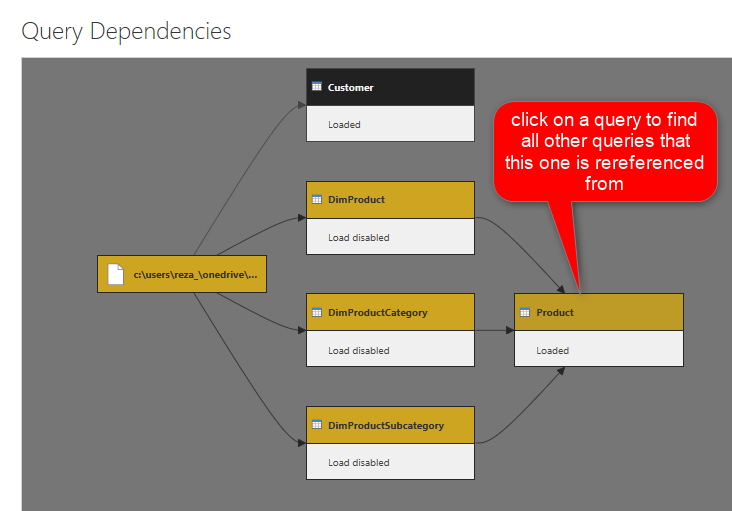
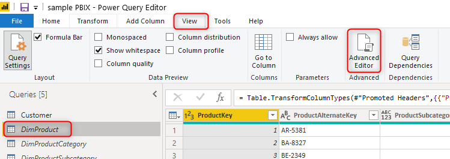
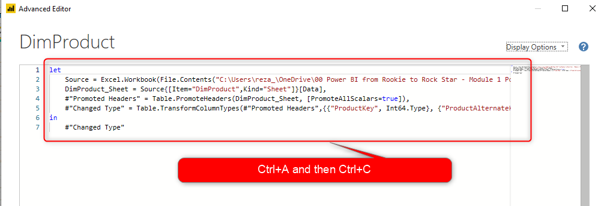
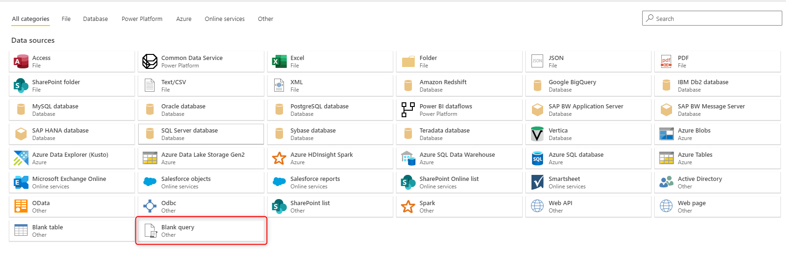
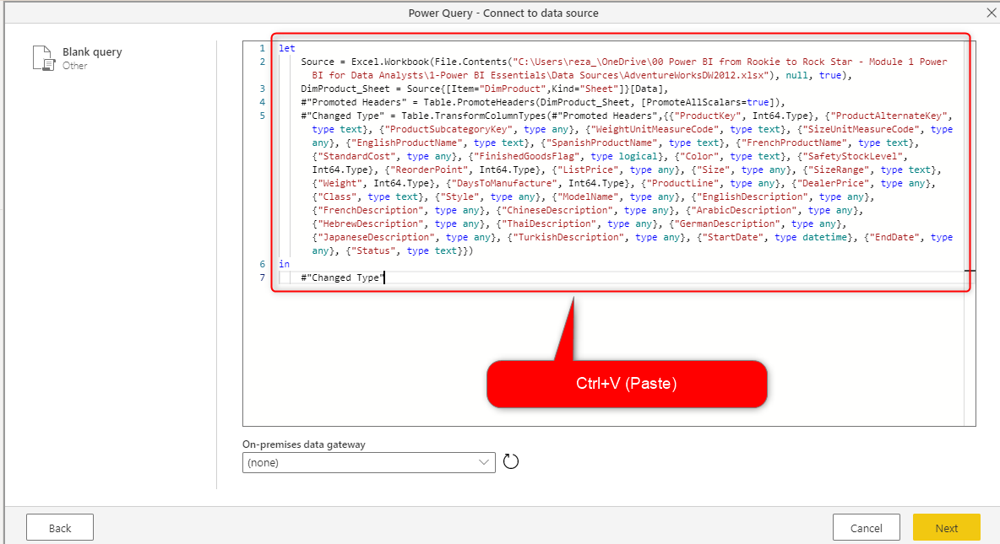
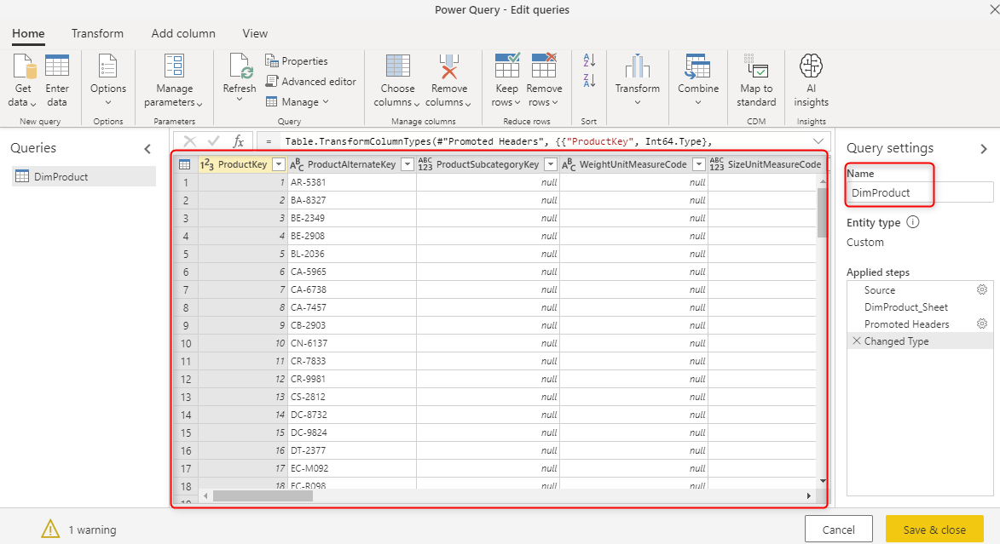
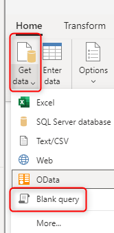
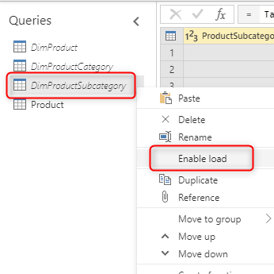

How to migrate queries from Power Query in the desktop (Power BI and Excel) to dataflows
=======================================================================================

If you already have queries in Power Query either in Power BI Desktop or in
Excel, you might want to migrate the queries now into dataflows. Although there
is no migration tool or service available at this stage, the migration process
is pretty simple and straightforward. In this article, you will learn steps to
do so.

Start with base queries.
-----------------------

Because you might have queries referenced from each other, it is always best to
start from the base queries. To find out what queries are the base queries,
firstly you need to go to Power Query Editor, which can be done by clicking on
Transform Data in the Power BI Desktop or Excel;

Then go to the View tab, in Power Query Editor, and select Query Dependencies.

If you have too many queries, and your diagram is busy, you can change the
layout to left-to-right for a better view;

Now in this diagram, if you click on any table (or query) that you want to migrate to the dataflow, you will see all queries that are helping in building this one, as you can see in the screenshot below. By clicking on the Product table, You will see all three base tables in a highlighted color; DimProduct, DimProductCategory, and DimProductSubcategory, and the source file are also in a highlighted color in the C: drive.

After finding the dependency tree, start with base queries, which are queries as
the first level of getting data from the source. In the above screenshot, the
base queries for the Product table, are; DimProduct, DimProductCategory, and
DimProductSubcategory.

Migrate to dataflow
-------------------

Now that you know what the base queries are, the next step is to migrate them
one by one to the dataflow.

### Copy the Script from Power Query Editor

First, create a copy of the M script (Power Query formula language) of the query by clicking on the query in the Power Query Editor, then going to View tab, and selecting Advanced Editor.

Then you can copy the entire script using Ctrl+A and then Ctrl+C from this
window.

\*There is also a right-click and Copy action, however, if your query is not the
base query, this will bring all the referenced queries too, which will cause
some problems when pasting it into the dataflow. The best option, for now, is to
copy it from the Advanced Editor.

### Paste the script into the dataflow

Create a dataflow if you don't have it already;

These articles, help you to create the dataflow in Power BI or Power Platform:

-   [Create and use dataflows in the Power Platform](https://docs.microsoft.com/en-us/data-integration/dataflows/dataflows-integration-overview)
    
-   [Creating and using dataflows in Power BI](https://docs.microsoft.com/en-us/power-bi/service-dataflows-create-use)

Add a new Entity, and then start with a Blank Query.

Paste the M code copied from the Power Query Editor into here, and click on
Next.

### Connect the On-premises data gateway

If your data source in an on-premises source, then you need to do this extra
step. On-premises sources can be Excel files in a shared folder in a local
domain, or a SQL Server database hosted in an on-premises server.

Dataflow, as a cloud-based service, requires the on-premises data gateway to connect to the on-premises data source. If the source is an on-premises source, you should [install and configure the gateway](https://docs.microsoft.com/en-us/data-integration/gateway/service-gateway-install) for that source system, and then add [the data source for it](https://docs.microsoft.com/en-us/data-integration/gateway/service-gateway-manage).
Once these are all ready, you can select the On-premises data gateway when
creating the entity in the dataflow.

The gateway is not needed if the data source is not an on-premises data source,
such as the Azure SQL Database, for example.

### Configure Connection

In the next step, configure the connection to the data source using the
Configure connection option, enter credentials, or anything else needed to
connect to the data source at this stage.

### Verification

If you have done all the steps successfully, you should see the data values in the dataflow entity. Remember to rename your query to whatever name it had in the Power Query Editor.

Migrate all other queries
-------------------------

Make sure to migrate all queries one by one to get them all moved to the
dataflow. Start from base queries, and end at final queries. You can add other
queries to the same dataflow using Get data and then Blank Query.

### Setup Enable Load

If queries in the Power Query Editor are not marked as Enable Load (which is the default option), you don't need to do this. However, if they are disabled load, then you need to do the same in the dataflow with right-click on the query, and uncheck the Enable Load option.

Refresh the dataflow entities
-----------------------------

After migrating your queries to the dataflow, set up a scheduled refresh for
your dataflow. You have to refresh the dataflow to get data loaded into these
entities. You can also do it for the first time as a manual refresh.

Get Data from Power Query Desktop
---------------------------------

You can get data from the dataflow entity now in Power BI Desktop, using Power
BI dataflows, Power Platform dataflows, or Common Data Services (depends on what
type of dataflow you are using)

[This article](https://docs.microsoft.com/en-us/power-bi/desktop-connect-dataflows)
helps you more to get data from dataflow entities from the Power Query Desktop.
